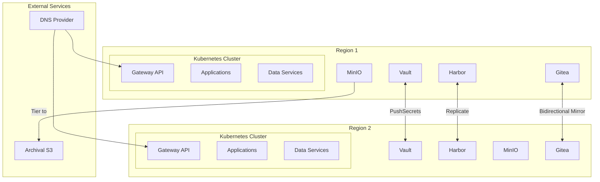
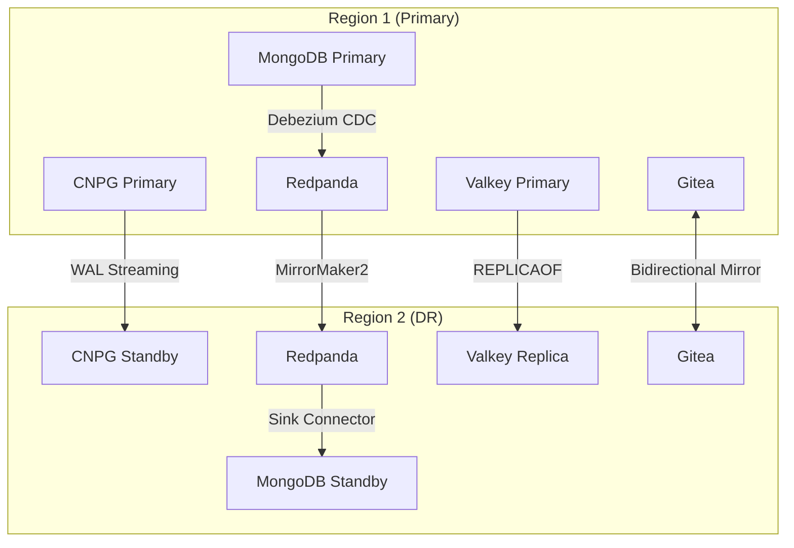

# Platform Technology Stack

Technology stack for the OpenOva Kubernetes platform.

**Status:** Accepted | **Updated:** 2026-02-07

---

## Overview

Components are categorized as **Mandatory** (always installed) or **User Choice** (options available).

---

## Architecture Overview



---

## Mandatory Components

### Infrastructure & Provisioning

| Component | Purpose |
|-----------|---------|
| Terraform | Bootstrap IaC (initial cluster only) |
| Crossplane | Day-2 cloud resource provisioning |

### Networking & Service Mesh

| Component | Purpose |
|-----------|---------|
| Cilium | CNI + Service Mesh (eBPF, mTLS, L7) |
| Coraza | WAF (OWASP CRS) |
| ExternalDNS | DNS sync to provider |
| k8gb | GSLB (authoritative DNS) |

### GitOps, Git & IDP

| Component | Purpose |
|-----------|---------|
| Flux | GitOps engine |
| Gitea | Internal Git + CI/CD |
| Backstage | Developer portal |

### Security

| Component | Purpose |
|-----------|---------|
| cert-manager | TLS certificates |
| External Secrets (ESO) | Secrets operator |
| Vault | Secrets backend (per cluster) |
| Kyverno | Policy engine |
| Trivy | Security scanning |

### Scaling

| Component | Purpose |
|-----------|---------|
| VPA | Vertical autoscaling |
| KEDA | Event-driven horizontal autoscaling |

### Observability

| Component | Purpose |
|-----------|---------|
| Grafana Alloy | Telemetry collector |
| Loki | Log aggregation |
| Mimir | Metrics storage |
| Tempo | Distributed tracing |
| Grafana | Visualization |
| OpenTelemetry | Application tracing |

### Storage & Registry

| Component | Purpose |
|-----------|---------|
| Harbor | Container registry + Trivy |
| MinIO | Object storage |
| Velero | Backup/restore |

### Failover & Resilience

| Component | Purpose |
|-----------|---------|
| Failover Controller | Failover orchestration |

---

## User Choice Options

### Cloud Provider

| Provider | Status | Crossplane Provider |
|----------|--------|---------------------|
| Hetzner Cloud | Available | hcloud |
| Huawei Cloud | Coming | huaweicloud |
| Oracle Cloud | Coming | oci |
| AWS | Coming | aws |
| GCP | Coming | gcp |
| Azure | Coming | azure |

### Regions

| Option | Description |
|--------|-------------|
| 1 region | Allowed (no DR) |
| 2 regions | Recommended (multi-region DR) |

### LoadBalancer

| Option | How It Works | Cost |
|--------|--------------|------|
| Cloud Provider LB | Native LB | ~€5-10/mo |
| k8gb DNS-based LB | Gateway API + k8gb | Free |
| Cilium L2 Mode | ARP-based (same subnet) | Free |

### DNS Provider

| Provider | Availability |
|----------|--------------|
| Cloudflare | Always |
| Hetzner DNS | If Hetzner chosen |
| AWS Route53 | If AWS chosen |
| GCP Cloud DNS | If GCP chosen |
| Azure DNS | If Azure chosen |

### Archival S3 Storage

| Provider | Availability |
|----------|--------------|
| Cloudflare R2 | Always (zero egress) |
| AWS S3 | If AWS chosen |
| GCP GCS | If GCP chosen |
| Azure Blob | If Azure chosen |

---

## À La Carte Data Services

| Component | Purpose | DR Strategy |
|-----------|---------|-------------|
| CNPG | PostgreSQL | WAL streaming |
| MongoDB | Document database | CDC via Debezium |
| Redpanda | Event streaming | MirrorMaker2 |
| Valkey | Redis-compatible cache | REPLICAOF |

---

## À La Carte Communication

| Component | Purpose |
|-----------|---------|
| Stalwart | Email server |
| STUNner | WebRTC gateway |

---

## À La Carte Blueprints

| Blueprint | Purpose |
|-----------|---------|
| Open Banking | Fintech sandbox (PSD2/FAPI) |

---

## Cluster Deployment

### K3s Installation

```bash
curl -sfL https://get.k3s.io | sh -s - server \
  --cluster-init \
  --disable traefik \
  --disable servicelb \
  --disable local-storage \
  --flannel-backend=none \
  --disable-network-policy \
  --kube-controller-manager-arg="node-monitor-period=5s" \
  --kube-controller-manager-arg="node-monitor-grace-period=20s" \
  --kube-apiserver-arg="default-watch-cache-size=50" \
  --etcd-arg="quota-backend-bytes=1073741824" \
  --kubelet-arg="max-pods=50"
```

### Disabled K3s Components

| Component | Replacement |
|-----------|-------------|
| traefik | Gateway API (Cilium) |
| servicelb | DNS-based failover (k8gb) |
| local-storage | Application-level replication |
| flannel | Cilium CNI |

### Cilium Installation

```bash
helm install cilium cilium/cilium \
  --namespace kube-system \
  --set kubeProxyReplacement=true \
  --set k8sServiceHost=${API_SERVER_IP} \
  --set k8sServicePort=6443 \
  --set hubble.enabled=true \
  --set hubble.relay.enabled=true \
  --set encryption.enabled=true \
  --set encryption.type=wireguard \
  --set gatewayAPI.enabled=true \
  --set envoy.enabled=true
```

---

## Resource Estimates (Per Region)

| Category | Components | Estimated RAM |
|----------|------------|---------------|
| Core Platform | Cilium, Flux, ESO, Kyverno | ~2GB |
| Observability | Grafana Stack + Alloy | ~3GB |
| Storage | Harbor, MinIO, Velero | ~4GB |
| Security | Vault, cert-manager, Trivy | ~1GB |
| Git & IDP | Gitea, Backstage | ~2GB |
| **Minimum Total** | | ~12GB |

**Recommended minimum:** 3 nodes × 8GB RAM = 24GB per region

---

## Multi-Region Data Flow



---

*Part of [OpenOva](https://openova.io)*
