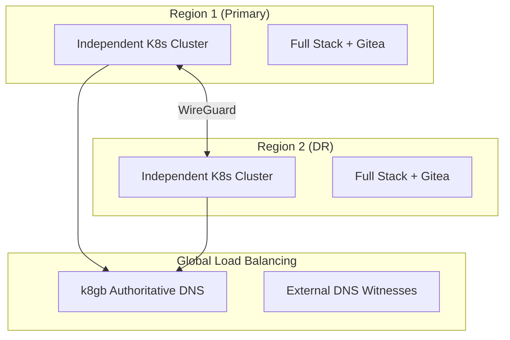
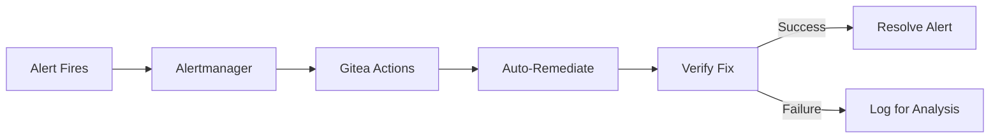
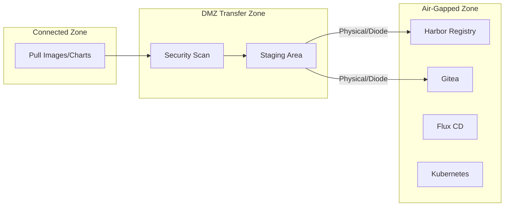
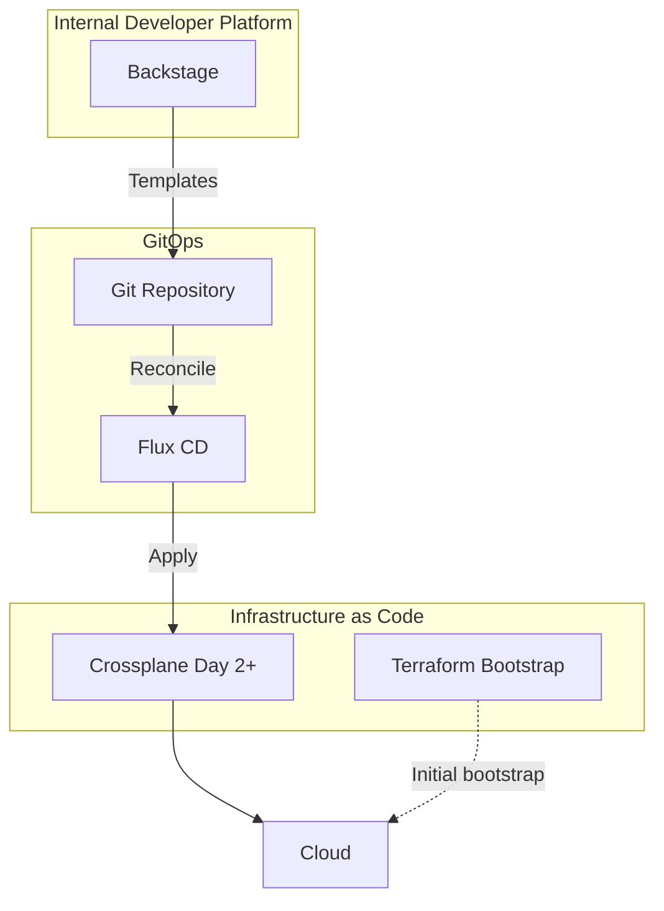

# SRE Handbook

Site Reliability Engineering practices for OpenOva platform operations.

**Status:** Accepted | **Updated:** 2026-02-07

---

## Overview

This document covers SRE practices, multi-region strategy, progressive delivery, auto-remediation, and operational tooling for OpenOva deployments.

---

## Multi-Region Strategy

### Architecture

Multi-region is strongly recommended. 2 independent clusters across regions provides true disaster recovery.



### Key Principles

- Each cluster survives independently during network partition
- No stretched clusters (avoids split-brain)
- Async data replication (eventual consistency)
- k8gb as authoritative DNS for GSLB zone
- External DNS witnesses for split-brain protection

### Cross-Region Networking

| Option | Use Case |
|--------|----------|
| WireGuard mesh | Different providers, secure overlay |
| Native peering | Same provider (lower latency) |

### Data Replication

| Service | Replication Method | RPO |
|---------|-------------------|-----|
| CNPG (Postgres) | WAL streaming to async standby | Near-zero |
| MongoDB | CDC via Debezium → Redpanda | Seconds |
| Redpanda | MirrorMaker2 | Seconds |
| Valkey | REPLICAOF command | Seconds |
| MinIO | Bucket replication | Minutes |
| Harbor | Registry replication | Minutes |
| Vault | ESO PushSecrets to both | Seconds |
| Gitea | Bidirectional mirror + CNPG | Seconds |

### Split-Brain Protection

Failover Controller queries external DNS witnesses:

| Resolver | Provider |
|----------|----------|
| 8.8.8.8 | Google |
| 1.1.1.1 | Cloudflare |
| 9.9.9.9 | Quad9 |

**Quorum:** 2/3 must agree other region is unreachable before promotion.

---

## Progressive Delivery

### Canary Deployments

Flagger provides automatic canary analysis with rollback:

- Flux-native integration
- Automatic rollback on metric degradation
- No ArgoCD dependency

### Feature Flags

Flipt for zero-cost feature flagging:

- Self-hosted deployment
- Simple SDK integration
- Gradual rollout control

---

## Auto-Remediation

### Architecture

Gitea Actions triggered by Alertmanager webhooks for automated incident response.



### Alert-to-Action Mapping

| Alert | Auto-Action | Verification |
|-------|-------------|--------------|
| HighMemoryUsage | Scale up deployment | Check memory |
| PodCrashLoopBackOff | Restart pod | Check pod status |
| HighErrorRate | Trigger rollback | Check error rate |
| DatabaseConnectionExhausted | Restart PgBouncer | Check connections |
| CertificateExpiringSoon | Trigger renewal | Check expiry |
| HighLatency | Scale service | Check latency |
| GslbEndpointDown | Check k8gb status | Verify DNS |

### Budget Control

| Threshold | Action |
|-----------|--------|
| 80% of budget | Warning log |
| 100% of budget | Block scale-up |

---

## Secret Rotation

| Secret Type | Frequency | Method |
|-------------|-----------|--------|
| Database credentials | Monthly | CronJob + ESO |
| JWT signing keys | 30 days | CronJob |
| TLS certificates | Auto | cert-manager |
| Gitea tokens | 90 days | CronJob + ESO |

---

## GDPR Automation

| Process | Schedule |
|---------|----------|
| Data subject requests | Daily 2 AM |
| Data retention | Weekly Sunday 3 AM |
| Audit log cleanup | Monthly |

---

## Air-Gap Compliance

For regulated industries requiring air-gapped deployments:

### Architecture



### Prerequisites

All mandatory components support air-gap:

- Harbor - local registry with replication
- MinIO - local object storage
- Flux - reconciles from local Git
- Velero - backups to local MinIO
- Grafana Stack - self-contained observability

### Content Transfer

| Content Type | Air-Gap Destination |
|--------------|---------------------|
| Container images | Harbor |
| Helm charts | Harbor ChartMuseum |
| Git repositories | Self-hosted Gitea |
| OS packages | Local mirror |

---

## Platform Engineering Tools

### Tool Selection

| Tool | Purpose | Status |
|------|---------|--------|
| Crossplane | Cloud resource provisioning (day-2) | Mandatory |
| Backstage | Internal Developer Platform (IDP) | Mandatory |
| Flux | GitOps delivery engine | Mandatory |
| Terraform | Bootstrap IaC only | Mandatory |

### Architecture



### Crossplane Providers

| Provider | Support |
|----------|---------|
| Hetzner Cloud | hcloud provider |
| Huawei Cloud | huaweicloud provider |
| Oracle Cloud | oci provider |
| AWS | aws provider |
| GCP | gcp provider |
| Azure | azure provider |

---

## Monitoring SLOs

| SLI | Target | Alert Threshold |
|-----|--------|-----------------|
| Availability | 99.9% | <99.5% for 5m |
| Latency (p95) | <500ms | >1s for 5m |
| Error Rate | <0.1% | >1% for 5m |

---

## Alertmanager Configuration

```yaml
receivers:
  - name: gitea-actions
    webhook_configs:
      - url: https://gitea.<domain>/api/v1/repos/<org>/platform/actions/dispatches
        http_config:
          authorization:
            type: Bearer
            credentials_file: /etc/alertmanager/gitea-token
        send_resolved: true

route:
  receiver: gitea-actions
  group_by: ['alertname', 'namespace']
  group_wait: 30s
  routes:
    - match:
        severity: critical
      receiver: gitea-actions
      group_wait: 10s
```

---

*Part of [OpenOva](https://openova.io)*
