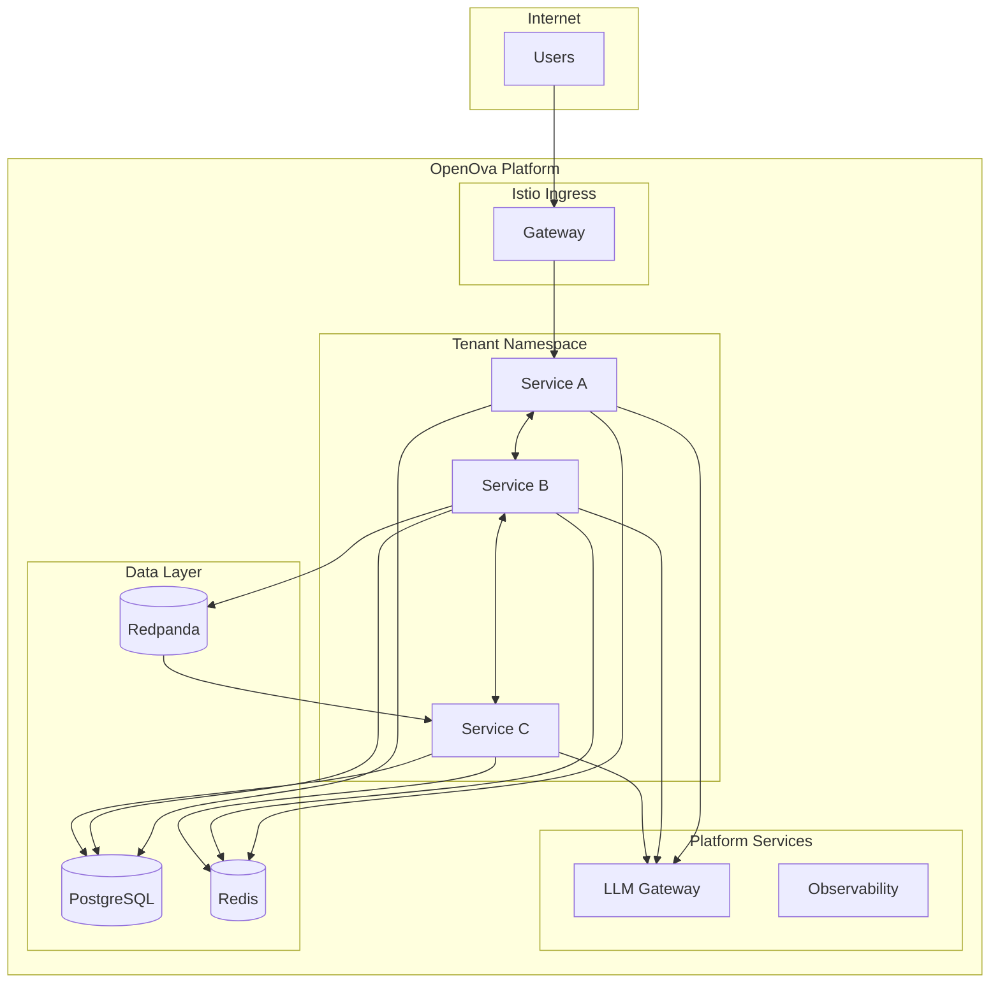

# ADR-001: Microservices Platform Support

## Status
**Accepted**

## Date
2026-01-01 (Updated: 2026-01-12)

## Context

OpenOva platform needs to support tenant applications built with various architectural patterns. Key requirements:

- Support for polyglot microservices (different languages/runtimes)
- Independent scaling of services
- Service-to-service communication
- Observability across distributed systems
- Multi-tenant isolation

## Decision

OpenOva provides a **microservices-ready platform** with the following capabilities:

### Platform Capabilities

| Capability | Implementation | Purpose |
|------------|----------------|---------|
| **Service Mesh** | Istio | mTLS, traffic management, observability |
| **Ingress** | Istio Gateway | External traffic routing |
| **Event Streaming** | Redpanda | Async service communication |
| **Service Discovery** | Kubernetes DNS | Service-to-service resolution |
| **Load Balancing** | Cilium/Istio | L4/L7 traffic distribution |
| **Observability** | Grafana Stack | Logs, metrics, traces |

### Architecture Pattern



### Service Mesh Features

| Feature | Description |
|---------|-------------|
| **mTLS** | Automatic encryption between services |
| **Traffic Splitting** | Canary deployments, A/B testing |
| **Circuit Breaking** | Fault tolerance |
| **Rate Limiting** | Protect services from overload |
| **Retry Policies** | Automatic retry with backoff |
| **Timeout Policies** | Request deadline enforcement |

### Tenant Service Requirements

Tenants deploying microservices on OpenOva must:

1. **Resource Requests/Limits** - All pods must specify resource requirements
2. **Health Probes** - Liveness and readiness probes required
3. **Pod Disruption Budgets** - Ensure availability during updates
4. **Topology Constraints** - Spread across nodes for resilience
5. **Security Context** - Non-root, read-only filesystem

```yaml
# Example tenant service specification
apiVersion: apps/v1
kind: Deployment
metadata:
  name: my-service
  namespace: <tenant>
spec:
  replicas: 2
  template:
    spec:
      containers:
        - name: my-service
          image: harbor.openova.io/<tenant>/my-service:v1.0.0
          resources:
            requests:
              cpu: 100m
              memory: 128Mi
            limits:
              cpu: 500m
              memory: 512Mi
          livenessProbe:
            httpGet:
              path: /health
              port: 8080
          readinessProbe:
            httpGet:
              path: /ready
              port: 8080
          securityContext:
            runAsNonRoot: true
            readOnlyRootFilesystem: true
      topologySpreadConstraints:
        - maxSkew: 1
          topologyKey: kubernetes.io/hostname
          whenUnsatisfiable: ScheduleAnyway
```

### Inter-Service Communication

| Pattern | Use Case | Implementation |
|---------|----------|----------------|
| Synchronous HTTP/gRPC | Request/response | Direct Kubernetes service calls |
| Async Events | Event-driven | Redpanda topics |
| Pub/Sub | Fan-out notifications | Redpanda with multiple consumers |

### Observability

All tenant services automatically get:

| Telemetry | Source | Storage |
|-----------|--------|---------|
| **Logs** | stdout/stderr | Loki |
| **Metrics** | Prometheus scrape | Mimir |
| **Traces** | OpenTelemetry | Tempo |

## Consequences

### Positive

1. **Polyglot support**: Any language that can run in containers
2. **Independent scaling**: HPA per service based on metrics
3. **Fault isolation**: Service mesh handles failures gracefully
4. **Unified observability**: All telemetry in Grafana
5. **Security by default**: mTLS, network policies enforced

### Negative

1. **Complexity**: Distributed systems are inherently complex
2. **Latency**: Inter-service calls add network overhead
3. **Learning curve**: Teams need service mesh knowledge

### Mitigations

- Platform provides templates and documentation
- Kyverno policies enforce best practices
- Grafana dashboards for debugging

## References

- [Deployment Architecture](../architecture/DEPLOYMENT_ARCHITECTURE.md)
- [Istio Documentation](https://istio.io/docs/)
- [Redpanda Documentation](https://docs.redpanda.com/)

---

*ADR Version: 2.0*
*Last Updated: 2026-01-12*
*Owner: Platform Team*
