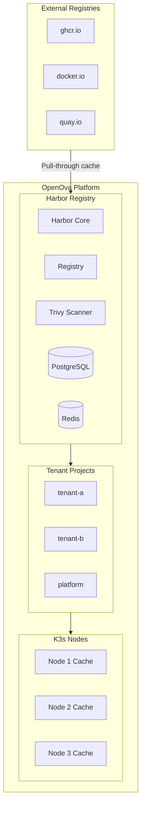

# ADR-018: Image Registry Strategy - Harbor

## Status
**Accepted** (Updated)

## Date
2026-01-07 (Updated: 2026-01-12)

## Context

Container image registries require a strategy for caching, security scanning, and multi-tenant access. Options considered:

1. **Direct pull (no cache)**: Pull images directly from source registries
2. **Harbor**: Full-featured registry with caching, replication, vulnerability scanning
3. **Registry mirror**: Simple pull-through cache (e.g., distribution/registry)

Key requirements:
- **Multi-tenant support**: Each tenant needs isolated image storage
- **Security scanning**: Vulnerability scanning before deployment
- **Air-gap ready**: Support for offline/disconnected deployments
- **Platform ownership**: Control over image distribution

## Decision

We will use **Harbor** as the platform container registry for:
- Multi-tenant image storage with project isolation
- Integrated Trivy vulnerability scanning
- Pull-through cache for external registries
- Replication for disaster recovery

### Architecture



### Harbor Project Structure

| Project | Purpose | Access |
|---------|---------|--------|
| `platform` | OpenOva platform images | Platform team |
| `<tenant>` | Tenant-specific images | Tenant team |
| `cache` | Pull-through cache | Read-only |

### Image Naming Convention

```
harbor.openova.io/<project>/<image>:<tag>
```

Examples:
```
harbor.openova.io/platform/llm-gateway:v1.0.0
harbor.openova.io/tenant-a/web-app:v2.1.0
harbor.openova.io/cache/docker.io/library/nginx:1.25
```

### Resource Allocation

| Harbor Component | Memory | CPU |
|------------------|--------|-----|
| Core | 512MB | 200m |
| Portal | 256MB | 100m |
| Registry | 256MB | 200m |
| Database | 512MB | 200m |
| Redis | 128MB | 50m |
| Trivy | 512MB | 200m |
| Job Service | 128MB | 50m |
| **Total** | **~2.3GB** | **~1000m** |

### Security Scanning Policy

All images scanned before allowing pull:

| Severity | Policy | Action |
|----------|--------|--------|
| CRITICAL | Block | Prevent pull until fixed |
| HIGH | Block | Prevent pull until fixed |
| MEDIUM | Warn | Log, allow pull |
| LOW | Allow | Informational only |

### Pull-Through Cache Configuration

```yaml
# Harbor proxy cache for external registries
registries:
  - name: docker-hub
    endpoint: https://registry-1.docker.io
    type: docker-hub
  - name: ghcr
    endpoint: https://ghcr.io
    type: docker-registry
  - name: quay
    endpoint: https://quay.io
    type: docker-registry
```

## Kubernetes Configuration

### ImagePullSecrets

```yaml
apiVersion: v1
kind: Secret
metadata:
  name: harbor-registry
  namespace: <tenant>
type: kubernetes.io/dockerconfigjson
data:
  .dockerconfigjson: <base64-encoded>
```

### Pod Configuration

```yaml
spec:
  imagePullSecrets:
    - name: harbor-registry
  containers:
    - name: app
      image: harbor.openova.io/<project>/<image>:<tag>
      imagePullPolicy: IfNotPresent
```

## Consequences

### Positive

1. **Centralized registry**: Single source of truth for all images
2. **Security scanning**: Trivy integrated for vulnerability detection
3. **Multi-tenant isolation**: Project-based access control
4. **Caching**: Reduce external registry dependencies
5. **Air-gap ready**: Support offline deployments
6. **Audit logging**: Track all image operations

### Negative

1. **Resource overhead**: ~2.3GB RAM for Harbor components
2. **Operational complexity**: Another component to manage
3. **Single point of failure**: Registry outage affects deployments

### Mitigations

- **High availability**: Deploy Harbor with replicas
- **Backup**: Regular database and storage backups
- **Monitoring**: Prometheus metrics and alerting
- **Fallback**: Direct pull from source if Harbor unavailable

## Deployment

Harbor is deployed via Helm:

```bash
helm repo add harbor https://helm.goharbor.io
helm install harbor harbor/harbor \
  --namespace harbor \
  --set expose.type=ingress \
  --set expose.ingress.hosts.core=harbor.openova.io \
  --set externalURL=https://harbor.openova.io \
  --set persistence.enabled=true \
  --set trivy.enabled=true
```

## References

- [Harbor Documentation](https://goharbor.io/docs/)
- [Harbor Helm Chart](https://github.com/goharbor/harbor-helm)
- [Trivy Scanner](https://aquasecurity.github.io/trivy/)
- [ADR-019: Trivy CI/CD Scanning](./ADR-019-TRIVY-CICD-SCANNING.md)

---

*ADR Version: 2.0*
*Last Updated: 2026-01-12*
*Owner: Platform Team*
