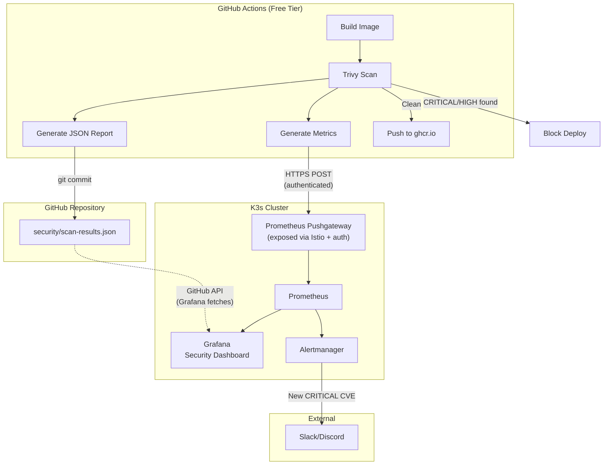
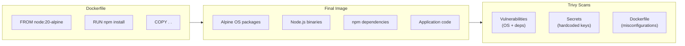

# ADR-019: Trivy CI/CD Vulnerability Scanning with Grafana Dashboard

## Status
**Accepted**

## Date
2026-01-07

## Context

Container security scanning is essential for identifying vulnerabilities before deployment. Options considered:

1. **Trivy in CI/CD**: Scan images in GitHub Actions before push
2. **Trivy Operator**: Continuous in-cluster scanning (~200MB RAM)
3. **Harbor + Trivy**: Registry-integrated scanning (requires Harbor ~2GB)
4. **Falco**: Runtime security monitoring (~1.6GB RAM)
5. **No scanning**: Rely on upstream image maintainers

Key constraints:
- **Limited resources**: 24GB RAM total, already ~328MB allocated to infra
- **Zero-cost preference**: Minimize paid services
- **MVP focus**: Essential security without over-engineering
- **GitHub-based workflow**: Already using ghcr.io and GitHub Actions
- **Single pane of glass**: Grafana already in stack for observability

## Decision

We will use **Trivy in GitHub Actions CI/CD pipeline** for vulnerability scanning with:
- **Zero cluster overhead** for scanning
- **Grafana dashboard** for visualization (via Prometheus Pushgateway)
- **Block deployments** on CRITICAL and HIGH severity CVEs
- **Weekly scans** for third-party images
- **No Falco** for MVP (saves ~1.6GB RAM)

### Why CI/CD Over In-Cluster

| Approach | Cluster Overhead | When Scans Run | Coverage |
|----------|------------------|----------------|----------|
| **Trivy CI/CD** | **0** | Before push | All images |
| Trivy Operator | ~200MB | Continuous | Running images |
| Harbor + Trivy | ~2.5GB | On push to registry | All images |

**CI/CD scanning catches vulnerabilities before images ever reach the cluster.**

### Architecture



### GitHub Free Tier Validation

| Component | Public Repos | Private Repos | Source |
|-----------|--------------|---------------|--------|
| GitHub Actions | **Unlimited** | 2,000 min/month | [Docs](https://docs.github.com/billing/managing-billing-for-github-actions/about-billing-for-github-actions) |
| ghcr.io storage | **Free** | **Free** (for now, 30-day notice) | [Docs](https://docs.github.com/en/billing/concepts/product-billing/github-packages) |
| Trivy | **Free** (OSS) | **Free** (OSS) | Apache 2.0 |

### Scan Coverage

#### Our Images (Build-Time Scanning)



**Trivy scans the ENTIRE final image**, including base image vulnerabilities.

#### Third-Party Images (Scheduled Scanning)

Images we deploy but don't build:

| Category | Images |
|----------|--------|
| **Databases** | cloudnative-pg/postgresql:16, mongo:7.0, redis:7.2-alpine, minio/minio |
| **Service Mesh** | istio/pilot:1.20, istio/proxyv2:1.20 |
| **GitOps** | fluxcd/source-controller, fluxcd/kustomize-controller |
| **TLS** | jetstack/cert-manager-controller |
| **TURN** | l7mp/stunner |

These are scanned weekly via scheduled GitHub Actions workflow.

### Severity Handling

| Severity | Action | Rationale |
|----------|--------|-----------|
| **CRITICAL** | **Block deploy** | Actively exploited, immediate risk |
| **HIGH** | **Block deploy** | Significant risk, should fix |
| **MEDIUM** | Warning in logs | Review, fix when possible |
| **LOW** | Log only | Informational |

### Scan Types Enabled

| Scan Type | What It Checks | Enabled |
|-----------|----------------|---------|
| **vuln** | OS packages, language dependencies | Yes |
| **secret** | Hardcoded secrets, API keys | Yes |
| **config** | Dockerfile best practices | Yes |

## Implementation

### 1. Build-Time Scanning Workflow

```yaml
# .github/workflows/build-scan-push.yml
name: Build, Scan, and Push

on:
  push:
    branches: [main]
  pull_request:
    branches: [main]

env:
  REGISTRY: ghcr.io
  IMAGE_NAME: ${{ github.repository }}

jobs:
  build-scan-push:
    runs-on: ubuntu-latest
    permissions:
      contents: read
      packages: write

    steps:
      - name: Checkout
        uses: actions/checkout@v4

      - name: Set up Docker Buildx
        uses: docker/setup-buildx-action@v3

      - name: Log in to GitHub Container Registry
        uses: docker/login-action@v3
        with:
          registry: ${{ env.REGISTRY }}
          username: ${{ github.actor }}
          password: ${{ secrets.GITHUB_TOKEN }}

      - name: Extract metadata
        id: meta
        uses: docker/metadata-action@v5
        with:
          images: ${{ env.REGISTRY }}/${{ env.IMAGE_NAME }}
          tags: |
            type=semver,pattern={{version}}
            type=sha,prefix=

      - name: Build image (no push yet)
        uses: docker/build-push-action@v5
        with:
          context: .
          load: true
          tags: ${{ steps.meta.outputs.tags }}
          cache-from: type=gha
          cache-to: type=gha,mode=max

      # ========== TRIVY SCANNING ==========

      - name: Run Trivy vulnerability scanner
        id: trivy
        uses: aquasecurity/trivy-action@master
        with:
          image-ref: ${{ env.REGISTRY }}/${{ env.IMAGE_NAME }}:${{ steps.meta.outputs.version }}
          format: 'json'
          output: 'trivy-results.json'
          severity: 'CRITICAL,HIGH'
          exit-code: '1'
          ignore-unfixed: true
          scanners: 'vuln,secret,config'

      - name: Parse and push metrics to Prometheus
        if: always()
        run: |
          # Parse vulnerability counts
          CRITICAL=$(jq '[.Results[]?.Vulnerabilities[]? | select(.Severity=="CRITICAL")] | length' trivy-results.json 2>/dev/null || echo 0)
          HIGH=$(jq '[.Results[]?.Vulnerabilities[]? | select(.Severity=="HIGH")] | length' trivy-results.json 2>/dev/null || echo 0)
          MEDIUM=$(jq '[.Results[]?.Vulnerabilities[]? | select(.Severity=="MEDIUM")] | length' trivy-results.json 2>/dev/null || echo 0)

          IMAGE_NAME="${{ env.IMAGE_NAME }}"
          IMAGE_TAG="${{ steps.meta.outputs.version }}"

          # Push to Prometheus Pushgateway
          cat <<EOF | curl --fail --data-binary @- \
            -H "Authorization: Bearer ${{ secrets.PUSHGATEWAY_TOKEN }}" \
            "https://pushgateway.openova.io/metrics/job/trivy/instance/${IMAGE_NAME}"
          # HELP trivy_vulnerabilities Number of vulnerabilities found
          # TYPE trivy_vulnerabilities gauge
          trivy_vulnerabilities{image="${IMAGE_NAME}",tag="${IMAGE_TAG}",severity="critical"} ${CRITICAL}
          trivy_vulnerabilities{image="${IMAGE_NAME}",tag="${IMAGE_TAG}",severity="high"} ${HIGH}
          trivy_vulnerabilities{image="${IMAGE_NAME}",tag="${IMAGE_TAG}",severity="medium"} ${MEDIUM}
          # HELP trivy_scan_timestamp Unix timestamp of last scan
          # TYPE trivy_scan_timestamp gauge
          trivy_scan_timestamp{image="${IMAGE_NAME}",tag="${IMAGE_TAG}"} $(date +%s)
          EOF

      - name: Upload scan results as artifact
        if: always()
        uses: actions/upload-artifact@v4
        with:
          name: trivy-results
          path: trivy-results.json

      # ========== PUSH (only if scan passes) ==========

      - name: Push image to ghcr.io
        if: github.event_name == 'push' && github.ref == 'refs/heads/main'
        uses: docker/build-push-action@v5
        with:
          context: .
          push: true
          tags: ${{ steps.meta.outputs.tags }}
          cache-from: type=gha
          cache-to: type=gha,mode=max
```

### 2. Third-Party Images Weekly Scan

```yaml
# .github/workflows/scan-third-party-images.yml
name: Weekly Third-Party Image Scan

on:
  schedule:
    - cron: '0 6 * * 1'  # Every Monday 6 AM UTC
  workflow_dispatch:

jobs:
  scan-infrastructure-images:
    runs-on: ubuntu-latest
    strategy:
      fail-fast: false
      matrix:
        include:
          # Databases
          - image: ghcr.io/cloudnative-pg/postgresql:16
            name: postgresql
          - image: mongo:7.0
            name: mongodb
          - image: redis:7.2-alpine
            name: redis
          - image: minio/minio:latest
            name: minio
          # Service Mesh
          - image: istio/pilot:1.20
            name: istio-pilot
          - image: istio/proxyv2:1.20
            name: istio-proxy
          # GitOps
          - image: ghcr.io/fluxcd/source-controller:v1.2.0
            name: flux-source
          - image: ghcr.io/fluxcd/kustomize-controller:v1.2.0
            name: flux-kustomize
          # TLS
          - image: quay.io/jetstack/cert-manager-controller:v1.14.0
            name: cert-manager
          # TURN
          - image: l7mp/stunner:latest
            name: stunner

    steps:
      - name: Scan ${{ matrix.name }}
        id: scan
        uses: aquasecurity/trivy-action@master
        with:
          image-ref: ${{ matrix.image }}
          format: 'json'
          output: 'trivy-${{ matrix.name }}.json'
          severity: 'CRITICAL,HIGH,MEDIUM'
          ignore-unfixed: true

      - name: Push metrics to Prometheus
        run: |
          CRITICAL=$(jq '[.Results[]?.Vulnerabilities[]? | select(.Severity=="CRITICAL")] | length' trivy-${{ matrix.name }}.json 2>/dev/null || echo 0)
          HIGH=$(jq '[.Results[]?.Vulnerabilities[]? | select(.Severity=="HIGH")] | length' trivy-${{ matrix.name }}.json 2>/dev/null || echo 0)
          MEDIUM=$(jq '[.Results[]?.Vulnerabilities[]? | select(.Severity=="MEDIUM")] | length' trivy-${{ matrix.name }}.json 2>/dev/null || echo 0)

          cat <<EOF | curl --fail --data-binary @- \
            -H "Authorization: Bearer ${{ secrets.PUSHGATEWAY_TOKEN }}" \
            "https://pushgateway.openova.io/metrics/job/trivy-thirdparty/instance/${{ matrix.name }}"
          trivy_vulnerabilities{image="${{ matrix.image }}",type="third-party",severity="critical"} ${CRITICAL}
          trivy_vulnerabilities{image="${{ matrix.image }}",type="third-party",severity="high"} ${HIGH}
          trivy_vulnerabilities{image="${{ matrix.image }}",type="third-party",severity="medium"} ${MEDIUM}
          trivy_scan_timestamp{image="${{ matrix.image }}",type="third-party"} $(date +%s)
          EOF

      - name: Alert on critical vulnerabilities
        if: always()
        run: |
          CRITICAL=$(jq '[.Results[]?.Vulnerabilities[]? | select(.Severity=="CRITICAL")] | length' trivy-${{ matrix.name }}.json 2>/dev/null || echo 0)
          if [ "$CRITICAL" -gt 0 ]; then
            echo "::error::CRITICAL vulnerabilities found in ${{ matrix.image }}"
          fi
```

### 3. Manifest Change Scanning

```yaml
# .github/workflows/scan-manifest-changes.yml
name: Scan Images in Changed Manifests

on:
  pull_request:
    paths:
      - 'k8s/**/*.yaml'
      - 'k8s/**/*.yml'

jobs:
  detect-and-scan:
    runs-on: ubuntu-latest
    steps:
      - uses: actions/checkout@v4
        with:
          fetch-depth: 0

      - name: Extract changed images
        id: images
        run: |
          # Find image references in changed YAML files
          IMAGES=$(git diff origin/main --name-only -- 'k8s/**/*.yaml' 'k8s/**/*.yml' | \
            xargs grep -h 'image:' 2>/dev/null | \
            sed 's/.*image:\s*//' | \
            tr -d '"' | tr -d "'" | \
            grep -v '^$' | sort -u || echo "")
          echo "images<<EOF" >> $GITHUB_OUTPUT
          echo "$IMAGES" >> $GITHUB_OUTPUT
          echo "EOF" >> $GITHUB_OUTPUT

      - name: Scan changed images
        if: steps.images.outputs.images != ''
        run: |
          echo "${{ steps.images.outputs.images }}" | while read img; do
            if [ -n "$img" ]; then
              echo "Scanning: $img"
              trivy image --severity CRITICAL,HIGH --exit-code 0 "$img" || true
            fi
          done
```

### 4. Trivy Configuration

```yaml
# .trivy.yaml (repository root)
severity:
  - CRITICAL
  - HIGH

ignore-unfixed: true
scanners:
  - vuln
  - secret
  - config

skip-dirs:
  - node_modules
  - __pycache__
  - .git
  - vendor

# Timeout for large images
timeout: 10m
```

### 5. Prometheus Pushgateway Setup

```yaml
# k8s/infrastructure/monitoring/pushgateway.yaml
apiVersion: apps/v1
kind: Deployment
metadata:
  name: pushgateway
  namespace: monitoring
spec:
  replicas: 1
  selector:
    matchLabels:
      app: pushgateway
  template:
    metadata:
      labels:
        app: pushgateway
    spec:
      containers:
      - name: pushgateway
        image: prom/pushgateway:v1.7.0
        ports:
        - containerPort: 9091
        resources:
          requests:
            memory: 32Mi
            cpu: 10m
          limits:
            memory: 64Mi
---
apiVersion: v1
kind: Service
metadata:
  name: pushgateway
  namespace: monitoring
spec:
  ports:
  - port: 9091
    targetPort: 9091
  selector:
    app: pushgateway
```

### 6. Istio Gateway for Pushgateway (Authenticated)

```yaml
# k8s/infrastructure/monitoring/pushgateway-gateway.yaml
apiVersion: networking.istio.io/v1beta1
kind: Gateway
metadata:
  name: pushgateway-gateway
  namespace: monitoring
spec:
  selector:
    istio: gateway
  servers:
  - port:
      number: 443
      name: https
      protocol: HTTPS
    hosts:
    - pushgateway.openova.io
    tls:
      mode: SIMPLE
      credentialName: pushgateway-tls
---
apiVersion: networking.istio.io/v1beta1
kind: VirtualService
metadata:
  name: pushgateway
  namespace: monitoring
spec:
  hosts:
  - pushgateway.openova.io
  gateways:
  - pushgateway-gateway
  http:
  - match:
    - uri:
        prefix: /metrics
    route:
    - destination:
        host: pushgateway
        port:
          number: 9091
---
apiVersion: security.istio.io/v1
kind: AuthorizationPolicy
metadata:
  name: pushgateway-auth
  namespace: monitoring
spec:
  selector:
    matchLabels:
      app: pushgateway
  rules:
  - from:
    - source:
        requestPrincipals: ["*"]
    when:
    - key: request.headers[authorization]
      values: ["Bearer $PUSHGATEWAY_TOKEN"]  # Set via sealed secret
```

### 7. Grafana Dashboard

```json
{
  "dashboard": {
    "title": "Security - Vulnerability Dashboard",
    "panels": [
      {
        "title": "Critical Vulnerabilities",
        "type": "stat",
        "targets": [
          {
            "expr": "sum(trivy_vulnerabilities{severity=\"critical\"})",
            "legendFormat": "Critical"
          }
        ],
        "fieldConfig": {
          "defaults": {
            "thresholds": {
              "steps": [
                {"color": "green", "value": 0},
                {"color": "red", "value": 1}
              ]
            }
          }
        }
      },
      {
        "title": "Vulnerabilities by Severity",
        "type": "piechart",
        "targets": [
          {"expr": "sum(trivy_vulnerabilities{severity=\"critical\"})", "legendFormat": "Critical"},
          {"expr": "sum(trivy_vulnerabilities{severity=\"high\"})", "legendFormat": "High"},
          {"expr": "sum(trivy_vulnerabilities{severity=\"medium\"})", "legendFormat": "Medium"}
        ]
      },
      {
        "title": "Vulnerabilities Over Time",
        "type": "timeseries",
        "targets": [
          {"expr": "sum(trivy_vulnerabilities{severity=\"critical\"})", "legendFormat": "Critical"},
          {"expr": "sum(trivy_vulnerabilities{severity=\"high\"})", "legendFormat": "High"}
        ]
      },
      {
        "title": "Vulnerabilities by Image",
        "type": "table",
        "targets": [
          {
            "expr": "trivy_vulnerabilities",
            "format": "table",
            "instant": true
          }
        ]
      },
      {
        "title": "Last Scan Time",
        "type": "table",
        "targets": [
          {
            "expr": "trivy_scan_timestamp",
            "format": "table",
            "instant": true
          }
        ]
      }
    ]
  }
}
```

### 8. Alerting Rules

```yaml
# k8s/infrastructure/monitoring/trivy-alerts.yaml
apiVersion: monitoring.coreos.com/v1
kind: PrometheusRule
metadata:
  name: trivy-alerts
  namespace: monitoring
spec:
  groups:
  - name: trivy
    rules:
    - alert: CriticalVulnerabilityFound
      expr: trivy_vulnerabilities{severity="critical"} > 0
      for: 5m
      labels:
        severity: critical
      annotations:
        summary: "Critical vulnerability in {{ $labels.image }}"
        description: "Image {{ $labels.image }} has {{ $value }} critical vulnerabilities"

    - alert: HighVulnerabilityCount
      expr: trivy_vulnerabilities{severity="high"} > 10
      for: 5m
      labels:
        severity: warning
      annotations:
        summary: "High vulnerability count in {{ $labels.image }}"
        description: "Image {{ $labels.image }} has {{ $value }} high severity vulnerabilities"

    - alert: ScanStale
      expr: (time() - trivy_scan_timestamp) > 604800  # 7 days
      for: 1h
      labels:
        severity: warning
      annotations:
        summary: "Trivy scan stale for {{ $labels.image }}"
        description: "No scan results for {{ $labels.image }} in over 7 days"
```

## Consequences

### Positive

1. **Zero cluster scanning overhead**: All scanning in GitHub Actions
2. **Shift-left security**: Catch issues before deployment
3. **Free**: GitHub Actions free tier sufficient for MVP
4. **Single pane of glass**: Security data in existing Grafana
5. **Blocking**: CRITICAL/HIGH CVEs prevent deployment
6. **Alerting**: Prometheus Alertmanager for critical findings
7. **Third-party coverage**: Weekly scans for images we don't build
8. **Audit trail**: All scans logged, metrics stored in Prometheus

### Negative

1. **No runtime scanning**: Only scans at build time and weekly
2. **New CVEs**: Won't catch CVEs discovered between scans
3. **Pushgateway exposure**: Requires authenticated external endpoint

### Mitigations

- **Weekly rescans**: Catch newly discovered CVEs
- **Dependabot**: Auto-PRs for dependency updates
- **Authenticated Pushgateway**: Bearer token + Istio authorization
- **Alerting**: Immediate notification on critical findings

## Resource Budget

| Component | Location | Memory | CPU |
|-----------|----------|--------|-----|
| Trivy scanning | GitHub Actions | **0** | **0** |
| Pushgateway | K3s cluster | 32-64MB | 10m |
| Grafana dashboard | Existing | **0** | **0** |
| Prometheus metrics | Existing | ~10MB | - |
| **Total cluster overhead** | | **~64MB** | **~10m** |

## Cost Analysis

| Component | Cost | Notes |
|-----------|------|-------|
| GitHub Actions | **$0** | 2,000 min/month free (private), unlimited (public) |
| Trivy | **$0** | Open source (Apache 2.0) |
| Pushgateway | **$0** | Open source, minimal resources |
| Grafana dashboard | **$0** | Already deployed |
| **Total** | **$0** | |

## References

- [Trivy Documentation](https://aquasecurity.github.io/trivy/)
- [Trivy GitHub Action](https://github.com/aquasecurity/trivy-action)
- [Prometheus Pushgateway](https://github.com/prometheus/pushgateway)
- [GitHub Actions Billing](https://docs.github.com/billing/managing-billing-for-github-actions/about-billing-for-github-actions)
- [ADR-018: Harbor Registry](./ADR-018-IMAGE-REGISTRY-NO-HARBOR.md)

---

*ADR Version: 2.0*
*Last Updated: 2026-01-07*
