# ADR-034: Operational Resilience (Circuit Breakers, Probes, SLOs)

## Status
**Accepted**

## Date
2026-01-08

## Context

Talent Mesh requires production-grade operational resilience:

1. **Circuit Breakers** - Prevent cascade failures when services degrade
2. **Health Probes** - Kubernetes needs to know if pods are healthy
3. **SLOs** - Define and monitor service level objectives with real metrics

Current state:
- Istio Ambient Mode provides L4 traffic management
- Grafana LGTM stack provides observability
- No documented resilience patterns

## Decision

### Operational Resilience Overview


### 1. Circuit Breakers (Istio DestinationRules)

Circuit breakers prevent cascade failures by ejecting unhealthy upstream endpoints.

**Pattern: Outlier Detection + Connection Pooling**


**Platform Services Circuit Breaker:**

```yaml
# k8s/istio/destination-rules/platform-services.yaml
apiVersion: networking.istio.io/v1beta1
kind: DestinationRule
metadata:
  name: auth-service-circuit-breaker
  namespace: platform-services
spec:
  host: auth-service.platform-services.svc.cluster.local
  trafficPolicy:
    connectionPool:
      tcp:
        maxConnections: 100
        connectTimeout: 5s
      http:
        h2UpgradePolicy: UPGRADE
        http1MaxPendingRequests: 100
        http2MaxRequests: 1000
        maxRequestsPerConnection: 100
        maxRetries: 3
    outlierDetection:
      consecutive5xxErrors: 5
      interval: 10s
      baseEjectionTime: 30s
      maxEjectionPercent: 50
      minHealthPercent: 30
---
apiVersion: networking.istio.io/v1beta1
kind: DestinationRule
metadata:
  name: user-service-circuit-breaker
  namespace: platform-services
spec:
  host: user-service.platform-services.svc.cluster.local
  trafficPolicy:
    connectionPool:
      tcp:
        maxConnections: 100
        connectTimeout: 5s
      http:
        http1MaxPendingRequests: 100
        http2MaxRequests: 1000
        maxRetries: 3
    outlierDetection:
      consecutive5xxErrors: 5
      interval: 10s
      baseEjectionTime: 30s
      maxEjectionPercent: 50
```

**AI Services Circuit Breaker (Higher Tolerance):**

```yaml
# k8s/istio/destination-rules/ai-services.yaml
apiVersion: networking.istio.io/v1beta1
kind: DestinationRule
metadata:
  name: llm-gateway-circuit-breaker
  namespace: ai-services
spec:
  host: llm-gateway.ai-services.svc.cluster.local
  trafficPolicy:
    connectionPool:
      tcp:
        maxConnections: 50
        connectTimeout: 10s  # LLM needs more time
      http:
        http1MaxPendingRequests: 50
        http2MaxRequests: 100
        maxRequestsPerConnection: 10
        maxRetries: 2  # Fewer retries for expensive operations
    outlierDetection:
      consecutive5xxErrors: 3  # Stricter for AI
      interval: 30s
      baseEjectionTime: 60s  # Longer ejection
      maxEjectionPercent: 30  # Keep more capacity
---
apiVersion: networking.istio.io/v1beta1
kind: DestinationRule
metadata:
  name: stt-service-circuit-breaker
  namespace: ai-services
spec:
  host: stt-service.ai-services.svc.cluster.local
  trafficPolicy:
    connectionPool:
      tcp:
        maxConnections: 30
        connectTimeout: 5s
      http:
        http1MaxPendingRequests: 30
        http2MaxRequests: 60
    outlierDetection:
      consecutive5xxErrors: 3
      interval: 15s
      baseEjectionTime: 45s
      maxEjectionPercent: 30
```

**Database Services Circuit Breaker:**

```yaml
# k8s/istio/destination-rules/databases.yaml
apiVersion: networking.istio.io/v1beta1
kind: DestinationRule
metadata:
  name: postgresql-circuit-breaker
  namespace: databases
spec:
  host: postgresql-rw.databases.svc.cluster.local
  trafficPolicy:
    connectionPool:
      tcp:
        maxConnections: 200  # Match PostgreSQL max_connections
        connectTimeout: 3s
    outlierDetection:
      consecutiveGatewayErrors: 3
      interval: 5s
      baseEjectionTime: 15s
      maxEjectionPercent: 30
---
apiVersion: networking.istio.io/v1beta1
kind: DestinationRule
metadata:
  name: mongodb-circuit-breaker
  namespace: databases
spec:
  host: mongodb-svc.databases.svc.cluster.local
  trafficPolicy:
    connectionPool:
      tcp:
        maxConnections: 150
        connectTimeout: 3s
    outlierDetection:
      consecutiveGatewayErrors: 3
      interval: 5s
      baseEjectionTime: 15s
      maxEjectionPercent: 30
```

**Circuit Breaker Settings Summary:**

| Service Type | Max Connections | 5xx Threshold | Ejection Time | Max Ejection % |
|--------------|-----------------|---------------|---------------|----------------|
| Platform Services | 100 | 5 errors | 30s | 50% |
| AI Services | 30-50 | 3 errors | 45-60s | 30% |
| Databases | 150-200 | 3 gateway errors | 15s | 30% |

### 2. Health Probes (Per-Service Configuration)

**Probe Types:**

| Probe | Purpose | Failure Action |
|-------|---------|----------------|
| **Startup** | Wait for slow-starting containers | Delay other probes |
| **Liveness** | Is the process alive? | Restart container |
| **Readiness** | Can it serve traffic? | Remove from Service endpoints |


**Platform Services Probes:**

```yaml
# services/auth-service/k8s/deployment.yaml
apiVersion: apps/v1
kind: Deployment
metadata:
  name: auth-service
  namespace: platform-services
spec:
  template:
    spec:
      containers:
        - name: auth-service
          image: ghcr.io/talent-mesh/auth-service:v1.0.0
          ports:
            - containerPort: 3000
              name: http
          startupProbe:
            httpGet:
              path: /health/startup
              port: http
            initialDelaySeconds: 5
            periodSeconds: 5
            failureThreshold: 30  # 150s max startup time
            timeoutSeconds: 3
          livenessProbe:
            httpGet:
              path: /health/live
              port: http
            initialDelaySeconds: 0  # Starts after startup probe succeeds
            periodSeconds: 10
            failureThreshold: 3
            timeoutSeconds: 3
          readinessProbe:
            httpGet:
              path: /health/ready
              port: http
            initialDelaySeconds: 0
            periodSeconds: 5
            failureThreshold: 3
            successThreshold: 1
            timeoutSeconds: 3
```

**Health Endpoint Implementation (Node.js):**

```typescript
// services/auth-service/src/health/health.controller.ts
import { Controller, Get } from '@nestjs/common';
import { PrismaService } from '../prisma/prisma.service';
import { DragonflyCacheService } from '../cache/dragonfly.service';

@Controller('health')
export class HealthController {
  constructor(
    private prisma: PrismaService,
    private cache: DragonflyCacheService,
  ) {}

  // Startup: Check if dependencies are connected
  @Get('startup')
  async startup() {
    // Check database connection
    await this.prisma.$queryRaw`SELECT 1`;
    // Check cache connection
    await this.cache.ping();
    return { status: 'started' };
  }

  // Liveness: Is the process responsive?
  @Get('live')
  live() {
    // Simple check - if we respond, we're alive
    return { status: 'alive', timestamp: Date.now() };
  }

  // Readiness: Can we serve traffic?
  @Get('ready')
  async ready() {
    const checks = {
      database: false,
      cache: false,
    };

    try {
      await this.prisma.$queryRaw`SELECT 1`;
      checks.database = true;
    } catch (e) {
      // Log but don't throw
    }

    try {
      await this.cache.ping();
      checks.cache = true;
    } catch (e) {
      // Log but don't throw
    }

    // Must have database, cache is optional
    if (!checks.database) {
      throw new Error('Database not ready');
    }

    return { status: 'ready', checks };
  }
}
```

**AI Services Probes (Longer Timeouts):**

```yaml
# services/llm-gateway/k8s/deployment.yaml
apiVersion: apps/v1
kind: Deployment
metadata:
  name: llm-gateway
  namespace: ai-services
spec:
  template:
    spec:
      containers:
        - name: llm-gateway
          image: ghcr.io/talent-mesh/llm-gateway:v1.0.0
          ports:
            - containerPort: 8000
              name: http
          startupProbe:
            httpGet:
              path: /health/startup
              port: http
            initialDelaySeconds: 10
            periodSeconds: 10
            failureThreshold: 30  # 300s for Claude CLI session pool warmup
            timeoutSeconds: 10
          livenessProbe:
            httpGet:
              path: /health/live
              port: http
            initialDelaySeconds: 0
            periodSeconds: 30  # Less frequent for AI
            failureThreshold: 3
            timeoutSeconds: 10
          readinessProbe:
            httpGet:
              path: /health/ready
              port: http
            initialDelaySeconds: 0
            periodSeconds: 10
            failureThreshold: 3
            timeoutSeconds: 10
```

**STT Service Probes (Rust):**

```yaml
# services/stt-service/k8s/deployment.yaml
apiVersion: apps/v1
kind: Deployment
metadata:
  name: stt-service
  namespace: ai-services
spec:
  template:
    spec:
      containers:
        - name: stt-service
          image: ghcr.io/talent-mesh/stt-service:v1.0.0
          ports:
            - containerPort: 8080
              name: http
          startupProbe:
            httpGet:
              path: /health/startup
              port: http
            initialDelaySeconds: 5
            periodSeconds: 5
            failureThreshold: 60  # 300s for whisper model loading
            timeoutSeconds: 5
          livenessProbe:
            httpGet:
              path: /health/live
              port: http
            periodSeconds: 15
            failureThreshold: 3
            timeoutSeconds: 5
          readinessProbe:
            httpGet:
              path: /health/ready
              port: http
            periodSeconds: 5
            failureThreshold: 3
            timeoutSeconds: 5
```

**Database Operator Probes (CNPG handles automatically):**

```yaml
# CNPG automatically configures probes for PostgreSQL pods
# Custom probe settings via spec if needed:
apiVersion: postgresql.cnpg.io/v1
kind: Cluster
metadata:
  name: postgresql
spec:
  instances: 3
  # CNPG automatically manages:
  # - Liveness: pg_isready
  # - Readiness: custom script checking replication lag
  # - Startup: wait for postmaster
```

**Probe Configuration Summary:**

| Service | Startup Timeout | Liveness Period | Readiness Period |
|---------|-----------------|-----------------|------------------|
| Auth Service | 150s | 10s | 5s |
| User Service | 150s | 10s | 5s |
| Assessment Service | 150s | 10s | 5s |
| LLM Gateway | 300s | 30s | 10s |
| STT Service | 300s | 15s | 5s |
| TTS Service | 60s | 15s | 5s |
| Signaling Service | 30s | 10s | 5s |
| PostgreSQL (CNPG) | Auto | Auto | Auto |
| MongoDB (Operator) | Auto | Auto | Auto |

### 3. SLOs with Grafana SLO Feature

**SLO Definitions:**

| Service | SLI | Target | Error Budget (30d) |
|---------|-----|--------|-------------------|
| API Gateway | Request success rate | 99.5% | 3.6 hours downtime |
| Auth Service | Login success rate | 99.9% | 43 minutes downtime |
| Assessment Service | Assessment completion rate | 99.0% | 7.2 hours issues |
| AI Pipeline | End-to-end latency < 2.5s | 95.0% | 36 hours slow |
| Database | Query success rate | 99.99% | 4.3 minutes errors |

**Grafana SLO Configuration:**

```yaml
# k8s/monitoring/grafana-slos.yaml
apiVersion: v1
kind: ConfigMap
metadata:
  name: grafana-slo-definitions
  namespace: monitoring
data:
  slos.yaml: |
    apiVersion: 1
    slos:
      - name: api-availability
        description: "API Gateway request success rate"
        service: api-gateway
        sli:
          type: ratio
          success:
            query: |
              sum(rate(istio_requests_total{
                reporter="destination",
                destination_service=~".*platform-services.*",
                response_code!~"5.."
              }[5m]))
          total:
            query: |
              sum(rate(istio_requests_total{
                reporter="destination",
                destination_service=~".*platform-services.*"
              }[5m]))
        objectives:
          - value: 0.995
            window: 30d
        alerting:
          fastBurn:
            annotations:
              summary: "API error rate burning through error budget quickly"
          slowBurn:
            annotations:
              summary: "API error rate steadily consuming error budget"

      - name: auth-service-availability
        description: "Auth service login success rate"
        service: auth-service
        sli:
          type: ratio
          success:
            query: |
              sum(rate(http_requests_total{
                service="auth-service",
                handler="/auth/linkedin/callback",
                status!~"5.."
              }[5m]))
          total:
            query: |
              sum(rate(http_requests_total{
                service="auth-service",
                handler="/auth/linkedin/callback"
              }[5m]))
        objectives:
          - value: 0.999
            window: 30d

      - name: assessment-completion
        description: "Assessment completion success rate"
        service: assessment-service
        sli:
          type: ratio
          success:
            query: |
              sum(rate(assessment_completed_total{status="success"}[5m]))
          total:
            query: |
              sum(rate(assessment_completed_total[5m]))
        objectives:
          - value: 0.99
            window: 30d

      - name: ai-pipeline-latency
        description: "AI pipeline end-to-end latency under 2.5s"
        service: ai-pipeline
        sli:
          type: ratio
          success:
            query: |
              sum(rate(ai_pipeline_duration_seconds_bucket{le="2.5"}[5m]))
          total:
            query: |
              sum(rate(ai_pipeline_duration_seconds_count[5m]))
        objectives:
          - value: 0.95
            window: 30d

      - name: database-availability
        description: "Database query success rate"
        service: databases
        sli:
          type: ratio
          success:
            query: |
              sum(rate(cnpg_pg_stat_database_xact_commit[5m]))
          total:
            query: |
              sum(rate(cnpg_pg_stat_database_xact_commit[5m])) +
              sum(rate(cnpg_pg_stat_database_xact_rollback[5m]))
        objectives:
          - value: 0.9999
            window: 30d
```

**SLO Burn Rate Alerts:**

```yaml
# k8s/monitoring/slo-alerts.yaml
apiVersion: monitoring.coreos.com/v1
kind: PrometheusRule
metadata:
  name: slo-burn-rate-alerts
  namespace: monitoring
spec:
  groups:
    - name: slo.api.availability
      rules:
        # Fast burn: 14.4x error budget consumption
        - alert: APIAvailabilityFastBurn
          expr: |
            (
              (1 - (sum(rate(istio_requests_total{response_code!~"5.."}[1h])) /
               sum(rate(istio_requests_total[1h])))) / (1 - 0.995)
            ) > 14.4
            and
            (
              (1 - (sum(rate(istio_requests_total{response_code!~"5.."}[5m])) /
               sum(rate(istio_requests_total[5m])))) / (1 - 0.995)
            ) > 14.4
          for: 2m
          labels:
            severity: critical
            slo: api-availability
          annotations:
            summary: "API availability burning error budget at 14.4x rate"
            description: "Error budget will be exhausted in {{ $value | humanizeDuration }}"
            runbook_url: "https://docs.talent-mesh.com/runbook/slo-api-fast-burn"

        # Slow burn: 1x error budget consumption over 6 hours
        - alert: APIAvailabilitySlowBurn
          expr: |
            (
              (1 - (sum(rate(istio_requests_total{response_code!~"5.."}[6h])) /
               sum(rate(istio_requests_total[6h])))) / (1 - 0.995)
            ) > 1
            and
            (
              (1 - (sum(rate(istio_requests_total{response_code!~"5.."}[1h])) /
               sum(rate(istio_requests_total[1h])))) / (1 - 0.995)
            ) > 1
          for: 1h
          labels:
            severity: warning
            slo: api-availability
          annotations:
            summary: "API availability steadily consuming error budget"
            runbook_url: "https://docs.talent-mesh.com/runbook/slo-api-slow-burn"

    - name: slo.ai.latency
      rules:
        - alert: AIPipelineLatencyFastBurn
          expr: |
            (
              (1 - (sum(rate(ai_pipeline_duration_seconds_bucket{le="2.5"}[1h])) /
               sum(rate(ai_pipeline_duration_seconds_count[1h])))) / (1 - 0.95)
            ) > 14.4
          for: 2m
          labels:
            severity: critical
            slo: ai-pipeline-latency
          annotations:
            summary: "AI pipeline latency burning error budget quickly"
            description: "More than 5% of requests taking > 2.5s"

    - name: slo.database.availability
      rules:
        - alert: DatabaseAvailabilityCritical
          expr: |
            (
              sum(rate(cnpg_pg_stat_database_xact_rollback[5m])) /
              (sum(rate(cnpg_pg_stat_database_xact_commit[5m])) +
               sum(rate(cnpg_pg_stat_database_xact_rollback[5m])))
            ) > 0.0001
          for: 5m
          labels:
            severity: critical
            slo: database-availability
          annotations:
            summary: "Database error rate exceeds 0.01%"
```

**SLO Dashboard (Grafana):**

```mermaid
flowchart LR
    subgraph slo_dashboard["Grafana SLO Dashboard"]
        overview["SLO Overview<br/>All services"]
        budget["Error Budget<br/>Remaining %"]
        burn["Burn Rate<br/>Current consumption"]
        history["30-Day History<br/>SLI trend"]
    end

    subgraph alerts["Alert State"]
        healthy["✅ Healthy"]
        warning["⚠️ Slow Burn"]
        critical["🔴 Fast Burn"]
    end

    subgraph actions["Response Actions"]
        investigate["Investigate<br/>Check logs/traces"]
        rollback["Rollback<br/>Previous version"]
        scale["Scale<br/>Add capacity"]
    end

    overview --> budget --> burn
    burn --> healthy
    burn --> warning --> investigate
    burn --> critical --> rollback & scale
```



### Application Metrics for SLOs

Services must expose metrics for SLO calculation:

```typescript
// services/assessment-service/src/metrics/metrics.service.ts
import { Injectable } from '@nestjs/common';
import { Counter, Histogram, Registry } from 'prom-client';

@Injectable()
export class MetricsService {
  private readonly registry: Registry;

  // SLO: Assessment completion rate
  readonly assessmentCompleted: Counter;

  // SLO: Assessment duration
  readonly assessmentDuration: Histogram;

  constructor() {
    this.registry = new Registry();

    this.assessmentCompleted = new Counter({
      name: 'assessment_completed_total',
      help: 'Total assessments completed',
      labelNames: ['status', 'type'],
      registers: [this.registry],
    });

    this.assessmentDuration = new Histogram({
      name: 'assessment_duration_seconds',
      help: 'Assessment duration in seconds',
      labelNames: ['type'],
      buckets: [60, 300, 600, 1200, 1800, 3600], // 1m to 1h
      registers: [this.registry],
    });
  }

  recordAssessmentCompletion(status: 'success' | 'failure' | 'abandoned', type: string) {
    this.assessmentCompleted.inc({ status, type });
  }

  recordAssessmentDuration(durationSeconds: number, type: string) {
    this.assessmentDuration.observe({ type }, durationSeconds);
  }
}
```

```python
# services/llm-gateway/metrics.py
from prometheus_client import Counter, Histogram, REGISTRY

# SLO: AI pipeline latency
ai_pipeline_duration = Histogram(
    'ai_pipeline_duration_seconds',
    'End-to-end AI pipeline duration',
    ['operation'],  # stt, llm, tts, full
    buckets=[0.1, 0.5, 1.0, 1.5, 2.0, 2.5, 3.0, 5.0, 10.0]
)

# SLO: LLM success rate
llm_requests = Counter(
    'llm_requests_total',
    'Total LLM requests',
    ['status', 'model']
)

def record_pipeline_duration(operation: str, duration: float):
    ai_pipeline_duration.labels(operation=operation).observe(duration)

def record_llm_request(status: str, model: str = 'claude'):
    llm_requests.labels(status=status, model=model).inc()
```

### Complete Resilience Stack


## Consequences

### Positive

1. **Cascade failure prevention** - Circuit breakers isolate failing services
2. **Automatic recovery** - Unhealthy pods removed and restarted
3. **Measurable reliability** - SLOs provide objective quality targets
4. **Proactive alerting** - Burn rate alerts before SLO breach
5. **Clear ownership** - Each service has defined availability targets

### Negative

1. **Configuration complexity** - Per-service probe and circuit breaker tuning
2. **Monitoring overhead** - Additional metrics and alerting rules
3. **False positives** - Aggressive settings may cause unnecessary restarts

### Neutral

1. **Istio integration** - DestinationRules leverage existing mesh
2. **Grafana SLO** - Uses existing monitoring stack

## Implementation Checklist

- [ ] Create DestinationRules for all services
- [ ] Configure health endpoints in all services
- [ ] Add probe configurations to all deployments
- [ ] Define SLO targets with stakeholders
- [ ] Create Grafana SLO configurations
- [ ] Set up burn rate alerting rules
- [ ] Create SLO dashboard in Grafana
- [ ] Document runbooks for SLO breaches
- [ ] Test circuit breaker behavior
- [ ] Test probe failure scenarios

## Related ADRs

- [ADR-028: Unified Observability - Grafana Alloy](/docs/09-adrs/ADR-028-UNIFIED-OBSERVABILITY-GRAFANA-ALLOY.md)
- [ADR-029: Metrics - Mimir + OTel](/docs/09-adrs/ADR-029-METRICS-MIMIR-OTEL.md)
- [ADR-030: K8s Workload Management](/docs/09-adrs/ADR-030-K8S-WORKLOAD-MANAGEMENT.md)

## References

- [Istio Circuit Breaking](https://istio.io/latest/docs/tasks/traffic-management/circuit-breaking/)
- [Kubernetes Probes](https://kubernetes.io/docs/tasks/configure-pod-container/configure-liveness-readiness-startup-probes/)
- [Grafana SLO](https://grafana.com/docs/grafana-cloud/alerting-and-irm/slo/)
- [Google SRE Book - SLOs](https://sre.google/sre-book/service-level-objectives/)
- [Burn Rate Alerting](https://sre.google/workbook/alerting-on-slos/)
