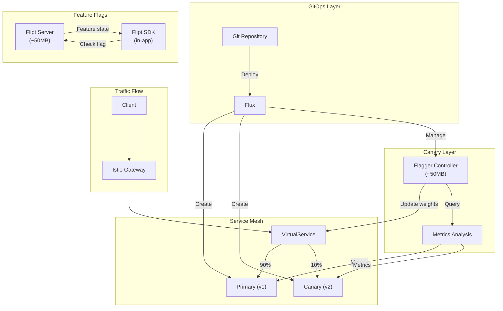
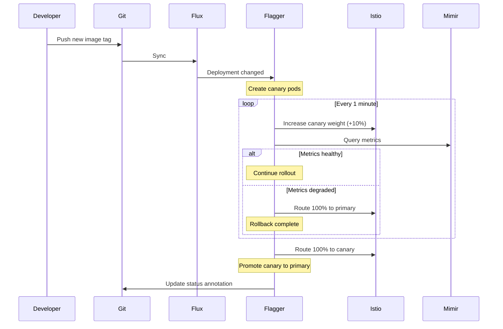
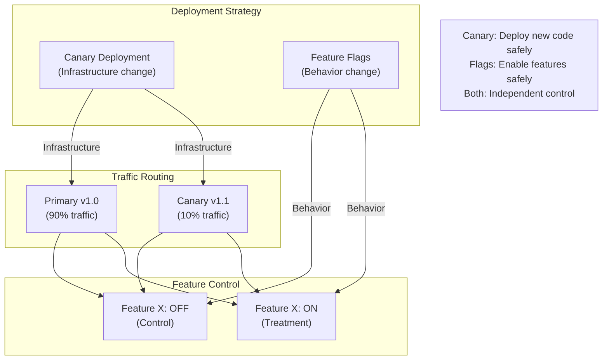

# ADR-035: Progressive Delivery (Canary, Feature Flags, Flagger)

## Status
**Accepted**

## Date
2026-01-08

## Context

Talent Mesh needs progressive delivery capabilities:

1. **Canary Deployments** - Gradually roll out changes to reduce risk
2. **Feature Flags** - Control feature rollout independently of deployment
3. **Automated Rollback** - Automatically revert on degradation

Current state:
- Flux GitOps for deployment
- Istio for traffic management
- No canary or feature flag infrastructure

## Decision

### Progressive Delivery Stack

| Component | Tool | Purpose |
|-----------|------|---------|
| Canary Controller | Flagger | Automated canary analysis and promotion |
| Traffic Shifting | Istio VirtualService | Route traffic between versions |
| Feature Flags | Flipt | Runtime feature toggling |
| Metrics Analysis | Prometheus/Mimir | Canary success criteria |

### Architecture Overview



### 1. Flagger for Automated Canary

**Why Flagger:**
- Native Istio integration
- Automated promotion/rollback based on metrics
- GitOps-friendly (works with Flux)
- Lightweight (~50MB RAM)
- No manual traffic shifting

**Flagger Installation:**

```yaml
# k8s/flagger/helmrelease.yaml
apiVersion: helm.toolkit.fluxcd.io/v2beta1
kind: HelmRelease
metadata:
  name: flagger
  namespace: istio-system
spec:
  interval: 1h
  chart:
    spec:
      chart: flagger
      version: "1.37.x"
      sourceRef:
        kind: HelmRepository
        name: flagger
        namespace: flux-system
  values:
    meshProvider: istio
    metricsServer: http://mimir.monitoring:9090
    slack:
      url: "${SLACK_WEBHOOK_URL}"
      channel: deployments
```

**Canary Resource Definition:**

```yaml
# k8s/canary/auth-service-canary.yaml
apiVersion: flagger.app/v1beta1
kind: Canary
metadata:
  name: auth-service
  namespace: platform-services
spec:
  # Target deployment
  targetRef:
    apiVersion: apps/v1
    kind: Deployment
    name: auth-service

  # Istio virtual service
  service:
    port: 80
    targetPort: 3000
    gateways:
      - istio-system/main-gateway
    hosts:
      - api.talent-mesh.com

  # Canary analysis settings
  analysis:
    # Schedule interval
    interval: 1m
    # Max traffic weight
    maxWeight: 50
    # Traffic increment step
    stepWeight: 10
    # Promotion threshold
    threshold: 5

    # Success criteria
    metrics:
      - name: request-success-rate
        thresholdRange:
          min: 99
        interval: 1m
      - name: request-duration
        thresholdRange:
          max: 500
        interval: 1m

    # Webhooks for testing
    webhooks:
      - name: smoke-test
        type: pre-rollout
        url: http://flagger-loadtester.istio-system/
        timeout: 30s
        metadata:
          type: bash
          cmd: "curl -s http://auth-service-canary.platform-services/health/ready"
      - name: load-test
        type: rollout
        url: http://flagger-loadtester.istio-system/
        timeout: 60s
        metadata:
          type: cmd
          cmd: "hey -z 1m -q 10 -c 2 http://auth-service-canary.platform-services/"
```

**Canary Workflow:**



**Metric Templates:**

```yaml
# k8s/flagger/metric-templates.yaml
apiVersion: flagger.app/v1beta1
kind: MetricTemplate
metadata:
  name: request-success-rate
  namespace: istio-system
spec:
  provider:
    type: prometheus
    address: http://mimir.monitoring:9090
  query: |
    100 - (
      sum(rate(istio_requests_total{
        reporter="destination",
        destination_workload_namespace="{{ namespace }}",
        destination_workload="{{ target }}",
        response_code=~"5.*"
      }[{{ interval }}])) /
      sum(rate(istio_requests_total{
        reporter="destination",
        destination_workload_namespace="{{ namespace }}",
        destination_workload="{{ target }}"
      }[{{ interval }}]))
    ) * 100
---
apiVersion: flagger.app/v1beta1
kind: MetricTemplate
metadata:
  name: request-duration
  namespace: istio-system
spec:
  provider:
    type: prometheus
    address: http://mimir.monitoring:9090
  query: |
    histogram_quantile(0.99,
      sum(rate(istio_request_duration_milliseconds_bucket{
        reporter="destination",
        destination_workload_namespace="{{ namespace }}",
        destination_workload="{{ target }}"
      }[{{ interval }}])) by (le)
    )
```

**Service-Specific Canary Configurations:**

| Service | Max Weight | Step | Interval | Success Rate | Latency P99 |
|---------|------------|------|----------|--------------|-------------|
| Auth Service | 50% | 10% | 1m | 99% | 500ms |
| User Service | 50% | 10% | 1m | 99% | 500ms |
| Assessment Service | 30% | 5% | 2m | 99% | 1000ms |
| LLM Gateway | 20% | 5% | 3m | 95% | 3000ms |
| STT Service | 20% | 5% | 2m | 95% | 2000ms |

### 2. Flipt for Feature Flags

**Why Flipt:**
- Open source, self-hosted
- No external dependencies
- Simple YAML configuration
- GitOps-friendly
- Multiple SDK languages (Go, Node, Python, Rust)
- ~50MB RAM overhead

**Flipt Deployment:**

```yaml
# k8s/flipt/deployment.yaml
apiVersion: apps/v1
kind: Deployment
metadata:
  name: flipt
  namespace: platform-services
spec:
  replicas: 2
  selector:
    matchLabels:
      app: flipt
  template:
    metadata:
      labels:
        app: flipt
    spec:
      containers:
        - name: flipt
          image: flipt/flipt:v1.35.0
          ports:
            - containerPort: 8080
              name: http
            - containerPort: 9000
              name: grpc
          env:
            - name: FLIPT_LOG_LEVEL
              value: "info"
            - name: FLIPT_META_TELEMETRY_ENABLED
              value: "false"
            - name: FLIPT_STORAGE_TYPE
              value: "git"
            - name: FLIPT_STORAGE_GIT_REPOSITORY
              value: "https://github.com/talent-mesh/feature-flags.git"
            - name: FLIPT_STORAGE_GIT_REF
              value: "main"
            - name: FLIPT_STORAGE_GIT_POLL_INTERVAL
              value: "30s"
          resources:
            requests:
              memory: "32Mi"
              cpu: "20m"
            limits:
              memory: "128Mi"
              cpu: "200m"
          livenessProbe:
            httpGet:
              path: /health
              port: http
          readinessProbe:
            httpGet:
              path: /health
              port: http
---
apiVersion: v1
kind: Service
metadata:
  name: flipt
  namespace: platform-services
spec:
  ports:
    - port: 80
      targetPort: 8080
      name: http
    - port: 9000
      targetPort: 9000
      name: grpc
  selector:
    app: flipt
```

**Feature Flag Definitions (Git-managed):**

```yaml
# feature-flags/flags.yaml
namespace: default
flags:
  - key: new-spider-map-algorithm
    name: New Spider Map Algorithm
    description: Use improved multi-dimensional scoring
    enabled: true
    variants:
      - key: control
        name: Control (current algorithm)
      - key: treatment
        name: Treatment (new algorithm)
    rules:
      # 10% of users get new algorithm
      - segment: all-users
        distributions:
          - variant: control
            rollout: 90
          - variant: treatment
            rollout: 10

  - key: enhanced-matching
    name: Enhanced Job Matching
    description: Cost-of-living and tax-aware matching
    enabled: true
    variants:
      - key: "off"
        name: Disabled
      - key: "on"
        name: Enabled
    rules:
      # Only for beta users
      - segment: beta-users
        distributions:
          - variant: "on"
            rollout: 100
      # Everyone else gets off
      - segment: all-users
        distributions:
          - variant: "off"
            rollout: 100

  - key: ai-interview-v2
    name: AI Interview V2
    description: New interview flow with better context
    enabled: false  # Kill switch
    variants:
      - key: v1
        name: Version 1
      - key: v2
        name: Version 2

segments:
  - key: all-users
    name: All Users
    match_type: ALL

  - key: beta-users
    name: Beta Users
    match_type: ANY
    constraints:
      - type: STRING
        property: user_role
        operator: eq
        value: "BETA_TESTER"

  - key: internal-users
    name: Internal Users
    match_type: ANY
    constraints:
      - type: STRING
        property: email
        operator: suffix
        value: "@talent-mesh.com"
```

**SDK Integration (Node.js):**

```typescript
// services/assessment-service/src/features/feature-flags.service.ts
import { FliptClient } from '@flipt-io/flipt';
import { Injectable, OnModuleInit } from '@nestjs/common';

@Injectable()
export class FeatureFlagService implements OnModuleInit {
  private client: FliptClient;

  async onModuleInit() {
    this.client = new FliptClient({
      url: process.env.FLIPT_URL || 'http://flipt.platform-services',
    });
  }

  async isEnabled(flagKey: string, entityId: string, context?: Record<string, string>): Promise<boolean> {
    try {
      const result = await this.client.evaluation.boolean({
        namespaceKey: 'default',
        flagKey,
        entityId,
        context: context || {},
      });
      return result.enabled;
    } catch (error) {
      // Default to disabled on error
      console.error(`Feature flag check failed: ${flagKey}`, error);
      return false;
    }
  }

  async getVariant(flagKey: string, entityId: string, context?: Record<string, string>): Promise<string> {
    try {
      const result = await this.client.evaluation.variant({
        namespaceKey: 'default',
        flagKey,
        entityId,
        context: context || {},
      });
      return result.variantKey;
    } catch (error) {
      console.error(`Feature flag variant check failed: ${flagKey}`, error);
      return 'control';
    }
  }
}

// Usage in service
@Injectable()
export class ScoringService {
  constructor(private featureFlags: FeatureFlagService) {}

  async calculateSpiderMap(candidateId: string, assessmentId: string): Promise<SpiderMap> {
    const variant = await this.featureFlags.getVariant(
      'new-spider-map-algorithm',
      candidateId,
      { assessment_type: 'technical' }
    );

    if (variant === 'treatment') {
      return this.calculateSpiderMapV2(candidateId, assessmentId);
    }
    return this.calculateSpiderMapV1(candidateId, assessmentId);
  }
}
```

**SDK Integration (Python):**

```python
# services/llm-gateway/features.py
from flipt import FliptClient
import os

flipt_client = FliptClient(url=os.getenv('FLIPT_URL', 'http://flipt.platform-services'))

def is_feature_enabled(flag_key: str, entity_id: str, context: dict = None) -> bool:
    try:
        result = flipt_client.evaluation.boolean(
            namespace_key='default',
            flag_key=flag_key,
            entity_id=entity_id,
            context=context or {}
        )
        return result.enabled
    except Exception as e:
        print(f"Feature flag check failed: {flag_key}", e)
        return False

def get_variant(flag_key: str, entity_id: str, context: dict = None) -> str:
    try:
        result = flipt_client.evaluation.variant(
            namespace_key='default',
            flag_key=flag_key,
            entity_id=entity_id,
            context=context or {}
        )
        return result.variant_key
    except Exception as e:
        print(f"Feature flag variant check failed: {flag_key}", e)
        return 'control'

# Usage
async def process_interview(session_id: str, user_id: str):
    if is_feature_enabled('ai-interview-v2', user_id):
        return await process_interview_v2(session_id)
    return await process_interview_v1(session_id)
```

### 3. Combined Canary + Feature Flags



**Progressive Delivery Strategies:**

| Strategy | Use Case | Tool |
|----------|----------|------|
| Canary | New service version | Flagger + Istio |
| Blue/Green | Database migrations | Flux + Manual |
| Feature Flag | New algorithm | Flipt |
| A/B Test | UI changes | Flipt + Analytics |
| Ring Deployment | Critical updates | Flagger segments |

### 4. Rollback Procedures

**Automatic Rollback (Flagger):**

```yaml
# Flagger automatically rolls back when:
# - Request success rate < threshold (e.g., 99%)
# - Latency > threshold (e.g., 500ms)
# - Custom metric fails
# - Webhook returns failure

# Rollback happens by:
# 1. Setting canary weight to 0
# 2. Routing 100% traffic to primary
# 3. Scaling down canary pods
```

**Manual Rollback:**

```bash
# Option 1: Suspend Flagger analysis
kubectl annotate canary auth-service \
  -n platform-services \
  flagger.app/suspend="true"

# Option 2: Revert to previous image
kubectl set image deployment/auth-service \
  -n platform-services \
  auth-service=ghcr.io/talent-mesh/auth-service:v1.0.0

# Option 3: Feature flag kill switch
# Update flags.yaml and push to git
# Flipt polls every 30s
```

**Feature Flag Emergency:**

```yaml
# feature-flags/flags.yaml
flags:
  - key: ai-interview-v2
    name: AI Interview V2
    enabled: false  # Kill switch - immediately disables
```

### Resource Overhead

| Component | Memory | CPU |
|-----------|--------|-----|
| Flagger | ~50MB | 20m |
| Flipt (2 replicas) | ~100MB | 40m |
| Loadtester (optional) | ~32MB | 10m |
| **Total** | **~180MB** | **~70m** |

### Observability Integration

**Flagger Metrics:**

```yaml
# ServiceMonitor for Flagger
apiVersion: monitoring.coreos.com/v1
kind: ServiceMonitor
metadata:
  name: flagger
  namespace: istio-system
spec:
  selector:
    matchLabels:
      app.kubernetes.io/name: flagger
  endpoints:
    - port: http
```

**Key Metrics:**

| Metric | Description |
|--------|-------------|
| flagger_canary_weight | Current canary traffic weight |
| flagger_canary_status | Canary status (0=init, 1=progressing, 2=succeeded, 3=failed) |
| flagger_canary_duration_seconds | Time to complete canary analysis |

**Grafana Dashboard Panels:**
- Active canaries and their weights
- Canary success/failure rate
- Rollback frequency
- Feature flag evaluation counts

## Consequences

### Positive

1. **Reduced deployment risk** - Gradual rollout with automatic rollback
2. **Feature isolation** - Decouple feature release from deployment
3. **Experimentation** - A/B testing capability built-in
4. **Fast recovery** - Automatic rollback on degradation
5. **GitOps-friendly** - Both tools integrate with Flux

### Negative

1. **Complexity** - Additional components to manage
2. **Testing overhead** - Need to test both flag states
3. **Metric dependency** - Canary requires reliable metrics
4. **Flag debt** - Old flags need cleanup

### Neutral

1. **SDK integration** - Requires code changes for feature flags
2. **Traffic splitting** - Leverages Istio capabilities

## Implementation Checklist

- [ ] Install Flagger via Helm
- [ ] Configure metric templates
- [ ] Create Canary resources for each service
- [ ] Deploy Flipt server
- [ ] Set up feature-flags git repository
- [ ] Integrate Flipt SDK in services
- [ ] Create initial feature flags
- [ ] Configure Slack notifications for Flagger
- [ ] Create Grafana dashboard for canary status
- [ ] Document rollback procedures
- [ ] Test canary promotion workflow
- [ ] Test feature flag toggle workflow

## Related ADRs

- [ADR-016: Flux GitOps](/docs/09-adrs/ADR-016-FLUX-GITOPS.md)
- [ADR-034: Operational Resilience](/docs/09-adrs/ADR-034-OPERATIONAL-RESILIENCE.md)
- [ADR-029: Metrics - Mimir + OTel](/docs/09-adrs/ADR-029-METRICS-MIMIR-OTEL.md)

## References

- [Flagger Documentation](https://docs.flagger.app/)
- [Flagger Istio Tutorial](https://docs.flagger.app/tutorials/istio-progressive-delivery)
- [Flipt Documentation](https://www.flipt.io/docs)
- [Progressive Delivery](https://www.weave.works/blog/progressive-delivery)
