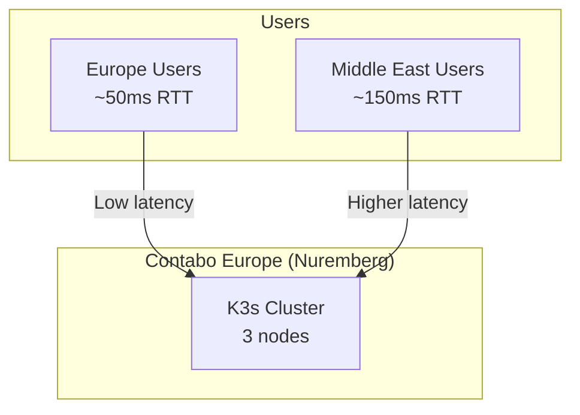
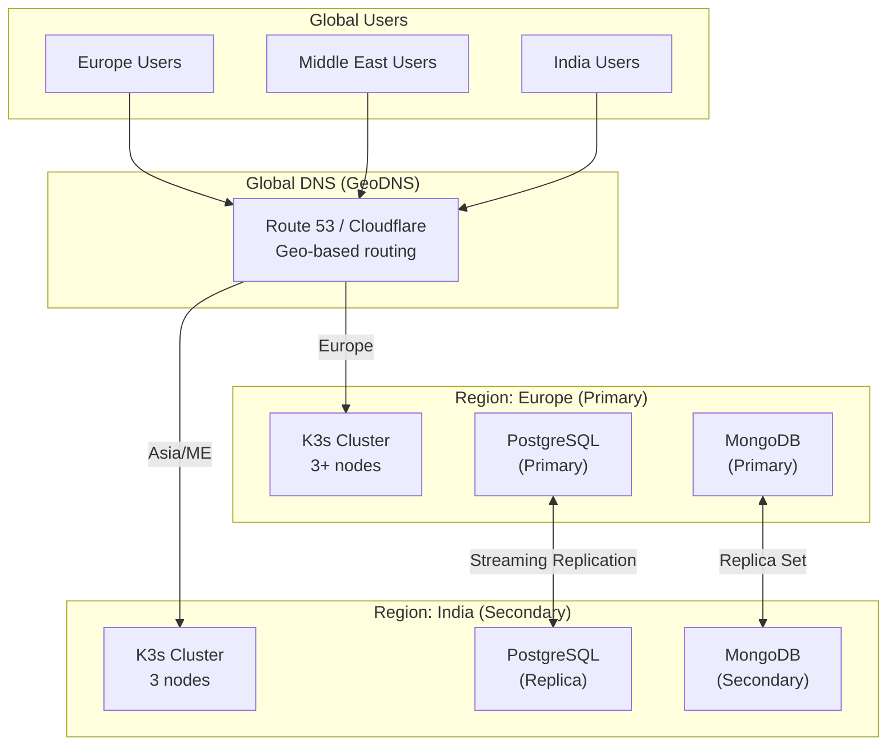
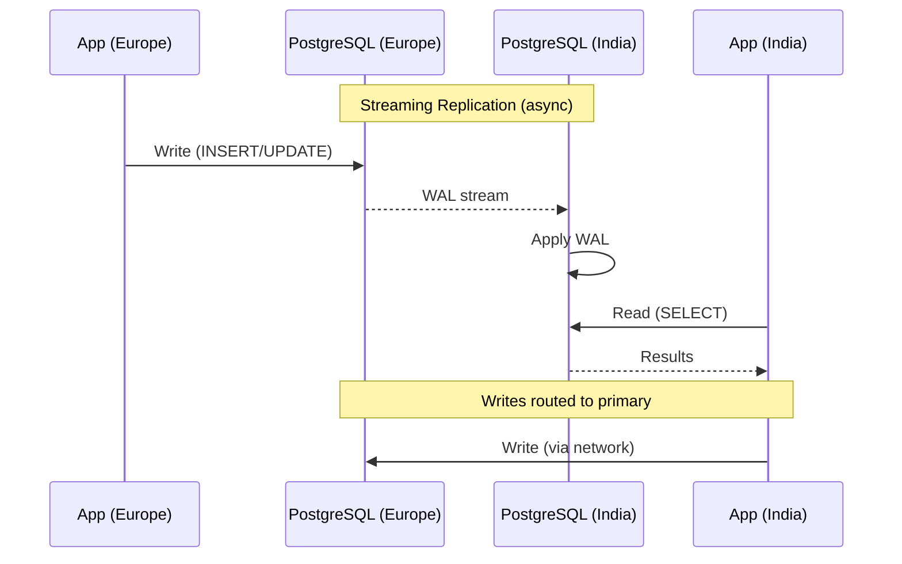
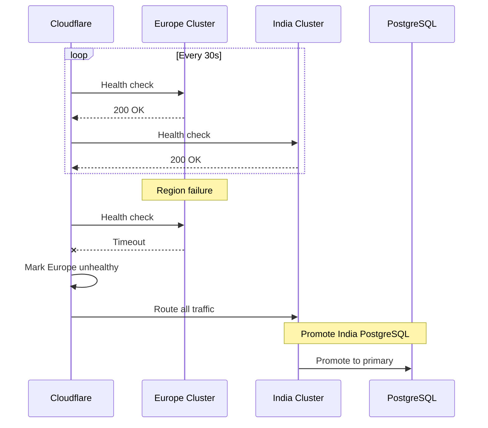

# ADR-036: Multi-Region Strategy (Future State)

## Status
**Proposed** (Future Implementation)

## Date
2026-01-08 (Updated: 2026-01-12)

## Context

OpenOva Platform MVP launches with a single region (Europe). As we scale, we need:

1. **Lower latency for Middle East** - India region provides better RTT
2. **Geographic redundancy** - Disaster recovery capability
3. **Data residency** - Future compliance requirements
4. **Scaling beyond single cluster** - Horizontal capacity growth

This ADR documents the future multi-region architecture for post-MVP expansion.

## Current State (MVP)



## Decision

### Future Multi-Region Architecture



### 1. Region Selection

**Primary Region: Europe (Contabo Nuremberg)**
- Current MVP location
- Primary data store
- Write operations

**Secondary Region: India (Contabo Mumbai or alternative)**
- Optimized for Middle East latency
- Read replicas
- Can accept writes during failover

**Latency Analysis:**

| User Location | To Europe | To India | Winner |
|---------------|-----------|----------|--------|
| Western Europe | 20-50ms | 150-200ms | Europe |
| Eastern Europe | 40-80ms | 120-180ms | Europe |
| Middle East (UAE) | 100-150ms | 50-80ms | India |
| India | 150-200ms | 20-50ms | India |
| Southeast Asia | 200-250ms | 80-120ms | India |

### 2. Data Replication Strategy

**PostgreSQL Cross-Region Replication:**



**CNPG External Replica Configuration:**

```yaml
# k8s/databases/postgresql-india-replica.yaml
apiVersion: postgresql.cnpg.io/v1
kind: Cluster
metadata:
  name: postgresql-replica
  namespace: databases
spec:
  instances: 3

  externalClusters:
    - name: postgresql-europe
      connectionParameters:
        host: pg-europe.openova.io
        user: streaming_replica
        sslMode: require
      password:
        name: pg-replication-credentials
        key: password

  replica:
    enabled: true
    source: postgresql-europe

  storage:
    size: 50Gi
    storageClass: local-path
```

**MongoDB Multi-Region Replica Set:**

```yaml
# Single replica set spanning regions
# Priority-based failover
apiVersion: mongodbcommunity.mongodb.com/v1
kind: MongoDBCommunity
metadata:
  name: mongodb-global
  namespace: databases
spec:
  members: 5  # 3 Europe + 2 India
  type: ReplicaSet
  version: "7.0.5"

  # Member configuration with priorities
  memberConfig:
    - votes: 1
      priority: 10  # Europe primary
      tags:
        region: europe
    - votes: 1
      priority: 9   # Europe secondary
      tags:
        region: europe
    - votes: 1
      priority: 8   # Europe arbiter-capable
      tags:
        region: europe
    - votes: 1
      priority: 5   # India secondary
      tags:
        region: india
    - votes: 1
      priority: 4   # India secondary
      tags:
        region: india

  # Read preference for local reads
  # Applications use: readPreference=nearest&readPreferenceTags=region:india
```

### 3. Traffic Routing

**GeoDNS Configuration:**

```hcl
# terraform/modules/multi-region/dns.tf
resource "cloudflare_record" "api_geo" {
  zone_id = var.cloudflare_zone_id
  name    = "api"
  type    = "A"
  proxied = true

  # Cloudflare Load Balancing with geo steering
}

resource "cloudflare_load_balancer" "api" {
  zone_id          = var.cloudflare_zone_id
  name             = "api.<tenant>.openova.io"
  fallback_pool_id = cloudflare_load_balancer_pool.europe.id
  default_pool_ids = [cloudflare_load_balancer_pool.europe.id]

  # Geo steering
  pop_pools {
    pop  = ["FRA", "AMS", "LHR", "CDG"]  # Europe POPs
    pool_ids = [cloudflare_load_balancer_pool.europe.id]
  }

  pop_pools {
    pop  = ["DXB", "BOM", "DEL", "SIN"]  # Asia/ME POPs
    pool_ids = [cloudflare_load_balancer_pool.india.id]
  }

  steering_policy = "geo"
}

resource "cloudflare_load_balancer_pool" "europe" {
  name = "europe-pool"
  origins {
    name    = "contabo-eu-1"
    address = var.europe_node_ips[0]
    enabled = true
  }
  origins {
    name    = "contabo-eu-2"
    address = var.europe_node_ips[1]
    enabled = true
  }
  origins {
    name    = "contabo-eu-3"
    address = var.europe_node_ips[2]
    enabled = true
  }
  monitor = cloudflare_load_balancer_monitor.health.id
}

resource "cloudflare_load_balancer_pool" "india" {
  name = "india-pool"
  origins {
    name    = "contabo-in-1"
    address = var.india_node_ips[0]
    enabled = true
  }
  origins {
    name    = "contabo-in-2"
    address = var.india_node_ips[1]
    enabled = true
  }
  origins {
    name    = "contabo-in-3"
    address = var.india_node_ips[2]
    enabled = true
  }
  monitor = cloudflare_load_balancer_monitor.health.id
}
```

### 4. Application Changes for Multi-Region

**Read/Write Splitting:**

```typescript
// Example: services/common/database/multi-region.ts
import { PrismaClient } from '@prisma/client';

const primaryClient = new PrismaClient({
  datasources: {
    db: { url: process.env.DATABASE_PRIMARY_URL }
  }
});

const replicaClient = new PrismaClient({
  datasources: {
    db: { url: process.env.DATABASE_REPLICA_URL }
  }
});

export async function query<T>(
  operation: 'read' | 'write',
  callback: (client: PrismaClient) => Promise<T>
): Promise<T> {
  const client = operation === 'write' ? primaryClient : replicaClient;
  return callback(client);
}

// Usage
const user = await query('read', (db) =>
  db.user.findUnique({ where: { id: userId } })
);

await query('write', (db) =>
  db.user.update({ where: { id: userId }, data: { name: 'New Name' } })
);
```

**MongoDB Read Preference:**

```typescript
// Example: services/common/database/mongodb-multi-region.ts
import { MongoClient, ReadPreference } from 'mongodb';

const client = new MongoClient(process.env.MONGODB_URI, {
  readPreference: ReadPreference.NEAREST,
  readPreferenceTags: [
    { region: process.env.REGION },  // Prefer local region
    {}  // Fall back to any
  ]
});

// For writes, always use primary
const collection = client.db('<tenant>').collection('data');
await collection.insertOne(doc, { writeConcern: { w: 'majority' } });
```

### 5. Failover Procedures

**Automated Failover (Cloudflare):**



**Manual Failover Runbook:**

```bash
# 1. Verify Europe is truly down
curl -I https://api-eu.openova.io/health

# 2. Promote India PostgreSQL to primary
kubectl exec -n databases postgresql-replica-1 -- \
  pg_ctl promote -D /var/lib/postgresql/data

# 3. Update DNS to point exclusively to India
# (Cloudflare dashboard or API)

# 4. Notify team
curl -X POST https://hooks.slack.com/services/xxx \
  -d '{"text": "FAILOVER: Traffic now routing to India region"}'

# 5. When Europe recovers, re-establish replication
# Europe becomes new replica of India
```

### 6. Cost Analysis

**MVP (Single Region):**

| Component | Monthly Cost |
|-----------|--------------|
| 3x Contabo VPS 10 (Europe) | €13.50 |
| **Total** | **~€13.50** |

**Multi-Region (Future):**

| Component | Monthly Cost |
|-----------|--------------|
| 3x Contabo VPS 10 (Europe) | €13.50 |
| 3x Contabo VPS 10 (India) | €13.50 |
| Cloudflare Load Balancing | $5.00 |
| Cross-region bandwidth | ~$10.00 |
| **Total** | **~€40.00** |

### 7. Implementation Phases

**Phase 1: MVP (Current)**
- Single Europe region
- All traffic to Europe
- No cross-region replication

**Phase 2: Read Replicas (6 months post-launch)**
- Add India region
- PostgreSQL streaming replica
- MongoDB secondary in India
- GeoDNS routing
- Read traffic to nearest region
- Writes still to Europe

**Phase 3: Active-Active (12 months post-launch)**
- CRDTs or conflict resolution for writes
- Multi-master database setup
- Global user routing
- True active-active capability

### Architecture Comparison

| Aspect | MVP | Phase 2 | Phase 3 |
|--------|-----|---------|---------|
| Regions | 1 | 2 | 2+ |
| Write location | Europe | Europe | Any |
| Read location | Europe | Nearest | Nearest |
| Failover | Manual | Semi-auto | Automatic |
| Complexity | Low | Medium | High |
| Cost | €13.50 | €40 | €60+ |
| Latency (ME) | 150ms | 80ms | 80ms |

## Consequences

### Positive

1. **Lower latency** - 50% reduction for ME/India users
2. **Disaster recovery** - Geographic redundancy
3. **Scaling headroom** - Horizontal capacity growth
4. **Future compliance** - Data residency options

### Negative

1. **Increased cost** - 3x infrastructure
2. **Complexity** - Multi-region operations
3. **Consistency challenges** - Replication lag
4. **Debugging difficulty** - Distributed tracing critical

### Neutral

1. **Terraform manages both** - IaC principles maintained
2. **GitOps unchanged** - Flux can manage multiple clusters
3. **Observability scales** - Grafana Cloud or cross-region Mimir

## Prerequisites for Multi-Region

Before implementing multi-region:

- [ ] Stable MVP with proven architecture
- [ ] 100+ active users requiring lower latency
- [ ] Revenue to justify 3x infrastructure cost
- [ ] Operational maturity for multi-cluster management
- [ ] Cross-region network testing completed
- [ ] Database replication tested in staging
- [ ] Failover procedures documented and tested
- [ ] Observability stack ready for multi-region

## Implementation Checklist (When Ready)

- [ ] Provision India region nodes via Terraform
- [ ] Set up K3s cluster in India
- [ ] Configure PostgreSQL streaming replication
- [ ] Extend MongoDB replica set to India
- [ ] Set up Cloudflare GeoDNS
- [ ] Deploy applications to India region
- [ ] Configure read/write splitting in apps
- [ ] Set up cross-region observability
- [ ] Test failover procedures
- [ ] Update runbooks for multi-region
- [ ] Train team on multi-region operations

## Related ADRs

- [ADR-014: Contabo VPS Infrastructure](/docs/09-adrs/ADR-014-CONTABO-VPS-INFRASTRUCTURE.md)
- [ADR-021: Database Operators - CNPG + MongoDB](/docs/09-adrs/ADR-021-DATABASE-OPERATORS-CNPG-MONGODB.md)
- [ADR-023: Backup Strategy - Cloudflare R2](/docs/09-adrs/ADR-023-BACKUP-CLOUDFLARE-R2.md)

## References

- [CNPG Replica Clusters](https://cloudnative-pg.io/documentation/current/replica_cluster/)
- [MongoDB Geographically Distributed Clusters](https://www.mongodb.com/docs/manual/core/replica-set-architecture-geographically-distributed/)
- [Cloudflare Load Balancing](https://developers.cloudflare.com/load-balancing/)
- [Multi-Region Kubernetes Patterns](https://learnk8s.io/kubernetes-multi-cluster)
