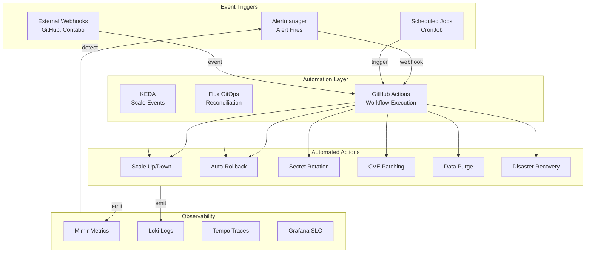
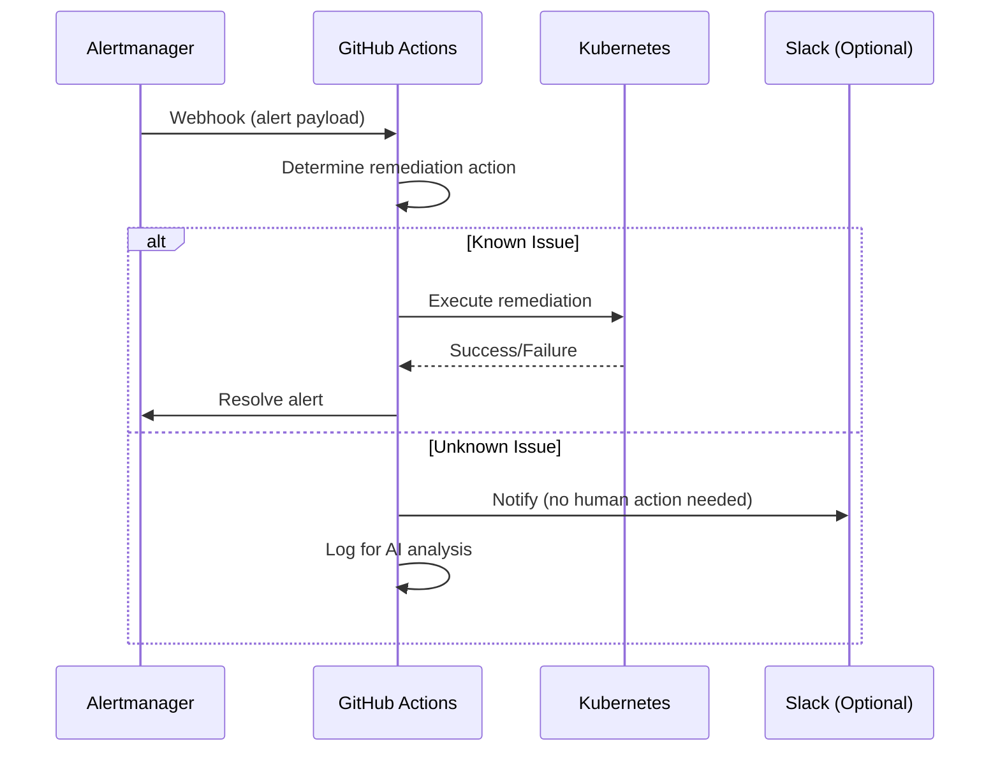

# ADR-037: Zero-Human-Intervention Operations

## Status
**Accepted**

## Date
2026-01-08 (Updated: 2026-01-12)

## Context

OpenOva Platform supports **100% vibe coding** where ALL aspects can be AI-maintained:
- Development
- DevOps
- SRE
- Maintenance
- Operations

This requires:
1. **No human on-call** - System must self-heal
2. **No manual runbook execution** - Automation handles all incidents
3. **No human capacity planning** - Automatic scaling with budget limits
4. **No human security response** - Automated CVE patching
5. **No human compliance management** - GDPR automation

## Decision

### Zero-Human-Intervention Architecture



### 1. Automated Incident Response

**Strategy: Alert → Webhook → GitHub Actions → Remediation**



**Alertmanager Configuration:**

```yaml
# k8s/monitoring/alertmanager-config.yaml
route:
  receiver: github-actions-webhook
  group_by: ['alertname', 'severity']
  group_wait: 30s
  group_interval: 5m
  repeat_interval: 4h
  routes:
    # Critical alerts trigger immediate remediation
    - match:
        severity: critical
      receiver: github-actions-webhook
      continue: true
    # Warning alerts logged for analysis
    - match:
        severity: warning
      receiver: slack-optional

receivers:
  - name: github-actions-webhook
    webhook_configs:
      - url: 'https://api.github.com/repos/<org>/<repo>/dispatches'
        send_resolved: true
        http_config:
          authorization:
            type: Bearer
            credentials_file: /etc/alertmanager/secrets/github-token
        # Payload includes alert details for remediation logic

  - name: slack-optional
    slack_configs:
      - api_url_file: /etc/alertmanager/secrets/slack-webhook
        channel: '#alerts'
        send_resolved: true
```

**GitHub Actions Remediation Workflow:**

```yaml
# .github/workflows/auto-remediation.yaml
name: Auto-Remediation

on:
  repository_dispatch:
    types: [alertmanager]

jobs:
  remediate:
    runs-on: ubuntu-latest
    steps:
      - uses: actions/checkout@v4

      - name: Setup kubectl
        uses: azure/setup-kubectl@v3

      - name: Configure kubeconfig
        run: |
          mkdir -p ~/.kube
          echo "${{ secrets.KUBECONFIG }}" | base64 -d > ~/.kube/config

      - name: Determine Remediation Action
        id: action
        run: |
          ALERT_NAME="${{ github.event.client_payload.alerts[0].labels.alertname }}"
          SEVERITY="${{ github.event.client_payload.alerts[0].labels.severity }}"

          case "$ALERT_NAME" in
            "HighMemoryUsage")
              echo "action=scale_up" >> $GITHUB_OUTPUT
              ;;
            "PodCrashLoopBackOff")
              echo "action=restart_pod" >> $GITHUB_OUTPUT
              ;;
            "HighErrorRate")
              echo "action=check_rollback" >> $GITHUB_OUTPUT
              ;;
            "DatabaseConnectionExhausted")
              echo "action=restart_pgbouncer" >> $GITHUB_OUTPUT
              ;;
            "CertificateExpiringSoon")
              echo "action=renew_cert" >> $GITHUB_OUTPUT
              ;;
            *)
              echo "action=log_only" >> $GITHUB_OUTPUT
              ;;
          esac

      - name: Execute Scale Up
        if: steps.action.outputs.action == 'scale_up'
        run: |
          NAMESPACE="${{ github.event.client_payload.alerts[0].labels.namespace }}"
          DEPLOYMENT="${{ github.event.client_payload.alerts[0].labels.deployment }}"
          CURRENT=$(kubectl get deployment $DEPLOYMENT -n $NAMESPACE -o jsonpath='{.spec.replicas}')
          NEW=$((CURRENT + 1))
          kubectl scale deployment $DEPLOYMENT -n $NAMESPACE --replicas=$NEW
          echo "Scaled $DEPLOYMENT from $CURRENT to $NEW replicas"

      - name: Execute Pod Restart
        if: steps.action.outputs.action == 'restart_pod'
        run: |
          NAMESPACE="${{ github.event.client_payload.alerts[0].labels.namespace }}"
          POD="${{ github.event.client_payload.alerts[0].labels.pod }}"
          kubectl delete pod $POD -n $NAMESPACE
          echo "Restarted pod $POD"

      - name: Check and Rollback
        if: steps.action.outputs.action == 'check_rollback'
        run: |
          NAMESPACE="${{ github.event.client_payload.alerts[0].labels.namespace }}"
          DEPLOYMENT="${{ github.event.client_payload.alerts[0].labels.deployment }}"

          # Check if recent deployment (within 30 min)
          LAST_UPDATE=$(kubectl get deployment $DEPLOYMENT -n $NAMESPACE \
            -o jsonpath='{.metadata.annotations.kubectl\.kubernetes\.io/last-applied-configuration}' \
            | jq -r '.metadata.creationTimestamp // empty')

          # Trigger Flagger rollback if canary in progress
          kubectl annotate canary $DEPLOYMENT -n $NAMESPACE \
            flagger.app/rollback="true" --overwrite || true

          echo "Triggered rollback check for $DEPLOYMENT"

      - name: Log for AI Analysis
        if: steps.action.outputs.action == 'log_only'
        run: |
          echo "Unknown alert: ${{ github.event.client_payload.alerts[0].labels.alertname }}"
          echo "Payload: ${{ toJSON(github.event.client_payload) }}"
          # Store for future automation development
```

### 2. Cost Control & Budget Automation

**Monthly Budget: €15 (~$16.50)**

```yaml
# k8s/monitoring/cost-alerts.yaml
apiVersion: monitoring.coreos.com/v1
kind: PrometheusRule
metadata:
  name: cost-alerts
  namespace: monitoring
spec:
  groups:
    - name: cost-control
      rules:
        # Track node count as proxy for cost
        - record: monthly_infrastructure_cost_euros
          expr: |
            count(kube_node_info) * 4.50

        - alert: BudgetWarning80Percent
          expr: monthly_infrastructure_cost_euros > 12  # €12 = 80% of €15
          for: 5m
          labels:
            severity: warning
          annotations:
            summary: "Infrastructure cost at 80% of monthly budget"
            description: "Current cost: €{{ $value }}, Budget: €15"

        - alert: BudgetExceeded
          expr: monthly_infrastructure_cost_euros > 15
          for: 5m
          labels:
            severity: critical
          annotations:
            summary: "Monthly infrastructure budget exceeded"
            description: "Current cost: €{{ $value }}, Budget: €15. Scale-up blocked."

        - alert: ScaleUpBlocked
          expr: |
            monthly_infrastructure_cost_euros >= 15
            and
            increase(kube_node_info[1h]) > 0
          for: 1m
          labels:
            severity: critical
          annotations:
            summary: "Node scale-up attempted but budget exceeded"
```

**Budget-Aware Node Autoscaling:**

```yaml
# .github/workflows/node-autoscaler.yaml (updated from ADR-030)
name: Node Autoscaler

on:
  repository_dispatch:
    types: [scale-nodes]

jobs:
  check-budget:
    runs-on: ubuntu-latest
    outputs:
      can_scale: ${{ steps.budget.outputs.can_scale }}
    steps:
      - name: Check Budget
        id: budget
        run: |
          CURRENT_NODES=${{ github.event.client_payload.current_nodes }}
          REQUESTED_NODES=${{ github.event.client_payload.requested_nodes }}
          COST_PER_NODE=4.50  # €4.50 for Contabo VPS 10
          MONTHLY_BUDGET=15.00

          PROJECTED_COST=$(echo "$REQUESTED_NODES * $COST_PER_NODE" | bc)

          if (( $(echo "$PROJECTED_COST > $MONTHLY_BUDGET" | bc -l) )); then
            echo "can_scale=false" >> $GITHUB_OUTPUT
            echo "Budget exceeded: €$PROJECTED_COST > €$MONTHLY_BUDGET"
          else
            echo "can_scale=true" >> $GITHUB_OUTPUT
          fi

  scale-up:
    needs: check-budget
    if: needs.check-budget.outputs.can_scale == 'true'
    runs-on: ubuntu-latest
    steps:
      - uses: actions/checkout@v4
      - uses: hashicorp/setup-terraform@v3

      - name: Scale Up Nodes
        working-directory: terraform/environments/contabo-europe
        run: |
          terraform init
          terraform apply -auto-approve \
            -var="node_count=${{ github.event.client_payload.requested_nodes }}"

  notify-budget-block:
    needs: check-budget
    if: needs.check-budget.outputs.can_scale == 'false'
    runs-on: ubuntu-latest
    steps:
      - name: Log Budget Block
        run: |
          echo "Scale-up blocked due to budget constraints"
          echo "Requested: ${{ github.event.client_payload.requested_nodes }} nodes"
          echo "Would exceed monthly budget of €15"
```

### 3. Self-Healing Mechanisms

**Auto-Restart on Failure:**

```yaml
# k8s/workload-management/self-healing.yaml
apiVersion: v1
kind: ConfigMap
metadata:
  name: self-healing-rules
  namespace: monitoring
data:
  rules: |
    # Pod restarts if liveness probe fails (built-in)
    # Pod removed from service if readiness probe fails (built-in)

    # Additional self-healing via KEDA:
    # - Scale to 0 if no traffic (saves resources)
    # - Scale up on queue depth (auto-capacity)

    # Additional self-healing via Kyverno:
    # - Auto-generate PDB (protects during VPA updates)
    # - Auto-generate NetworkPolicy (security)

    # Database self-healing:
    # - CNPG auto-promotes replica on primary failure
    # - MongoDB auto-elects new primary
    # - Dragonfly auto-restarts on OOM
```

**Deadlock Detection and Resolution:**

```yaml
# k8s/monitoring/deadlock-detection.yaml
apiVersion: monitoring.coreos.com/v1
kind: PrometheusRule
metadata:
  name: deadlock-detection
  namespace: monitoring
spec:
  groups:
    - name: deadlock
      rules:
        # Detect stuck pods (no requests for 10 min but pod running)
        - alert: PossibleDeadlock
          expr: |
            (
              rate(http_requests_total[10m]) == 0
              and
              kube_pod_status_phase{phase="Running"} == 1
              and
              time() - kube_pod_start_time > 600
            )
          for: 5m
          labels:
            severity: warning
            auto_action: restart_pod
          annotations:
            summary: "Pod {{ $labels.pod }} may be deadlocked"
            action: "Auto-restart triggered"

        # Detect database connection exhaustion
        - alert: ConnectionPoolExhausted
          expr: |
            pg_stat_activity_count / pg_settings_max_connections > 0.9
          for: 2m
          labels:
            severity: critical
            auto_action: restart_pgbouncer
          annotations:
            summary: "PostgreSQL connection pool at 90%"
```

### 4. Dependency Update Automation (Renovate)

**Renovate Configuration:**

```json
// renovate.json
{
  "$schema": "https://docs.renovatebot.com/renovate-schema.json",
  "extends": [
    "config:base",
    ":semanticCommits",
    ":automergeMinor",
    ":automergePatch"
  ],
  "timezone": "UTC",
  "schedule": ["before 6am on monday"],
  "prHourlyLimit": 5,
  "prConcurrentLimit": 10,

  "packageRules": [
    {
      "description": "Auto-merge security patches",
      "matchUpdateTypes": ["patch"],
      "matchCategories": ["security"],
      "automerge": true,
      "automergeType": "pr",
      "platformAutomerge": true
    },
    {
      "description": "Auto-merge minor updates for trusted packages",
      "matchUpdateTypes": ["minor"],
      "matchPackagePatterns": ["^@types/", "^eslint", "^prettier"],
      "automerge": true
    },
    {
      "description": "Group Kubernetes updates",
      "matchPackagePatterns": ["k8s.io/*", "kubernetes/*"],
      "groupName": "kubernetes",
      "automerge": false
    },
    {
      "description": "Group Helm chart updates",
      "matchManagers": ["helmv3"],
      "groupName": "helm-charts",
      "automerge": false
    },
    {
      "description": "Pin Docker digests for reproducibility",
      "matchManagers": ["dockerfile", "docker-compose"],
      "pinDigests": true
    }
  ],

  "kubernetes": {
    "fileMatch": ["k8s/.+\\.yaml$"]
  },

  "helm-values": {
    "fileMatch": ["k8s/.+\\.yaml$"]
  },

  "terraform": {
    "enabled": true
  }
}
```

**K3s Update Automation:**

```yaml
# .github/workflows/k3s-update.yaml
name: K3s Update Check

on:
  schedule:
    - cron: '0 6 * * 1'  # Weekly Monday 6 AM UTC
  workflow_dispatch:

jobs:
  check-update:
    runs-on: ubuntu-latest
    steps:
      - name: Get Current K3s Version
        id: current
        run: |
          # Query cluster for current version
          VERSION=$(ssh contabo-node-1 'k3s --version' | grep -oP 'v\d+\.\d+\.\d+')
          echo "version=$VERSION" >> $GITHUB_OUTPUT

      - name: Get Latest Stable K3s Version
        id: latest
        run: |
          VERSION=$(curl -s https://update.k3s.io/v1-release/channels/stable | jq -r '.data.latest')
          echo "version=$VERSION" >> $GITHUB_OUTPUT

      - name: Compare Versions
        id: compare
        run: |
          CURRENT="${{ steps.current.outputs.version }}"
          LATEST="${{ steps.latest.outputs.version }}"

          if [ "$CURRENT" != "$LATEST" ]; then
            echo "update_available=true" >> $GITHUB_OUTPUT
            echo "Update available: $CURRENT → $LATEST"
          else
            echo "update_available=false" >> $GITHUB_OUTPUT
            echo "Already on latest: $CURRENT"
          fi

      - name: Create Update Issue
        if: steps.compare.outputs.update_available == 'true'
        uses: actions/github-script@v7
        with:
          script: |
            github.rest.issues.create({
              owner: context.repo.owner,
              repo: context.repo.repo,
              title: `K3s Update Available: ${{ steps.current.outputs.version }} → ${{ steps.latest.outputs.version }}`,
              body: `A new K3s version is available.\n\nCurrent: ${{ steps.current.outputs.version }}\nLatest: ${{ steps.latest.outputs.version }}\n\nReview changelog and approve update.`,
              labels: ['dependency', 'k3s']
            })
```

### 5. Secret Rotation Automation

**CronJob for Credential Rotation:**

```yaml
# k8s/secrets/secret-rotation-job.yaml
apiVersion: batch/v1
kind: CronJob
metadata:
  name: rotate-db-credentials
  namespace: secrets
spec:
  schedule: "0 0 1 * *"  # Monthly on 1st
  jobTemplate:
    spec:
      template:
        spec:
          serviceAccountName: secret-rotator
          restartPolicy: OnFailure
          containers:
            - name: rotator
              image: ghcr.io/openova-io/secret-rotator:v1
              env:
                - name: SOPS_AGE_KEY_FILE
                  value: /secrets/age-key
              volumeMounts:
                - name: age-key
                  mountPath: /secrets
                  readOnly: true
              command:
                - /bin/sh
                - -c
                - |
                  # Generate new PostgreSQL password
                  NEW_PG_PASSWORD=$(openssl rand -base64 32)

                  # Update PostgreSQL user password
                  PGPASSWORD=$CURRENT_PG_PASSWORD psql -h postgresql-rw -U app -c \
                    "ALTER USER app PASSWORD '$NEW_PG_PASSWORD'"

                  # Update SOPS-encrypted secret
                  sops --set '["stringData"]["password"] "'"$NEW_PG_PASSWORD"'"' \
                    /repo/k8s/secrets/postgresql-credentials.enc.yaml

                  # Commit and push (triggers Flux reconciliation)
                  cd /repo
                  git add k8s/secrets/postgresql-credentials.enc.yaml
                  git commit -m "chore: rotate PostgreSQL credentials [skip ci]"
                  git push

                  echo "Credentials rotated successfully"
          volumes:
            - name: age-key
              secret:
                secretName: sops-age-key
```

**LinkedIn OAuth Token Refresh:**

```yaml
# k8s/secrets/oauth-refresh-job.yaml
apiVersion: batch/v1
kind: CronJob
metadata:
  name: refresh-linkedin-token
  namespace: secrets
spec:
  schedule: "0 */6 * * *"  # Every 6 hours
  jobTemplate:
    spec:
      template:
        spec:
          restartPolicy: OnFailure
          containers:
            - name: oauth-refresh
              image: ghcr.io/openova-io/oauth-refresher:v1
              env:
                - name: LINKEDIN_CLIENT_ID
                  valueFrom:
                    secretKeyRef:
                      name: linkedin-oauth
                      key: client_id
                - name: LINKEDIN_CLIENT_SECRET
                  valueFrom:
                    secretKeyRef:
                      name: linkedin-oauth
                      key: client_secret
                - name: LINKEDIN_REFRESH_TOKEN
                  valueFrom:
                    secretKeyRef:
                      name: linkedin-oauth
                      key: refresh_token
              command:
                - /bin/sh
                - -c
                - |
                  # Refresh access token using refresh token
                  RESPONSE=$(curl -s -X POST \
                    https://www.linkedin.com/oauth/v2/accessToken \
                    -d "grant_type=refresh_token" \
                    -d "refresh_token=$LINKEDIN_REFRESH_TOKEN" \
                    -d "client_id=$LINKEDIN_CLIENT_ID" \
                    -d "client_secret=$LINKEDIN_CLIENT_SECRET")

                  NEW_ACCESS_TOKEN=$(echo $RESPONSE | jq -r '.access_token')

                  if [ "$NEW_ACCESS_TOKEN" != "null" ]; then
                    # Update secret via kubectl patch
                    kubectl create secret generic linkedin-oauth \
                      --from-literal=access_token="$NEW_ACCESS_TOKEN" \
                      --dry-run=client -o yaml | kubectl apply -f -
                    echo "LinkedIn token refreshed"
                  else
                    echo "Token refresh failed: $RESPONSE"
                    exit 1
                  fi
```

### 6. GDPR Compliance Automation

**Data Subject Request Automation:**

```yaml
# k8s/compliance/gdpr-automation.yaml
apiVersion: batch/v1
kind: CronJob
metadata:
  name: process-data-requests
  namespace: platform-services
spec:
  schedule: "0 2 * * *"  # Daily 2 AM
  jobTemplate:
    spec:
      template:
        spec:
          restartPolicy: OnFailure
          containers:
            - name: gdpr-processor
              image: ghcr.io/openova-io/gdpr-processor:v1
              env:
                - name: DATABASE_URL
                  valueFrom:
                    secretKeyRef:
                      name: postgresql-credentials
                      key: uri
              command:
                - /bin/sh
                - -c
                - |
                  # Process pending data export requests
                  psql $DATABASE_URL -c "
                    SELECT id, user_id, request_type, created_at
                    FROM data_subject_requests
                    WHERE status = 'pending'
                    AND created_at < NOW() - INTERVAL '24 hours'
                  " | while read request; do
                    REQUEST_ID=$(echo $request | cut -d'|' -f1)
                    USER_ID=$(echo $request | cut -d'|' -f2)
                    REQUEST_TYPE=$(echo $request | cut -d'|' -f3)

                    case $REQUEST_TYPE in
                      'export')
                        /app/export-user-data.sh $USER_ID
                        ;;
                      'delete')
                        /app/delete-user-data.sh $USER_ID
                        ;;
                    esac

                    # Mark request as completed
                    psql $DATABASE_URL -c "
                      UPDATE data_subject_requests
                      SET status = 'completed', completed_at = NOW()
                      WHERE id = $REQUEST_ID
                    "
                  done
```

**Data Retention Enforcement:**

```yaml
# k8s/compliance/data-retention.yaml
apiVersion: batch/v1
kind: CronJob
metadata:
  name: enforce-data-retention
  namespace: platform-services
spec:
  schedule: "0 3 * * 0"  # Weekly Sunday 3 AM
  jobTemplate:
    spec:
      template:
        spec:
          restartPolicy: OnFailure
          containers:
            - name: retention-enforcer
              image: ghcr.io/openova-io/retention-enforcer:v1
              env:
                - name: DATABASE_URL
                  valueFrom:
                    secretKeyRef:
                      name: postgresql-credentials
                      key: uri
                - name: MONGODB_URI
                  valueFrom:
                    secretKeyRef:
                      name: mongodb-credentials
                      key: uri
              command:
                - /bin/sh
                - -c
                - |
                  # Retention policies:
                  # - Assessment recordings: 2 years
                  # - User activity logs: 1 year
                  # - Audit logs: 7 years (regulatory)
                  # - Deleted user data: 30 days

                  # Delete old assessment recordings
                  psql $DATABASE_URL -c "
                    DELETE FROM assessment_recordings
                    WHERE created_at < NOW() - INTERVAL '2 years'
                  "

                  # Delete old activity logs
                  mongosh $MONGODB_URI --eval "
                    db.activity_logs.deleteMany({
                      createdAt: { \$lt: new Date(Date.now() - 365*24*60*60*1000) }
                    })
                  "

                  # Purge soft-deleted user data (30 days after deletion)
                  psql $DATABASE_URL -c "
                    DELETE FROM users
                    WHERE deleted_at IS NOT NULL
                    AND deleted_at < NOW() - INTERVAL '30 days'
                  "

                  echo "Data retention enforcement completed"
```

### 7. SLO-Driven Auto-Remediation

**SLO → Action Mapping:**

| SLO Breach | Auto-Action | Escalation |
|------------|-------------|------------|
| API error rate > 1% | Check canary, consider rollback | Log for analysis |
| Auth latency > 500ms | Scale auth-service | Alert if persists |
| Assessment completion < 99% | Check AI services | Log for analysis |
| AI latency > 2.5s (P95) | Scale STT/TTS pods | Alert if persists |
| Database errors > 0.01% | Restart PgBouncer | Alert if persists |

**Alertmanager Rules with Auto-Actions:**

```yaml
# k8s/monitoring/slo-auto-actions.yaml
apiVersion: monitoring.coreos.com/v1
kind: PrometheusRule
metadata:
  name: slo-auto-actions
  namespace: monitoring
spec:
  groups:
    - name: slo-remediation
      rules:
        - alert: APIErrorRateHigh
          expr: |
            (1 - (
              sum(rate(istio_requests_total{response_code!~"5.."}[5m])) /
              sum(rate(istio_requests_total[5m]))
            )) > 0.01
          for: 2m
          labels:
            severity: critical
            auto_action: check_rollback
          annotations:
            summary: "API error rate exceeds 1%"
            action: "Auto-checking for recent deployments to rollback"

        - alert: AuthLatencyHigh
          expr: |
            histogram_quantile(0.95,
              sum(rate(http_request_duration_seconds_bucket{service="auth-service"}[5m]))
              by (le)
            ) > 0.5
          for: 3m
          labels:
            severity: warning
            auto_action: scale_up
            target_deployment: auth-service
            target_namespace: platform-services
          annotations:
            summary: "Auth service P95 latency > 500ms"
            action: "Auto-scaling auth-service"

        - alert: AILatencyHigh
          expr: |
            histogram_quantile(0.95,
              sum(rate(ai_pipeline_duration_seconds_bucket[5m])) by (le)
            ) > 2.5
          for: 5m
          labels:
            severity: warning
            auto_action: scale_up
            target_deployment: stt-service
            target_namespace: ai-services
          annotations:
            summary: "AI pipeline P95 latency > 2.5s"
            action: "Auto-scaling STT service"
```

### 8. Disaster Recovery Automation

**Automated Backup Verification:**

```yaml
# k8s/backup/backup-verification.yaml
apiVersion: batch/v1
kind: CronJob
metadata:
  name: verify-backups
  namespace: velero
spec:
  schedule: "0 4 * * *"  # Daily 4 AM
  jobTemplate:
    spec:
      template:
        spec:
          restartPolicy: OnFailure
          containers:
            - name: backup-verifier
              image: velero/velero:v1.12
              command:
                - /bin/sh
                - -c
                - |
                  # Check last backup status
                  LAST_BACKUP=$(velero backup get --output json | jq -r '.items[0]')
                  STATUS=$(echo $LAST_BACKUP | jq -r '.status.phase')
                  AGE_HOURS=$(echo $LAST_BACKUP | jq -r '
                    (now - (.metadata.creationTimestamp | fromdateiso8601)) / 3600
                  ')

                  if [ "$STATUS" != "Completed" ]; then
                    echo "ALERT: Last backup status is $STATUS"
                    exit 1
                  fi

                  if [ $(echo "$AGE_HOURS > 25" | bc) -eq 1 ]; then
                    echo "ALERT: Last backup is older than 25 hours"
                    exit 1
                  fi

                  # Test restore to temporary namespace
                  velero restore create test-restore-$(date +%Y%m%d) \
                    --from-backup $(echo $LAST_BACKUP | jq -r '.metadata.name') \
                    --namespace-mappings platform-services:restore-test \
                    --wait

                  # Verify restored resources
                  RESTORED_PODS=$(kubectl get pods -n restore-test --no-headers | wc -l)
                  if [ "$RESTORED_PODS" -lt 1 ]; then
                    echo "ALERT: Restore verification failed"
                    exit 1
                  fi

                  # Cleanup test namespace
                  kubectl delete namespace restore-test

                  echo "Backup verification successful"
```

**Auto-Recovery on Cluster Failure:**

```yaml
# .github/workflows/disaster-recovery.yaml
name: Disaster Recovery

on:
  repository_dispatch:
    types: [cluster-failure]
  workflow_dispatch:
    inputs:
      recovery_type:
        description: 'Type of recovery'
        required: true
        type: choice
        options:
          - full-cluster
          - single-node
          - database-only

jobs:
  assess-damage:
    runs-on: ubuntu-latest
    outputs:
      recovery_needed: ${{ steps.assess.outputs.recovery_needed }}
      recovery_type: ${{ steps.assess.outputs.recovery_type }}
    steps:
      - name: Assess Cluster State
        id: assess
        run: |
          # Try to reach cluster
          if ! ssh contabo-node-1 'kubectl get nodes' 2>/dev/null; then
            echo "recovery_needed=true" >> $GITHUB_OUTPUT
            echo "recovery_type=full-cluster" >> $GITHUB_OUTPUT
          elif [ $(ssh contabo-node-1 'kubectl get nodes --no-headers | grep -c Ready') -lt 2 ]; then
            echo "recovery_needed=true" >> $GITHUB_OUTPUT
            echo "recovery_type=single-node" >> $GITHUB_OUTPUT
          else
            echo "recovery_needed=false" >> $GITHUB_OUTPUT
          fi

  recover-cluster:
    needs: assess-damage
    if: needs.assess-damage.outputs.recovery_needed == 'true'
    runs-on: ubuntu-latest
    steps:
      - uses: actions/checkout@v4
      - uses: hashicorp/setup-terraform@v3

      - name: Full Cluster Recovery
        if: needs.assess-damage.outputs.recovery_type == 'full-cluster'
        working-directory: terraform/environments/contabo-europe
        run: |
          # Recreate all nodes
          terraform init
          terraform apply -auto-approve -var="force_recreate=true"

          # Wait for nodes
          sleep 300

          # Restore from Velero backup
          velero restore create disaster-recovery-$(date +%Y%m%d%H%M) \
            --from-backup $(velero backup get --output json | jq -r '.items[0].metadata.name')

      - name: Single Node Recovery
        if: needs.assess-damage.outputs.recovery_type == 'single-node'
        run: |
          # Identify failed node
          FAILED_NODE=$(ssh contabo-node-1 'kubectl get nodes --no-headers | grep NotReady | cut -d" " -f1')

          # Recreate via Terraform
          cd terraform/environments/contabo-europe
          terraform init
          terraform apply -auto-approve -target="module.k3s_node[\"$FAILED_NODE\"]"

          # Rejoin cluster
          ssh $FAILED_NODE 'curl -sfL https://get.k3s.io | K3S_URL=https://contabo-node-1:6443 K3S_TOKEN=$TOKEN sh -'
```

## Consequences

### Positive

1. **True zero-human-intervention** - All operations automated
2. **Cost controlled** - Budget limits prevent runaway spending
3. **Self-healing** - System recovers from common failures automatically
4. **Compliant** - GDPR automation ensures regulatory compliance
5. **Secure** - Automatic secret rotation and CVE patching

### Negative

1. **Complexity** - Many automation workflows to maintain
2. **Debugging difficulty** - Automated actions may be harder to trace
3. **Edge cases** - Some failures may not have automated remediation

### Neutral

1. **GitHub Actions dependency** - Relies on GitHub for automation
2. **Alertmanager webhooks** - Single integration point for all automation

## Implementation Checklist

- [ ] Configure Alertmanager webhooks to GitHub Actions
- [ ] Create auto-remediation workflow with action handlers
- [ ] Add cost tracking metrics and budget alerts
- [ ] Configure Renovate for dependency updates
- [ ] Create secret rotation CronJobs
- [ ] Implement GDPR automation jobs
- [ ] Set up SLO-action mapping alerts
- [ ] Configure backup verification job
- [ ] Create disaster recovery workflow
- [ ] Test all automation end-to-end

## Related ADRs

- [ADR-030: K8s Workload Management](/docs/09-adrs/ADR-030-K8S-WORKLOAD-MANAGEMENT.md)
- [ADR-034: Operational Resilience](/docs/09-adrs/ADR-034-OPERATIONAL-RESILIENCE.md)
- [ADR-035: Progressive Delivery](/docs/09-adrs/ADR-035-PROGRESSIVE-DELIVERY.md)
- [ADR-013: Secrets - SOPS + ESO](/docs/09-adrs/ADR-013-SECRETS-SOPS-ESO.md)
- [ADR-016: Flux GitOps](/docs/09-adrs/ADR-016-FLUX-GITOPS.md)

## References

- [Alertmanager Webhook](https://prometheus.io/docs/alerting/latest/configuration/#webhook_config)
- [GitHub Actions Repository Dispatch](https://docs.github.com/en/actions/using-workflows/events-that-trigger-workflows#repository_dispatch)
- [Renovate Documentation](https://docs.renovatebot.com/)
- [Velero Disaster Recovery](https://velero.io/docs/main/disaster-case/)
