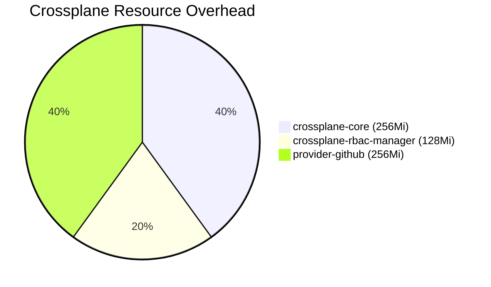
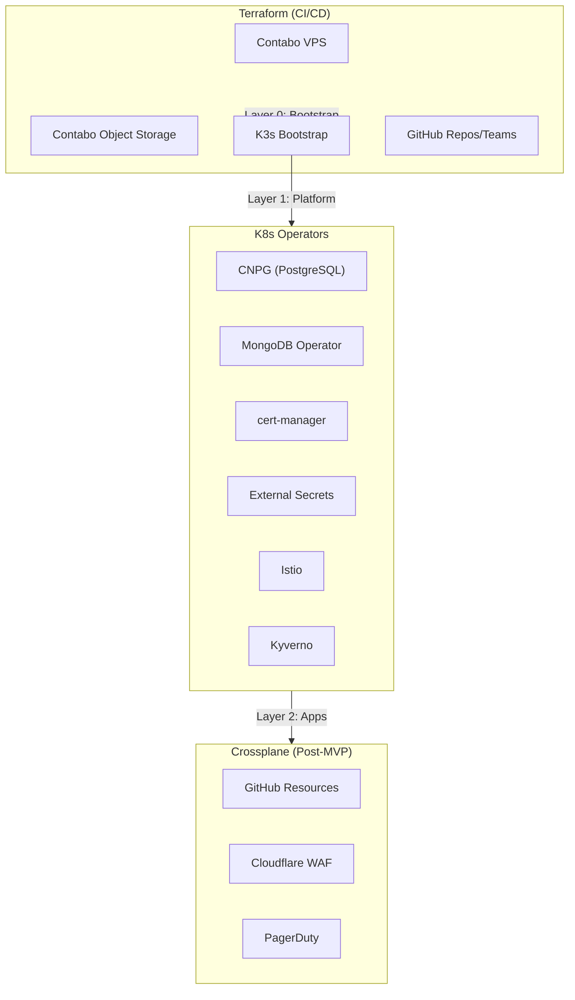

# ADR-038: Platform Engineering Tools

## Status
**Accepted**

## Date
2026-01-09

## Context

OpenOva is an enterprise platform with 20+ products, where each product team operates like an independent hosted customer. This requires platform engineering tools that enable:

- **Maximum team autonomy** - No waiting, no handovers, no tickets
- **Self-service infrastructure** - Teams can provision resources independently
- **Strict isolation** - Teams cannot access others' resources, configs, certs, domains

Key constraints:
- **MVP focus**: Claude is the only developer during MVP phase
- **Resource limits**: 24GB RAM total across 3 Contabo VPS nodes
- **Zero cost preference**: Minimize additional service costs
- **"Vibe coding" approach**: 100% AI-assisted development

Tools evaluated:
1. **Crossplane**: Kubernetes-native infrastructure provisioning
2. **Backstage**: Developer portal for service discovery
3. **Terraform**: Infrastructure as Code
4. **Kyverno**: Policy enforcement

## Decision

### Tool Selection Matrix

| Category | MVP Tool | Post-MVP | Rationale |
|----------|----------|----------|-----------|
| Developer Portal | None | Backstage | Claude is only developer for MVP |
| Infrastructure Provisioning | Terraform | Terraform | Contabo has no Crossplane provider |
| External Resources (GitHub) | Terraform | Crossplane | Add when self-service needed |
| K8s Resources | Native Operators | Native Operators | CNPG, MongoDB, cert-manager, etc. |
| Policy Enforcement | Kyverno | Kyverno | YAML-native, fits "vibe coding" |

### Crossplane Decision

**MVP Status:** Not required

**Rationale:**
- Contabo has no native Crossplane provider
- K8s operators (CNPG, MongoDB, cert-manager) already provide CRDs
- Terraform handles Contabo resources effectively
- Crossplane is for managing **external non-K8s resources**, not K8s-internal resources

**What Crossplane Does NOT Manage:**
- PostgreSQL clusters (CNPG operator handles this)
- MongoDB replica sets (MongoDB Community Operator)
- TLS certificates (cert-manager)
- MinIO tenants (MinIO operator)
- Dragonfly clusters (Dragonfly operator)

**Future Use Cases (Post-MVP):**
- GitHub repository/team management (provider-github)
- Cloudflare WAF rules (provider-cloudflare) - if added
- PagerDuty alerting (provider-pagerduty) - if added

**Resource Overhead (if added):**



| Component | Memory | CPU |
|-----------|--------|-----|
| crossplane-core | 256Mi | 100m |
| crossplane-rbac-manager | 128Mi | 50m |
| provider-github | 256Mi | 100m |
| **Total** | **~640Mi** | **~250m** |

### Backstage Decision

**MVP Status:** Not required

**Rationale:**
- Claude is the only developer during MVP
- Service discovery not a problem with single developer
- Resource overhead (~1-1.5GB) better used elsewhere

**Trigger Points for Adding Backstage:**
- "Who owns this?" asked >5x/week
- New developer onboarding takes >1 week
- Documentation complaints from non-developers
- 5+ products actively developed

**Resource Overhead (when added):**

| Component | Memory | CPU |
|-----------|--------|-----|
| backstage-backend | 512Mi-1Gi | 250m-500m |
| backstage-frontend | 256Mi | 100m |
| **Total** | **~1-1.5Gi** | **~350m-600m** |

### Tool Boundaries



| Layer | Tool | Scope |
|-------|------|-------|
| 0 - Bootstrap | Terraform | Contabo VPS, K3s, Object Storage, GitHub (MVP) |
| 1 - Platform | K8s Operators | Databases, TLS, Secrets, Service Mesh |
| 2 - External | Crossplane | GitHub (post-MVP), External SaaS |

## Consequences

### Positive

1. **Minimal overhead**: No unnecessary tools for MVP
2. **Clear boundaries**: Each tool has defined scope
3. **Future-ready**: Clear migration path to Crossplane/Backstage
4. **Resource efficient**: ~0MB for MVP (vs ~2GB if all tools deployed)
5. **Fits "vibe coding"**: YAML-native tools, no new languages

### Negative

1. **Manual GitHub management**: Terraform for GitHub repos (not self-service)
2. **No developer portal**: Service discovery via documentation only
3. **No unified control plane**: Multiple tools to learn

### Neutral

1. **Trigger-based adoption**: Add tools when pain points emerge
2. **Team-specific timing**: Different products may need tools at different times

## Implementation

### MVP Setup

```yaml
# No Crossplane installation
# No Backstage installation
# Terraform for all infrastructure
# K8s operators for in-cluster resources
```

### Post-MVP: Adding Crossplane

```bash
# When GitHub self-service is needed
helm repo add crossplane-stable https://charts.crossplane.io/stable
helm install crossplane crossplane-stable/crossplane \
  --namespace crossplane-system \
  --create-namespace

# Install GitHub provider
kubectl apply -f - <<EOF
apiVersion: pkg.crossplane.io/v1
kind: Provider
metadata:
  name: provider-github
spec:
  package: xpkg.upbound.io/upbound/provider-github:v0.8.0
EOF
```

### Post-MVP: Adding Backstage

```bash
# When developer portal is needed
npx @backstage/create-app@latest

# Configure with existing services
# Add to platform-gitops repo
```

## References

- [Crossplane Documentation](https://crossplane.io/docs/)
- [Backstage Documentation](https://backstage.io/docs/)
- [Terraform Contabo Provider](https://registry.terraform.io/providers/contabo/contabo/latest)
- [ADR-014: Contabo VPS Infrastructure](/docs/09-adrs/ADR-014-CONTABO-VPS-INFRASTRUCTURE.md)
- [ADR-016: Flux GitOps](/docs/09-adrs/ADR-016-FLUX-GITOPS.md)
- [PROJECT_CONTEXT.md](/docs/PROJECT_CONTEXT.md)

---

*ADR Version: 1.0*
*Last Updated: 2026-01-09*
