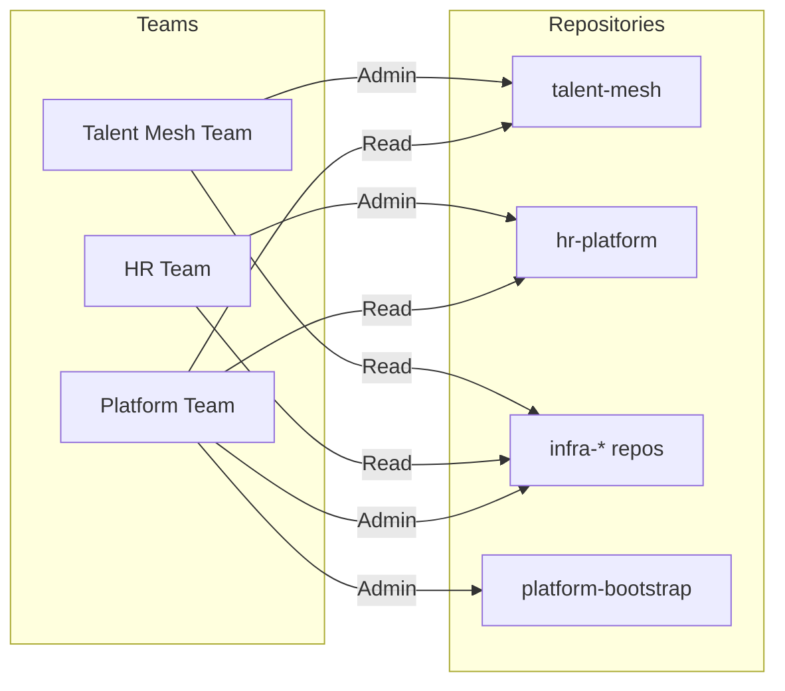

# ADR-040: Repository Structure for Enterprise Multi-Product Platform

## Status
**Accepted**

## Date
2026-01-09

## Context

OpenOva is an enterprise platform with 20+ products, where each product team operates like an independent hosted customer. This requires a repository structure that enables:

- **Maximum team autonomy** - No waiting, no handovers, no tickets
- **Component as application** - Shared infrastructure treated as independent apps
- **Clear ownership** - Every repo has defined team ownership
- **Strict isolation** - Teams cannot access others' resources

Key constraints:
- **MVP focus**: Claude is the only developer during MVP phase
- **Future-ready**: Structure must scale to multiple teams
- **GitOps compatible**: Works with Flux folder-per-environment pattern

## Decision

We will use a **product-centric repository structure** with shared infrastructure as independent component repos.

### Repository Categories

```mermaid
flowchart TB
    subgraph product_repos["Product Repositories (Team-Owned)"]
        tm["talent-mesh<br/>(Talent Mesh Team)"]
        hr["hr-platform<br/>(HR Team)"]
        fi["finance-hub<br/>(Finance Team)"]
    end

    subgraph infra_repos["Infrastructure Component Repos (Platform Team)"]
        istio["infra-istio"]
        cnpg["infra-cnpg"]
        mongo["infra-mongodb"]
        dragonfly["infra-dragonfly"]
        minio["infra-minio"]
        redpanda["infra-redpanda"]
        flux["infra-flux"]
        eso["infra-external-secrets"]
        certmgr["infra-cert-manager"]
        kyverno["infra-kyverno"]
        cilium["infra-cilium"]
        infisical["infra-infisical"]
        grafana["infra-grafana-stack"]
    end

    subgraph platform_repos["Platform Repositories"]
        bootstrap["platform-bootstrap<br/>(Terraform IaC)"]
        docs["platform-docs<br/>(Central Documentation)"]
    end

    bootstrap -->|"Provisions"| istio & cnpg & mongo
    tm & hr & fi -->|"Depends on"| istio & cnpg & mongo
```



### Repository Ownership Matrix

| Repository | Owner | Purpose |
|------------|-------|---------|
| `talent-mesh` | Talent Mesh Team | Product application code + GitOps |
| `hr-platform` | HR Team | Product application code + GitOps |
| `finance-hub` | Finance Team | Product application code + GitOps |
| `infra-istio` | Platform Team | Istio service mesh configuration |
| `infra-cnpg` | Platform Team | PostgreSQL operator + clusters |
| `infra-mongodb` | Platform Team | MongoDB operator + replica sets |
| `infra-dragonfly` | Platform Team | Dragonfly cache clusters |
| `infra-minio` | Platform Team | MinIO object storage |
| `infra-redpanda` | Platform Team | Redpanda event streaming |
| `infra-flux` | Platform Team | Flux controllers + bootstrap |
| `infra-external-secrets` | Platform Team | ESO operator + stores |
| `infra-cert-manager` | Platform Team | Certificate management |
| `infra-kyverno` | Platform Team | Policy engine |
| `infra-cilium` | Platform Team | CNI + network policies |
| `infra-infisical` | Platform Team | Secrets management UI |
| `infra-grafana-stack` | Platform Team | LGTM observability stack |
| `platform-bootstrap` | Platform Team | Terraform IaC for nodes/clusters |
| `platform-docs` | Platform Team | Central documentation hub |

### Product Repository Structure

Each product repo follows the folder-per-environment pattern:

```
talent-mesh/
├── README.md
├── CODEOWNERS                    # Path-based approval rules
├── .github/
│   ├── workflows/
│   │   ├── ci.yaml               # Build, test, scan
│   │   ├── cd-dev.yaml           # Auto-deploy to dev
│   │   ├── cd-staging.yaml       # Deploy to staging (1 approval)
│   │   └── cd-prod.yaml          # Deploy to prod (2 approvals)
│   └── CODEOWNERS                # GitHub CODEOWNERS file
├── src/                          # Application source code
│   ├── services/
│   │   ├── auth-service/
│   │   ├── user-service/
│   │   └── assessment-service/
│   └── frontend/
├── deploy/                       # GitOps manifests
│   ├── base/                     # Kustomize base (shared)
│   │   ├── kustomization.yaml
│   │   ├── namespace.yaml
│   │   ├── deployment.yaml
│   │   ├── service.yaml
│   │   └── configmap.yaml
│   └── envs/                     # Environment overlays
│       ├── dev/
│       │   ├── kustomization.yaml
│       │   └── patches/
│       ├── staging/
│       │   ├── kustomization.yaml
│       │   └── patches/
│       └── prod/
│           ├── kustomization.yaml
│           └── patches/
├── helm/                         # Helm charts (if used)
└── tests/
    ├── unit/
    ├── integration/
    └── e2e/
```

### Infrastructure Component Repository Structure

Each infrastructure component follows the same pattern:

```
infra-istio/
├── README.md
├── CODEOWNERS
├── .github/
│   └── workflows/
│       ├── ci.yaml
│       └── cd.yaml
├── deploy/
│   ├── base/
│   │   ├── kustomization.yaml
│   │   ├── namespace.yaml
│   │   ├── istio-operator.yaml
│   │   └── gateway.yaml
│   └── envs/
│       ├── dev/
│       ├── staging/
│       └── prod/
└── tests/
    └── smoke/
```

### CODEOWNERS Configuration

```gitignore
# CODEOWNERS for talent-mesh repo

# Base changes = same as prod (2 prod approvers required)
/deploy/base/           @openova/prod-approvers

# Dev - team self-approve
/deploy/envs/dev/       @openova/talent-mesh-team

# Staging - QA approval
/deploy/envs/staging/   @openova/qa-approvers

# Prod - 2 prod approvers
/deploy/envs/prod/      @openova/prod-approvers

# Source code - team owns
/src/                   @openova/talent-mesh-team

# CI/CD workflows - platform review
/.github/workflows/     @openova/platform-team
```

### Team Access Model



## Consequences

### Positive

1. **Team autonomy**: Each product team owns their repo completely
2. **Clear boundaries**: Infrastructure components are isolated
3. **Scalable**: Adding new products = new repo, no changes elsewhere
4. **GitOps ready**: Each repo has its own Flux sync
5. **Audit trail**: Changes per repo, per team
6. **Component independence**: infra-istio can be updated without affecting infra-mongodb

### Negative

1. **Repo proliferation**: 15-20 repos for infrastructure components
2. **Cross-repo changes**: Coordinated updates need planning
3. **Discovery overhead**: Developers need to know which repo to look in

### Mitigations

- **platform-docs** as central documentation hub
- **Backstage** (post-MVP) for service catalog and discovery
- GitHub Organization-level search
- Consistent naming conventions (infra-*, product-name)

## Implementation

### MVP Repositories

For MVP (Claude as only developer), minimal repo set:

```
Repos to create:
├── talent-mesh           # Product code + GitOps
├── platform-bootstrap    # Terraform for Contabo/K3s
└── platform-docs         # This documentation

Infrastructure deployed inline initially,
split to separate repos when team grows.
```

### Post-MVP Transition

When team grows beyond 3 developers:

```bash
# Extract infrastructure components to separate repos
git filter-branch --subdirectory-filter k8s/infrastructure/istio -- infra-istio
git filter-branch --subdirectory-filter k8s/infrastructure/databases -- infra-cnpg

# Update Flux to sync from new repos
flux create source git infra-istio \
  --url=https://github.com/openova/infra-istio \
  --branch=main
```

## References

- [ADR-016: Flux GitOps](/docs/09-adrs/ADR-016-FLUX-GITOPS.md)
- [ADR-041: GitOps Release Management](/docs/09-adrs/ADR-041-GITOPS-RELEASE-MANAGEMENT.md)
- [ADR-038: Platform Engineering Tools](/docs/09-adrs/ADR-038-PLATFORM-ENGINEERING-TOOLS.md)
- [GitHub CODEOWNERS](https://docs.github.com/en/repositories/managing-your-repositorys-settings-and-features/customizing-your-repository/about-code-owners)

---

*ADR Version: 1.0*
*Last Updated: 2026-01-09*
