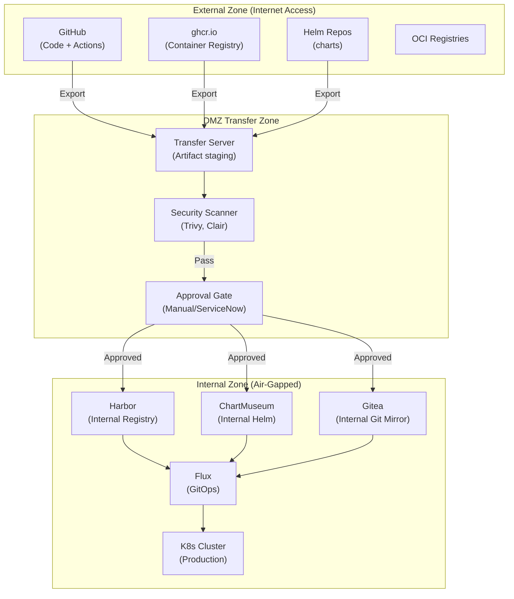
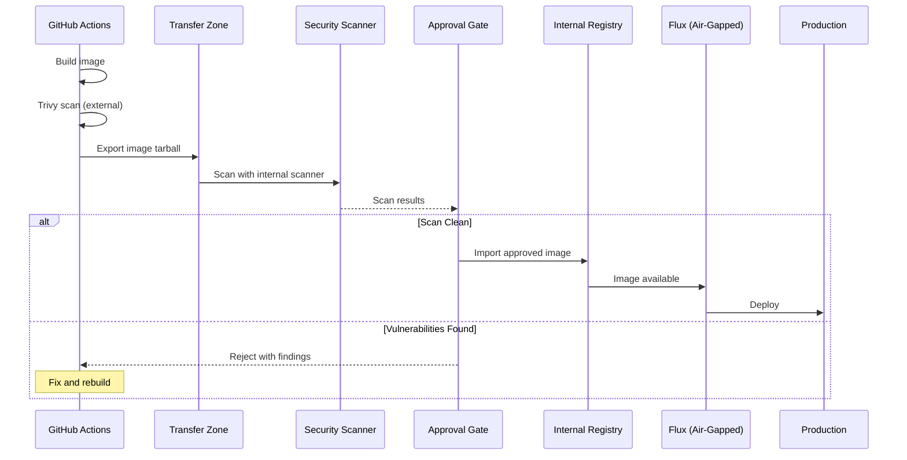

# ADR-043: Air-Gap Compliance for Regulated Environments

## Status
**Accepted**

## Date
2026-01-09 (Updated: 2026-01-12)

## Context

OpenOva targets enterprise customers including banks and financial institutions that require air-gapped deployments. This means:

- **No direct internet access** from production clusters
- **Strict network isolation** between zones
- **Auditable artifact transfer** between external and internal environments
- **Compliance with regulations** (PCI-DSS, SOC 2, banking regulators)

Key requirements:
- Production clusters cannot pull from public registries (ghcr.io, docker.io)
- All artifacts must be scanned and approved before entering production
- Full audit trail of what enters the environment
- Support for both connected (dev/staging) and air-gapped (prod) deployments

## Decision

We will implement a **DMZ Transfer Zone architecture** with internal mirrors for air-gapped production deployments.

### Architecture



### Zone Definitions

| Zone | Network Access | Purpose |
|------|----------------|---------|
| External | Full internet | CI/CD, development, public registry access |
| DMZ | Limited (transfer only) | Artifact staging, scanning, approval |
| Internal | No internet | Production workloads, air-gapped |

### Artifact Transfer Process



### Export/Import Scripts

```bash
#!/bin/bash
# scripts/export-for-airgap.sh
# Run in CI (external zone)

set -euo pipefail

IMAGE="ghcr.io/openova-io/<tenant>:v1.2.3"
EXPORT_DIR="/transfer/images"

# Pull and save image
docker pull $IMAGE
docker save $IMAGE | gzip > $EXPORT_DIR/<tenant>-v1.2.3.tar.gz

# Generate SBOM
syft $IMAGE -o spdx-json > $EXPORT_DIR/<tenant>-v1.2.3.sbom.json

# Generate checksums
sha256sum $EXPORT_DIR/<tenant>-v1.2.3.* > $EXPORT_DIR/<tenant>-v1.2.3.checksums

# Sign with cosign
cosign sign-blob --key cosign.key $EXPORT_DIR/<tenant>-v1.2.3.tar.gz
```

```bash
#!/bin/bash
# scripts/import-from-airgap.sh
# Run in internal zone after approval

set -euo pipefail

IMPORT_DIR="/transfer/images"
VERSION="v1.2.3"

# Verify checksums
cd $IMPORT_DIR
sha256sum -c <tenant>-$VERSION.checksums

# Verify signature
cosign verify-blob --key cosign.pub <tenant>-$VERSION.tar.gz

# Load into internal registry
docker load < <tenant>-$VERSION.tar.gz
docker tag ghcr.io/openova-io/<tenant>:$VERSION harbor.internal/openova-io/<tenant>:$VERSION
docker push harbor.internal/openova-io/<tenant>:$VERSION
```

### Internal Mirror Components

#### Harbor (Internal Container Registry)

```yaml
# k8s/infrastructure/harbor/values.yaml
expose:
  type: clusterIP
  tls:
    enabled: true
    certSource: secret
    secret:
      secretName: harbor-tls
externalURL: https://harbor.internal.openova.io
persistence:
  enabled: true
  persistentVolumeClaim:
    registry:
      size: 100Gi
trivy:
  enabled: true  # Internal scanning
notary:
  enabled: true  # Image signing
```

#### Gitea (Internal Git Mirror)

```yaml
# k8s/infrastructure/gitea/values.yaml
gitea:
  admin:
    username: gitea_admin
  config:
    repository:
      ENABLE_PUSH_CREATE_USER: false
      DISABLE_HTTP_GIT: false
    mirror:
      ENABLED: true
      DISABLE_NEW_PUSH: true  # Read-only mirrors
persistence:
  enabled: true
  size: 50Gi
```

#### ChartMuseum (Internal Helm Repository)

```yaml
# k8s/infrastructure/chartmuseum/values.yaml
env:
  open:
    DISABLE_API: false
    STORAGE: local
persistence:
  enabled: true
  size: 20Gi
```

### Flux Configuration for Air-Gapped

```yaml
# External cluster (dev/staging) - uses public registries
apiVersion: source.toolkit.fluxcd.io/v1
kind: HelmRepository
metadata:
  name: istio
  namespace: flux-system
spec:
  interval: 1h
  url: https://istio-release.storage.googleapis.com/charts

---
# Air-gapped cluster (prod) - uses internal mirrors
apiVersion: source.toolkit.fluxcd.io/v1
kind: HelmRepository
metadata:
  name: istio
  namespace: flux-system
spec:
  interval: 1h
  url: https://chartmuseum.internal.openova.io/charts/istio

---
# Git source - internal Gitea mirror
apiVersion: source.toolkit.fluxcd.io/v1
kind: GitRepository
metadata:
  name: talent-mesh
  namespace: flux-system
spec:
  interval: 5m
  url: https://gitea.internal.openova.io/openova-io/<tenant>
  ref:
    branch: main
```

### Image Pull Configuration

```yaml
# Air-gapped deployments use internal Harbor
apiVersion: apps/v1
kind: Deployment
metadata:
  name: talent-mesh
spec:
  template:
    spec:
      imagePullSecrets:
        - name: harbor-pull-secret
      containers:
        - name: app
          # Internal registry reference
          image: harbor.internal.openova.io/openova/<tenant>:v1.2.3
```

### Kustomize Overlay for Air-Gap

```yaml
# deploy/envs/prod-airgap/kustomization.yaml
apiVersion: kustomize.config.k8s.io/v1beta1
kind: Kustomization
resources:
  - ../prod
images:
  # Rewrite all images to internal registry
  - name: ghcr.io/openova-io/<tenant>
    newName: harbor.internal.openova.io/openova-io/<tenant>
  - name: ghcr.io/openova-io/<tenant>-auth
    newName: harbor.internal.openova.io/openova-io/<tenant>-auth
patches:
  - patch: |
      - op: add
        path: /spec/template/spec/imagePullSecrets
        value:
          - name: harbor-pull-secret
    target:
      kind: Deployment
```

### Network Policies for Air-Gap

```yaml
# Deny all egress by default in air-gapped namespace
apiVersion: cilium.io/v2
kind: CiliumNetworkPolicy
metadata:
  name: deny-external-egress
  namespace: <tenant>-prod
spec:
  endpointSelector: {}
  egress:
    # Only allow internal cluster communication
    - toEndpoints:
        - matchLabels:
            k8s:io.kubernetes.pod.namespace: kube-system
    - toEndpoints:
        - matchLabels:
            k8s:io.kubernetes.pod.namespace: databases
    # Allow internal Harbor
    - toFQDNs:
        - matchName: harbor.internal.openova.io
    # Block all external
    - toCIDRSet:
        - cidr: 0.0.0.0/0
          except:
            - 10.0.0.0/8
            - 172.16.0.0/12
            - 192.168.0.0/16
```

### Compliance Requirements Mapping

| Requirement | Implementation |
|-------------|----------------|
| PCI-DSS 6.5 | Trivy scanning before import |
| PCI-DSS 10.5 | Audit logs in Harbor/Gitea |
| SOC 2 CC6.1 | Network isolation via Cilium |
| SOC 2 CC7.2 | Approval gates in DMZ |
| Banking Reg | No internet from prod zone |

## Consequences

### Positive

1. **Regulatory compliance**: Meets air-gap requirements for banks
2. **Security**: Multiple scan points (external CI, DMZ, internal Harbor)
3. **Audit trail**: Full history of artifacts entering internal zone
4. **Flexibility**: Same codebase works for connected and air-gapped
5. **Supply chain security**: Signed artifacts with SBOM

### Negative

1. **Additional infrastructure**: Harbor, Gitea, ChartMuseum in internal zone
2. **Operational overhead**: Manual/semi-manual transfer process
3. **Deployment latency**: Air-gap adds time to production deployments
4. **Resource cost**: ~3GB additional memory for internal mirrors

### Neutral

1. **Hybrid approach**: Dev/staging stay connected, only prod air-gapped
2. **Customer choice**: Air-gap is optional, customers choose deployment model

## Implementation

### Phase 1: MVP (Connected)

```
No air-gap for MVP:
- All clusters pull from ghcr.io
- Trivy scanning in GitHub Actions only
- Standard Flux GitOps from github.com
```

### Phase 2: Air-Gap Ready

```
When first bank customer onboards:
1. Deploy Harbor in internal zone
2. Deploy Gitea as git mirror
3. Deploy ChartMuseum
4. Create transfer scripts
5. Configure Flux for internal sources
6. Test full air-gap workflow
```

### Air-Gap Deployment Checklist

```markdown
## Air-Gap Deployment Checklist

### Pre-Deployment
- [ ] Image tarball exported and signed
- [ ] SBOM generated
- [ ] Checksums calculated
- [ ] Internal scan passed
- [ ] Approval obtained

### Import
- [ ] Checksums verified
- [ ] Signatures verified
- [ ] Image imported to Harbor
- [ ] Harbor internal scan passed
- [ ] Image tag matches expected version

### Deployment
- [ ] Flux Kustomization updated
- [ ] Flux reconciliation triggered
- [ ] Pods running with new image
- [ ] Health checks passing
- [ ] Smoke tests passed
```

## References

- [Harbor Installation](https://goharbor.io/docs/2.9.0/install-config/)
- [Gitea Installation](https://docs.gitea.io/en-us/install-on-kubernetes/)
- [Flux Air-Gapped Installations](https://fluxcd.io/docs/installation/#air-gapped-environments)
- [Cosign Signing](https://docs.sigstore.dev/cosign/overview/)
- [Syft SBOM](https://github.com/anchore/syft)
- [ADR-019: Trivy CI/CD Scanning](/docs/09-adrs/ADR-019-TRIVY-CICD-SCANNING.md)
- [ADR-041: GitOps Release Management](/docs/09-adrs/ADR-041-GITOPS-RELEASE-MANAGEMENT.md)

---

*ADR Version: 1.0*
*Last Updated: 2026-01-09*
