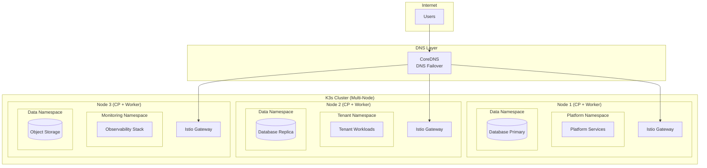
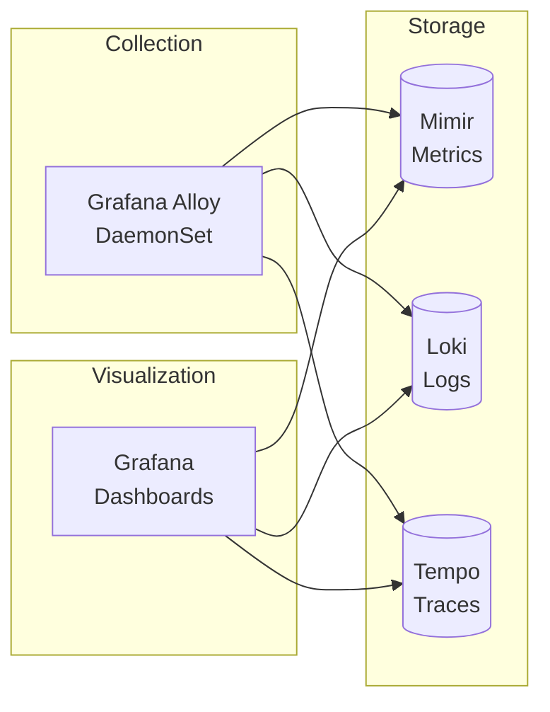

# OpenOva Platform Deployment Architecture

## Overview

This document defines the deployment architecture for the OpenOva platform, featuring a **multi-node K3s cluster** with GitOps-based deployment. OpenOva provides infrastructure services for tenant applications.

---

## Architecture Philosophy

### Unified K8s Platform

OpenOva provides a shared Kubernetes platform with:

| Layer | Responsibility | Examples |
|-------|----------------|----------|
| **Infrastructure** | Compute, storage, networking | VPS nodes, block storage, public IPs |
| **Platform Services** | Shared services for tenants | LLM Gateway, observability, secrets management |
| **Tenant Workloads** | Application deployments | Tenant-specific services and databases |

---

## Cluster Architecture

### Node Topology



---

## Namespace Strategy

| Namespace | Purpose | Owner |
|-----------|---------|-------|
| `kube-system` | K3s system components | Platform |
| `istio-system` | Service mesh + ingress | Platform |
| `flux-system` | GitOps controllers | Platform |
| `platform-services` | Shared platform services (LLM Gateway, etc.) | Platform |
| `monitoring` | Observability stack (Grafana, Mimir, Loki, Tempo) | Platform |
| `cert-manager` | Certificate management | Platform |
| `external-secrets` | Secrets management | Platform |
| `databases` | Shared database operators (CNPG, MongoDB) | Platform |
| `<tenant>-*` | Tenant-specific namespaces | Tenant |

---

## Platform Services

### Shared Services Provided to Tenants

| Service | Namespace | Endpoint | Purpose |
|---------|-----------|----------|---------|
| LLM Gateway | `platform-services` | `llm-gateway.platform-services:5005` | OpenAI-compatible LLM API |
| Grafana | `monitoring` | `grafana.monitoring:3000` | Dashboards and alerting |
| Loki | `monitoring` | `loki.monitoring:3100` | Log aggregation |
| Mimir | `monitoring` | `mimir.monitoring:9009` | Metrics storage |

### Service Discovery

Tenants access platform services via Kubernetes DNS:

```
<service>.<namespace>.svc.cluster.local
```

Example:
```
llm-gateway.platform-services.svc.cluster.local:5005
```

---

## GitOps Deployment Model

### Flux CD Structure

```
flux/
├── clusters/
│   └── production/
│       ├── flux-system/          # Flux controllers
│       ├── infrastructure/       # Platform infrastructure
│       │   ├── cert-manager/
│       │   ├── external-secrets/
│       │   ├── istio/
│       │   └── monitoring/
│       └── tenants/              # Tenant workloads
│           └── <tenant>/
├── infrastructure/
│   ├── base/                     # Shared Kustomize bases
│   └── overlays/
│       ├── dev/
│       ├── staging/
│       └── production/
└── tenants/
    └── <tenant>/
        └── kustomization.yaml    # Points to tenant repo
```

### Tenant Onboarding

```yaml
# flux/clusters/production/tenants/<tenant>/kustomization.yaml
apiVersion: kustomize.toolkit.fluxcd.io/v1
kind: Kustomization
metadata:
  name: <tenant>
  namespace: flux-system
spec:
  interval: 5m
  sourceRef:
    kind: GitRepository
    name: <tenant>-repo
  path: ./deploy/envs/production
  prune: true
  targetNamespace: <tenant>
```

---

## Network Architecture

### Istio Service Mesh

```yaml
apiVersion: networking.istio.io/v1beta1
kind: Gateway
metadata:
  name: platform-gateway
  namespace: istio-system
spec:
  selector:
    istio: ingressgateway
  servers:
    - port:
        number: 443
        name: https
        protocol: HTTPS
      tls:
        mode: SIMPLE
        credentialName: platform-tls
      hosts:
        - "*.openova.io"
```

### DNS Failover

OpenOva provides DNS-based failover for high availability:

- Health Orchestrator monitors node health
- CoreDNS DaemonSet updates DNS records
- Unhealthy nodes removed from rotation

See [DNS Failover Specification](../technical/DNS_FAILOVER_SPEC.md) for details.

---

## Resource Management

### Tenant Resource Quotas

```yaml
apiVersion: v1
kind: ResourceQuota
metadata:
  name: tenant-quota
  namespace: <tenant>
spec:
  hard:
    requests.cpu: "4"
    requests.memory: 8Gi
    limits.cpu: "8"
    limits.memory: 16Gi
    persistentvolumeclaims: "10"
```

### Platform Reserved Resources

| Component | CPU Request | Memory Request |
|-----------|-------------|----------------|
| Istio control plane | 500m | 1Gi |
| Flux controllers | 200m | 256Mi |
| Monitoring stack | 1000m | 4Gi |
| Platform services | 500m | 1Gi |
| **Total Reserved** | **2200m** | **6.25Gi** |

---

## Scaling Model

### Horizontal Scaling

Add nodes to increase capacity:

| Nodes | Total Resources | Tenant Capacity |
|-------|-----------------|-----------------|
| 3 (minimum) | 12 vCPU, 24GB RAM | 2-3 tenants (small) |
| 5 | 20 vCPU, 40GB RAM | 5-6 tenants (small) |
| 10 | 40 vCPU, 80GB RAM | 10+ tenants |

### Vertical Scaling

Upgrade node sizes for larger workloads.

---

## Observability

### Monitoring Stack



### Tenant Observability

Tenants access their metrics via:
- Grafana dashboards (filtered by namespace)
- PromQL queries scoped to tenant labels
- Log queries filtered by namespace

---

## Security

### Network Policies

```yaml
apiVersion: cilium.io/v2
kind: CiliumNetworkPolicy
metadata:
  name: tenant-isolation
  namespace: <tenant>
spec:
  endpointSelector: {}
  ingress:
    - fromEndpoints:
        - matchLabels:
            k8s:io.kubernetes.pod.namespace: <tenant>
    - fromEndpoints:
        - matchLabels:
            k8s:io.kubernetes.pod.namespace: istio-system
```

### Secrets Management

- External Secrets Operator syncs from Infisical/Vault
- SOPS encryption for GitOps secrets
- Tenant secrets isolated by namespace

---

## Backup & Recovery

### Backup Components

| Component | Method | Frequency | Retention |
|-----------|--------|-----------|-----------|
| etcd | Velero | Daily | 30 days |
| Databases | Operator snapshots | Continuous | Per policy |
| Object Storage | Cross-region replication | Continuous | Per bucket |

### Recovery Time Objectives

| Scenario | RTO | RPO |
|----------|-----|-----|
| Pod failure | < 1 min | 0 |
| Node failure | < 5 min | 0 |
| Cluster failure | < 1 hour | < 5 min |

---

## Compliance

### Workload Requirements (Kyverno-Enforced)

All tenant deployments must include:

- Resource requests and limits
- Pod Disruption Budgets
- Topology spread constraints
- Health probes
- Security contexts

Non-compliant deployments are rejected at admission.

See [Kyverno Policy Engine](../adrs/ADR-032-KYVERNO-POLICY-ENGINE.md) for policies.

---

## References

- [DNS Failover Specification](../technical/DNS_FAILOVER_SPEC.md)
- [ADR-016: Flux GitOps](../../flux/docs/ADR-016-FLUX-GITOPS.md)
- [ADR-025: Cilium CNI](../../cilium/docs/ADR-025-CNI-CILIUM-EBPF.md)
- [ADR-031: Pod Security](../../kyverno/docs/ADR-031-POD-SECURITY-NETWORK-POLICIES.md)

---

*Document Version: 5.0*
*Last Updated: 2026-01-12*
*Owner: Platform Team*
