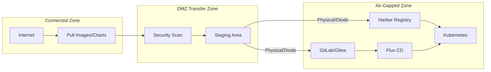
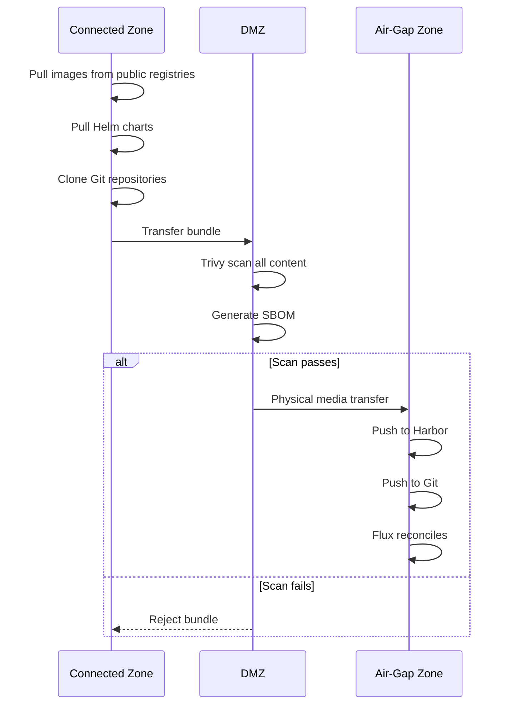

# ADR: Air-Gap Compliance

**Status:** Accepted (Future Enhancement)
**Date:** 2024-11-01
**Updated:** 2026-01-16

## Context

Regulated industries require air-gapped deployments with no internet connectivity:
- Financial services (PCI-DSS, SOX)
- Government (FedRAMP, NIST)
- Defense (IL4/IL5)
- Healthcare (HIPAA)

## Decision

Define air-gap architecture leveraging mandatory components:

| Component | Purpose | Status |
|-----------|---------|--------|
| Harbor | Container registry | ✅ Mandatory |
| GitLab Self-Hosted | Git repository | Option |
| MinIO | Object storage | ✅ Mandatory |
| Velero | Backup/restore | ✅ Mandatory |

## Architecture

## Transfer Procedure

## Content Transfer

| Content Type | Source | Air-Gap Destination |
|--------------|--------|---------------------|
| Container images | Public registries | Harbor |
| Helm charts | Public repos | Harbor ChartMuseum |
| Git repositories | GitHub/GitLab | Self-hosted Git |
| OS packages | Package repos | Local mirror |

## Git Provider Options (Air-Gap)

| Option | Resource Usage | Features |
|--------|----------------|----------|
| GitLab Self-Hosted | High (~4GB) | Full CI/CD |
| Gitea | Low (~256MB) | Basic Git |

## Prerequisites

All mandatory components support air-gap:

- ✅ Harbor - local registry with replication
- ✅ MinIO - local object storage
- ✅ Flux - reconciles from local Git
- ✅ Velero - backups to local MinIO
- ✅ Grafana Stack - self-contained observability

## Implementation Status

| Phase | Status |
|-------|--------|
| Architecture design | ✅ Complete |
| Component selection | ✅ Complete |
| Transfer automation | 🔜 Future |
| Documentation | 🔜 Future |

## Consequences

**Positive:**
- Access to regulated industries
- Premium pricing opportunity
- Strong security posture
- No external dependencies

**Negative:**
- Update lag (manual transfers)
- Additional infrastructure in DMZ
- Operational complexity
- Transfer automation required

## Related

- [ADR-IMAGE-REGISTRY](./ADR-IMAGE-REGISTRY.md)
- [ADR-SECURITY-SCANNING](./ADR-SECURITY-SCANNING.md)
