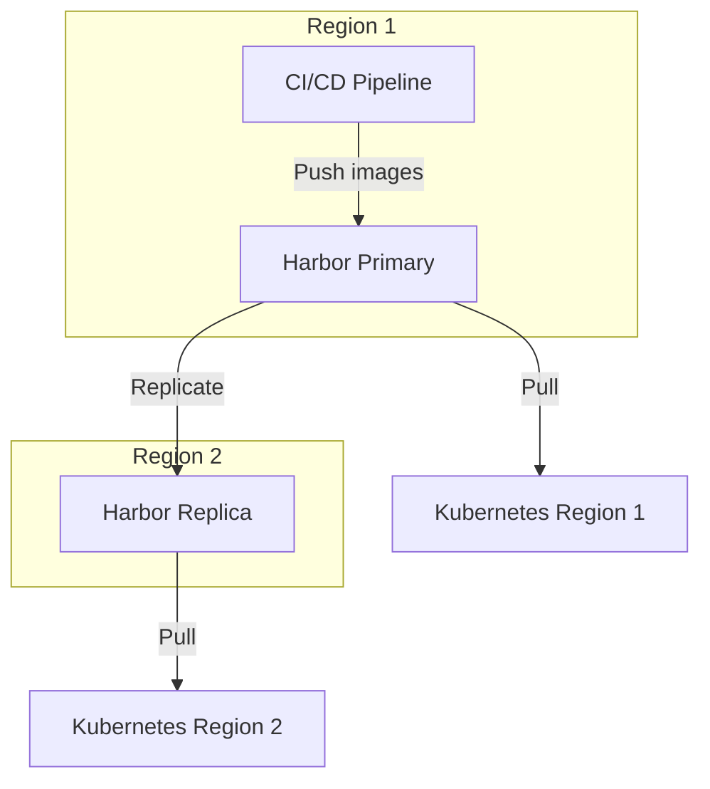
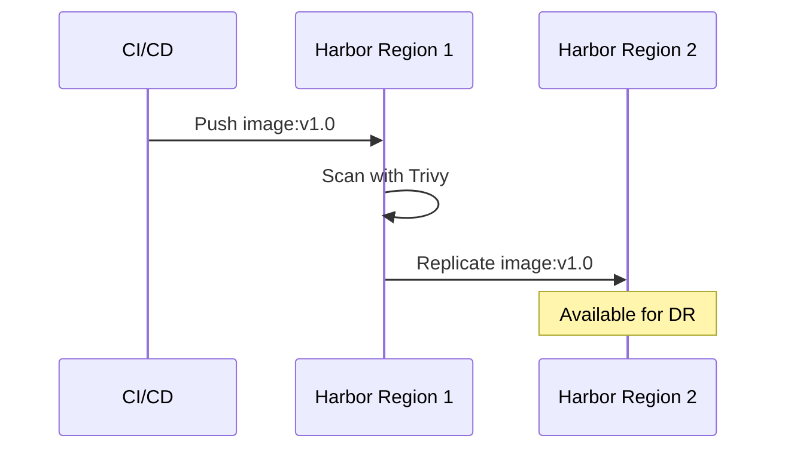

# ADR: Image Registry - Harbor

**Status:** Accepted
**Date:** 2024-06-01
**Updated:** 2026-01-16

## Context

Container images require a registry for:
- Secure storage and distribution
- Vulnerability scanning
- Multi-region replication for DR
- Air-gap deployments
- Access control and audit

## Decision

**Harbor is mandatory** as the container registry for all OpenOva deployments.

## Rationale

| Requirement | Harbor | External Registry (ghcr.io) |
|-------------|--------|----------------------------|
| Multi-region replication | ✅ Built-in | ❌ |
| Vulnerability scanning | ✅ Trivy integrated | ⚠️ Depends on provider |
| Air-gap support | ✅ Self-hosted | ❌ |
| RBAC | ✅ Full control | ⚠️ Provider-specific |
| Audit logging | ✅ Complete | ⚠️ Limited |
| No external dependency | ✅ | ❌ |

## Architecture

## Features Used

| Feature | Purpose |
|---------|---------|
| Registry replication | Cross-region image sync for DR |
| Trivy scanning | Vulnerability detection |
| Robot accounts | CI/CD authentication |
| Project quotas | Resource management |
| Audit logs | Compliance and security |

## Multi-Region Replication

Harbor supports push and pull-based replication:

**Replication modes:**
- **Push-based**: Primary pushes to replicas (default)
- **Pull-based**: Replicas pull from primary
- **Bidirectional**: Both push and pull (active-active)

## Resource Requirements

| Component | CPU | Memory |
|-----------|-----|--------|
| Harbor Core | 0.5 | 512Mi |
| Registry | 0.5 | 512Mi |
| Database (PostgreSQL) | 0.5 | 512Mi |
| Redis | 0.25 | 256Mi |
| Trivy | 0.5 | 1Gi |
| **Total** | **2.25** | **2.75Gi** |

## Consequences

**Positive:**
- Complete control over image lifecycle
- Built-in vulnerability scanning
- Multi-region replication for DR
- Air-gap ready
- Audit trail for compliance

**Negative:**
- Resource overhead (~3GB RAM)
- Operational responsibility
- Backup requirements (handled by Velero)

## Related

- [ADR-SECURITY-SCANNING](./ADR-SECURITY-SCANNING.md)
- [ADR-MULTI-REGION-STRATEGY](./ADR-MULTI-REGION-STRATEGY.md)
