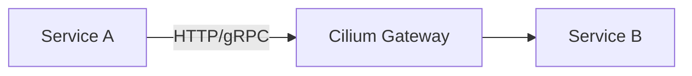
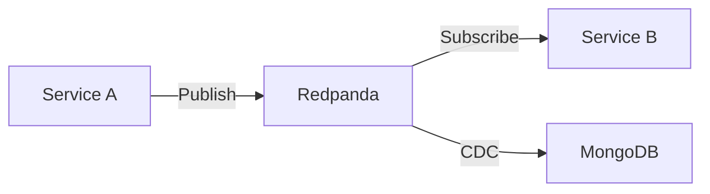

# ADR: Microservices Architecture

**Status:** Accepted
**Date:** 2024-01-01
**Updated:** 2026-01-17

## Context

The OpenOva platform needs to support multiple tenant applications with varying requirements.

## Decision

Adopt a microservices architecture with domain-driven design, API-first approach, and event-driven communication.

## Rationale

- **Multi-tenant Requirements** - Different tenants need different service configurations
- **Team Scalability** - Independent teams can own individual services
- **Technology Flexibility** - Different services can use different languages/frameworks
- **Fault Isolation** - Service failures don't cascade to entire platform

## Alternatives Considered

| Alternative | Why Rejected |
|-------------|--------------|
| Monolith | Limited scalability, coupling |
| Serverless | Cold starts, vendor lock-in |

## Service Communication

### Synchronous (HTTP/gRPC)

- **Gateway API** (HTTPRoute) for ingress
- **Cilium Service Mesh** for mTLS and L7 policies
- **CiliumEnvoyConfig** for circuit breakers

### Asynchronous (Events)

- **Redpanda** for event streaming
- **Debezium** for CDC (Change Data Capture)

## Observability

| Component | Purpose |
|-----------|---------|
| Hubble | Network observability (Cilium) |
| OpenTelemetry | Distributed tracing (independent of mesh) |
| Grafana Alloy | Telemetry collection |
| Loki/Mimir/Tempo | Logs, metrics, traces |

**Key Finding:** OpenTelemetry auto-instrumentation works independently of the service mesh, providing full distributed tracing without sidecar proxies.

## Resilience

| Pattern | Implementation |
|---------|---------------|
| Circuit Breaker | CiliumEnvoyConfig |
| Retries | HTTPRoute (Gateway API) |
| Timeouts | CiliumEnvoyConfig |
| mTLS | Cilium WireGuard |

## Consequences

**Positive:** Independent deployment, technology diversity, fault isolation
**Negative:** Operational complexity, network latency, distributed tracing required

## Mitigations

- Cilium Service Mesh for inter-service communication (unified CNI + mesh)
- Grafana LGTM stack for unified observability
- OpenTelemetry for distributed tracing

## Related

- [ADR-CILIUM-SERVICE-MESH](../../cilium/docs/ADR-CILIUM-SERVICE-MESH.md)
- [ADR-OPERATIONAL-RESILIENCE](./ADR-OPERATIONAL-RESILIENCE.md)
- [SPEC-PLATFORM-TECH-STACK](../specs/SPEC-PLATFORM-TECH-STACK.md)
