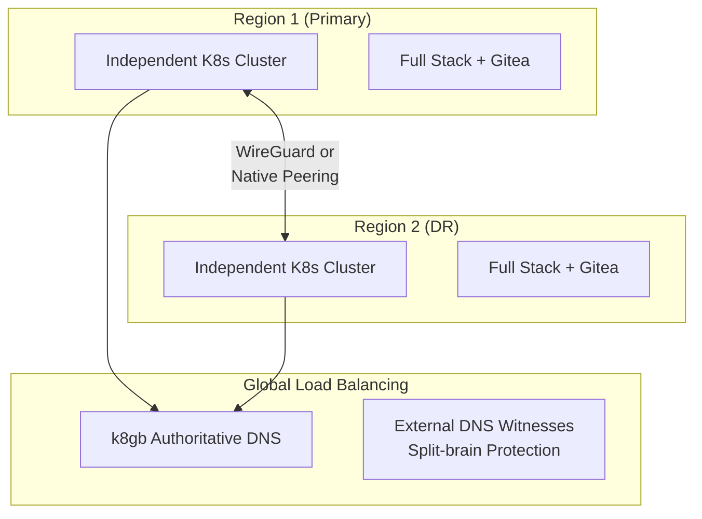

# ADR: Multi-Region Strategy

**Status:** Accepted
**Date:** 2024-09-01
**Updated:** 2026-01-17

## Context

Enterprise deployments require multi-region capability for:
- Business Continuity Planning (BCP)
- Disaster Recovery (DR)
- Latency optimization for global users
- Regulatory compliance (data sovereignty)

## Decision

**Multi-region is strongly recommended** - 2 independent clusters across regions provides true disaster recovery. Single-region deployments are supported but lack BCP/DR capability.

### Architecture: Independent Clusters (NOT Stretched)



**Key Principles:**
- Each cluster survives independently during network partition
- No stretched clusters (avoids split-brain, reduces complexity)
- Async data replication between regions (eventual consistency)
- k8gb CoreDNS as authoritative DNS for GSLB zone
- External DNS witnesses (8.8.8.8, 1.1.1.1, 9.9.9.9) for split-brain protection
- Cilium Service Mesh for mTLS and L7 policies (no Istio)
- Gitea with bidirectional mirroring for Git availability

## Rationale

| Strategy | Complexity | Resilience | Selected |
|----------|------------|------------|----------|
| Single region | Low | Poor | ❌ |
| Stretched cluster | High | Risky (split-brain) | ❌ |
| **Independent clusters** | Medium | High | ✅ |

## Cross-Region Networking Options

| Option | Use Case | Notes |
|--------|----------|-------|
| WireGuard mesh | Different providers, secure overlay | Default |
| Native peering | Same provider (Hetzner vSwitch) | Lower latency |

Cilium provides WireGuard-based encryption for cross-region mTLS.

## Data Replication Strategy

Each data service uses its own replication mechanism:

| Service | Replication Method | RPO |
|---------|-------------------|-----|
| CNPG (Postgres) | WAL streaming to async standby | Near-zero |
| MongoDB | CDC via Debezium → Redpanda | Seconds |
| Redpanda | MirrorMaker2 | Seconds |
| Dragonfly | REPLICAOF command | Seconds |
| MinIO | Bucket replication | Minutes |
| Harbor | Registry replication | Minutes |
| Vault | ESO PushSecrets to both | Seconds |
| Gitea | Bidirectional mirror + CNPG | Seconds |

### Gitea Replication


- Git repos mirrored bidirectionally between Gitea instances
- Gitea database (CNPG) replicated via WAL streaming
- Both Giteas read from local instance, write to primary

## Global Load Balancing

k8gb serves as **authoritative DNS** for GSLB zone:

- Health-based DNS routing
- Automatic failover when region is unhealthy
- Geo-based routing (optional)
- No external GSLB dependency

### DNS Hierarchy

```
example.com                    → DNS Provider
  └── gslb.example.com (NS)    → k8gb CoreDNS (authoritative)
        └── app.gslb.example.com → Healthy IPs
```

## Split-Brain Protection

Failover Controller queries external DNS witnesses before promoting stateful services:

| Resolver | Provider |
|----------|----------|
| 8.8.8.8 | Google |
| 1.1.1.1 | Cloudflare |
| 9.9.9.9 | Quad9 |

**Quorum:** 2/3 must agree other region is unreachable before promotion.

See [SPEC-SPLIT-BRAIN-PROTECTION](../specs/SPEC-SPLIT-BRAIN-PROTECTION.md).

## Service Mesh

Cilium provides service mesh functionality:

| Feature | Implementation |
|---------|---------------|
| mTLS | WireGuard encryption |
| L7 Policies | CiliumEnvoyConfig |
| Traffic Management | Gateway API (HTTPRoute) |
| Observability | Hubble + OpenTelemetry |

See [ADR-CILIUM-SERVICE-MESH](../../cilium/docs/ADR-CILIUM-SERVICE-MESH.md).

## Region Options

| Provider | Available Regions |
|----------|------------------|
| Hetzner Cloud | eu-central (Falkenstein), eu-west (Helsinki), us-east (Ashburn) |
| Huawei Cloud | eu-west (Paris), ap-southeast (Singapore), etc. |
| OCI | eu-frankfurt, eu-amsterdam, us-phoenix, etc. |

## Consequences

**Positive:**
- True disaster recovery capability
- Each region survives independently
- External witness verification prevents split-brain
- Flexibility in provider selection
- Self-hosted Git (Gitea) with full redundancy

**Negative:**
- Increased infrastructure cost (2x clusters)
- Cross-region latency for data sync
- Operational complexity (manage 2 clusters)
- Eventual consistency trade-offs

## Related

- [SPEC-DNS-FAILOVER](../specs/SPEC-DNS-FAILOVER.md)
- [SPEC-SPLIT-BRAIN-PROTECTION](../specs/SPEC-SPLIT-BRAIN-PROTECTION.md)
- [ADR-K8GB-GSLB](../../k8gb/docs/ADR-K8GB-GSLB.md)
- [ADR-FAILOVER-CONTROLLER](../../failover-controller/docs/ADR-FAILOVER-CONTROLLER.md)
- [ADR-CILIUM-SERVICE-MESH](../../cilium/docs/ADR-CILIUM-SERVICE-MESH.md)
- [ADR-GITEA](../../gitea/docs/ADR-GITEA.md)
- [ADR-BOOTSTRAP-ARCHITECTURE](https://github.com/openova-io/bootstrap/docs/ADR-BOOTSTRAP-ARCHITECTURE.md)
