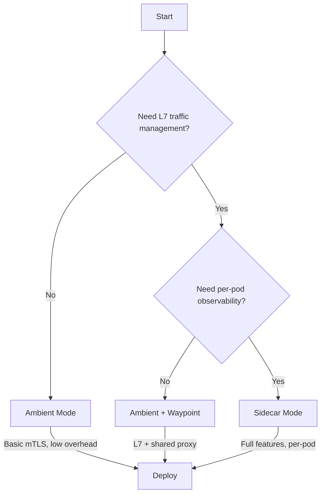
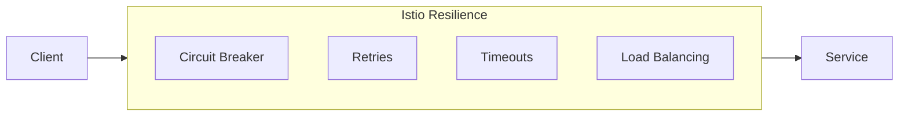
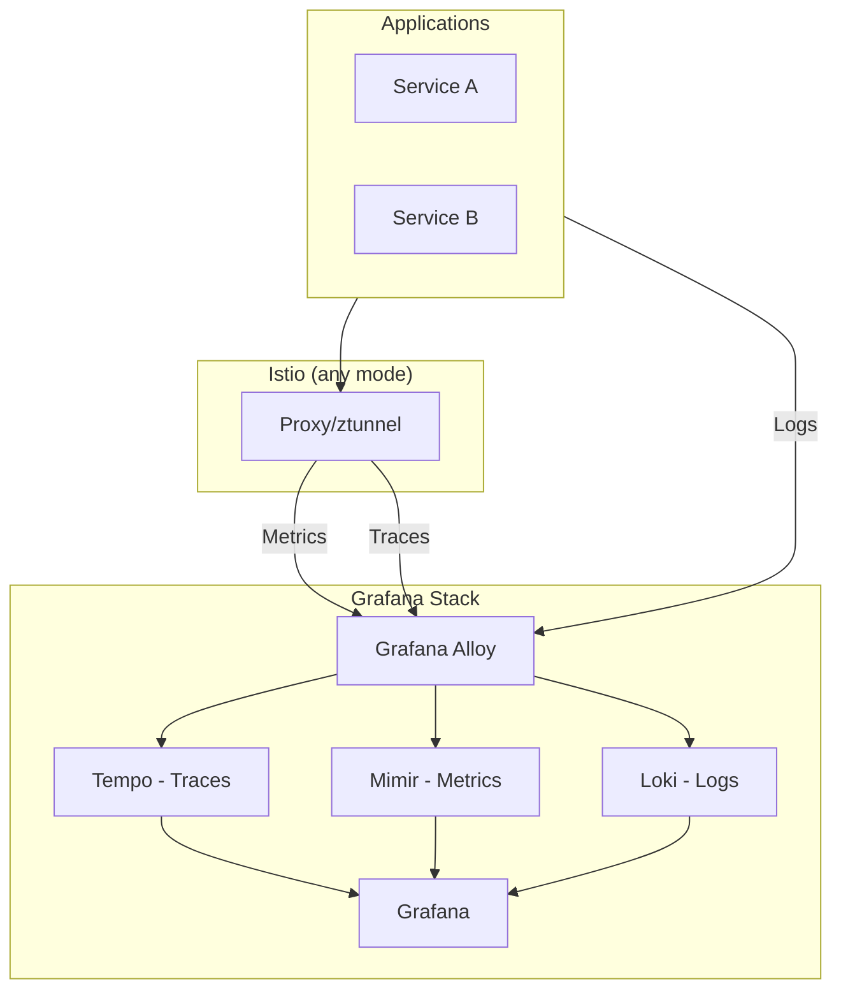

# ADR: Operational Resilience Patterns

**Status:** Accepted
**Date:** 2024-09-01
**Updated:** 2026-01-16

## Context

Services require resilience patterns to:
- Handle failures gracefully
- Prevent cascade failures
- Meet SLO targets
- Support observability requirements

## Decision

Implement resilience at the **service mesh level** using Istio with user-selectable modes.

## Istio Mode Options

| Mode | L4 mTLS | L7 Traffic | OTel Traces | Resource Usage |
|------|---------|------------|-------------|----------------|
| **Ambient** | ✅ ztunnel | ❌ | ⚠️ Limited | Low |
| **Ambient + Waypoint** | ✅ ztunnel | ✅ Waypoint | ✅ Full | Medium |
| **Sidecar** | ✅ Envoy | ✅ Envoy | ✅ Full | High |

### Mode Selection Guide



### Recommendation by Use Case

| Use Case | Recommended Mode |
|----------|------------------|
| Cost-sensitive, basic security | Ambient |
| Balanced L7 + observability | Ambient + Waypoint |
| Full observability, legacy apps | Sidecar |
| Heavy OTel/tracing requirements | Sidecar or Ambient + Waypoint |

## Resilience Features

Implemented via Istio regardless of mode:



### Circuit Breaker (DestinationRule)

```yaml
apiVersion: networking.istio.io/v1beta1
kind: DestinationRule
metadata:
  name: service-circuit-breaker
spec:
  host: my-service
  trafficPolicy:
    connectionPool:
      tcp:
        maxConnections: 100
      http:
        h2UpgradePolicy: UPGRADE
        http1MaxPendingRequests: 100
        http2MaxRequests: 1000
    outlierDetection:
      consecutive5xxErrors: 5
      interval: 30s
      baseEjectionTime: 30s
      maxEjectionPercent: 50
```

### Retries (VirtualService)

```yaml
apiVersion: networking.istio.io/v1beta1
kind: VirtualService
metadata:
  name: service-retry
spec:
  hosts:
    - my-service
  http:
    - retries:
        attempts: 3
        perTryTimeout: 2s
        retryOn: 5xx,reset,connect-failure
```

## Observability Integration



## SLO-Based Alerting

Grafana dashboards include SLO monitoring:

| SLI | Target | Alert |
|-----|--------|-------|
| Availability | 99.9% | < 99.5% |
| Latency P99 | 500ms | > 1s |
| Error Rate | 0.1% | > 1% |

## Consequences

**Positive:**
- Language-agnostic resilience (no code changes)
- Centralized policy management
- Integrated with observability stack
- Mode flexibility based on requirements

**Negative:**
- Istio operational complexity
- Mode selection requires understanding trade-offs
- Sidecar mode increases resource usage

## Related

- [SPEC-CIRCUIT-BREAKER](../specs/SPEC-CIRCUIT-BREAKER.md)
- [BLUEPRINT-DESTINATION-RULE](../blueprints/BLUEPRINT-DESTINATION-RULE.md)
