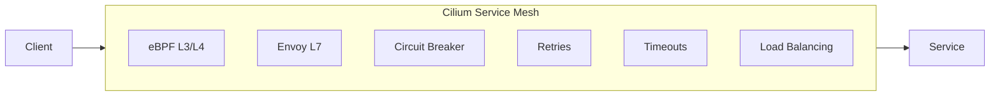
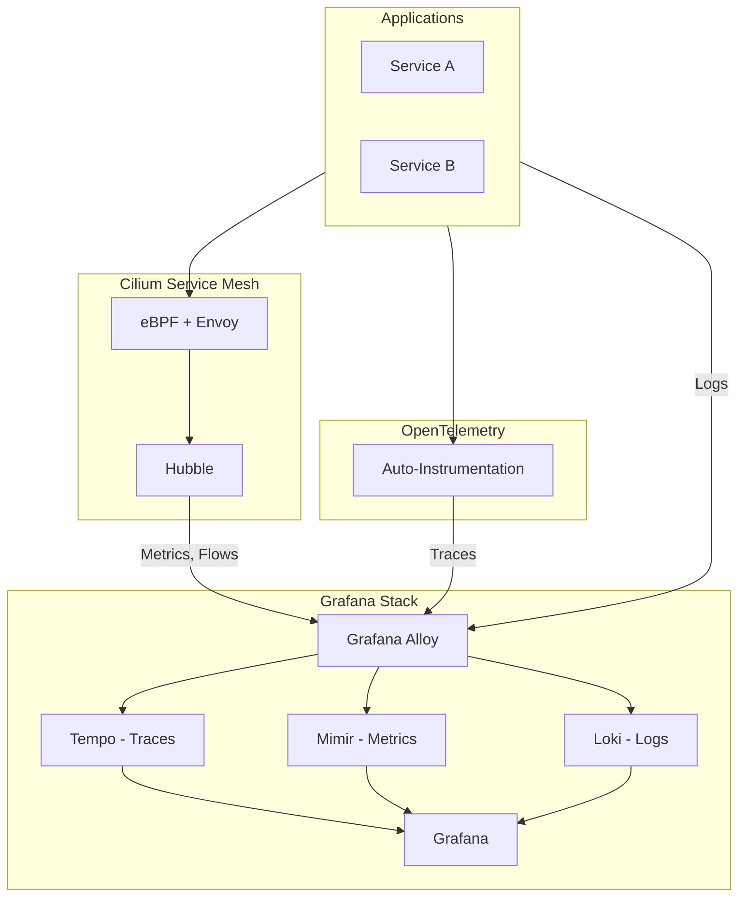

# ADR: Operational Resilience Patterns

**Status:** Accepted
**Date:** 2024-09-01
**Updated:** 2026-01-17

## Context

Services require resilience patterns to:
- Handle failures gracefully
- Prevent cascade failures
- Meet SLO targets
- Support observability requirements

## Decision

Implement resilience at the **Cilium Service Mesh level** using eBPF-based networking and Envoy L7 proxy.

## Architecture



## Resilience Features

Cilium provides resilience via CiliumEnvoyConfig and HTTPRoute:

### Circuit Breaker (CiliumEnvoyConfig)

```yaml
apiVersion: cilium.io/v2
kind: CiliumEnvoyConfig
metadata:
  name: service-circuit-breaker
  namespace: default
spec:
  services:
    - name: my-service
      namespace: default
  resources:
    - "@type": type.googleapis.com/envoy.config.cluster.v3.Cluster
      name: my-service
      connect_timeout: 5s
      circuit_breakers:
        thresholds:
          - priority: DEFAULT
            max_connections: 100
            max_pending_requests: 100
            max_requests: 1000
            max_retries: 3
      outlier_detection:
        consecutive_5xx: 5
        interval: 30s
        base_ejection_time: 30s
        max_ejection_percent: 50
```

### Retries (HTTPRoute)

```yaml
apiVersion: gateway.networking.k8s.io/v1
kind: HTTPRoute
metadata:
  name: service-route
spec:
  parentRefs:
    - name: cilium-gateway
  hostnames:
    - "app.example.com"
  rules:
    - matches:
        - path:
            type: PathPrefix
            value: /
      backendRefs:
        - name: my-service
          port: 80
      timeouts:
        request: 10s
      retry:
        attempts: 3
        backoff:
          initialInterval: 100ms
          maxInterval: 10s
```

### Timeouts (CiliumEnvoyConfig)

```yaml
apiVersion: cilium.io/v2
kind: CiliumEnvoyConfig
metadata:
  name: service-timeouts
spec:
  services:
    - name: my-service
      namespace: default
  resources:
    - "@type": type.googleapis.com/envoy.config.route.v3.RouteConfiguration
      name: my-service-routes
      virtual_hosts:
        - name: my-service
          domains: ["*"]
          routes:
            - match:
                prefix: "/"
              route:
                cluster: my-service
                timeout: 30s
```

## Observability Integration



### Key Finding: OpenTelemetry Independence

**Important:** OpenTelemetry auto-instrumentation works **independently** of the service mesh. This means:
- Full distributed tracing without sidecar proxies
- OTel operator injects auto-instrumentation into pods
- Traces flow directly from apps to Tempo via Alloy
- Cilium provides network observability via Hubble

## Cilium Resilience Features

| Feature | Implementation | Configuration |
|---------|---------------|---------------|
| mTLS | WireGuard encryption | `encryption.type: wireguard` |
| Circuit Breaker | CiliumEnvoyConfig | Outlier detection |
| Retries | HTTPRoute | Gateway API |
| Timeouts | CiliumEnvoyConfig | Route configuration |
| Load Balancing | eBPF | Built-in |
| Rate Limiting | CiliumEnvoyConfig | Rate limit service |

## Comparison: Cilium vs Istio

| Feature | Cilium | Istio Sidecar | Istio Ambient |
|---------|--------|---------------|---------------|
| mTLS | eBPF/WireGuard | Envoy | ztunnel |
| L7 Policies | CiliumEnvoyConfig | VirtualService | Waypoint |
| Resource Usage | Low | High | Medium |
| Complexity | Lower | Higher | Medium |
| OTel Support | Via OTel Operator | Built-in | Limited |

**Selected: Cilium** - Unified CNI + mesh with lower complexity.

## SLO-Based Alerting

Grafana dashboards include SLO monitoring:

| SLI | Target | Alert |
|-----|--------|-------|
| Availability | 99.9% | < 99.5% |
| Latency P99 | 500ms | > 1s |
| Error Rate | 0.1% | > 1% |

## Consequences

**Positive:**
- Language-agnostic resilience (no code changes)
- Centralized policy management via CiliumEnvoyConfig
- Integrated with Grafana observability stack
- OTel tracing works independently of mesh
- Unified CNI + mesh reduces operational complexity

**Negative:**
- CiliumEnvoyConfig requires Envoy configuration knowledge
- Some features require Gateway API (newer standard)

## Related

- [ADR-CILIUM-SERVICE-MESH](../../cilium/docs/ADR-CILIUM-SERVICE-MESH.md)
- [SPEC-CIRCUIT-BREAKER](../specs/SPEC-CIRCUIT-BREAKER.md)
