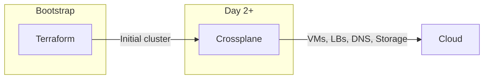
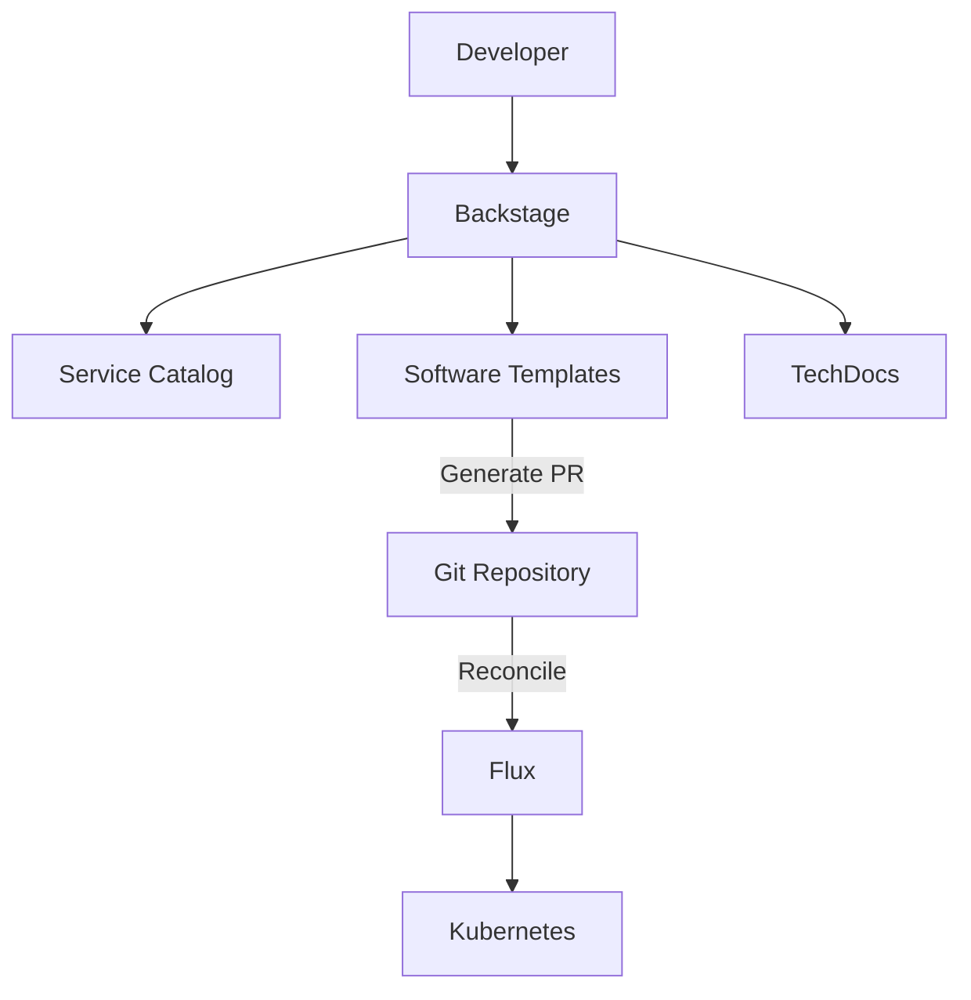
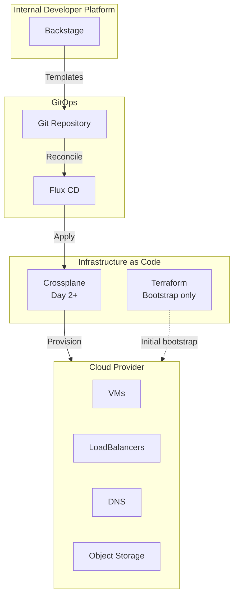

# ADR: Platform Engineering Tools

**Status:** Accepted
**Date:** 2024-09-01
**Updated:** 2026-01-16

## Context

Enterprise Kubernetes platforms require tooling for:
- Infrastructure provisioning beyond initial bootstrap
- Developer self-service and catalog management
- GitOps delivery and reconciliation

## Decision

Adopt the following platform engineering tools as **mandatory components**:

| Tool | Purpose | Status |
|------|---------|--------|
| Crossplane | Cloud resource provisioning (post-bootstrap) | Mandatory |
| Backstage | Internal Developer Platform (IDP) | Mandatory |
| Flux | GitOps delivery engine | Mandatory |
| Terraform | Bootstrap IaC only | Mandatory |

## Crossplane: Mandatory

Crossplane handles cloud resource provisioning after initial bootstrap:

**Rationale:**
- Terraform bootstraps the initial cluster
- Crossplane takes over for all subsequent cloud operations
- GitOps-native (declarative, reconciled by Flux)
- Provider support for target clouds

| Provider | Crossplane Support |
|----------|-------------------|
| Hetzner Cloud | ✅ hcloud provider |
| Huawei Cloud | ✅ huaweicloud provider |
| Oracle Cloud (OCI) | ✅ oci provider |
| AWS | ✅ aws provider |
| GCP | ✅ gcp provider |
| Azure | ✅ azure provider |

## Backstage: Mandatory

Backstage serves as the Internal Developer Platform entry point:

**Rationale:**
- Single entry point for developers
- Service catalog and ownership
- Software templates for self-service
- TechDocs for documentation
- Integrates with Flux GitOps workflow

## Flux: Mandatory (ArgoCD Future)

Flux is the GitOps engine:

| Feature | Flux | ArgoCD (Future) |
|---------|------|-----------------|
| GitOps reconciliation | ✅ | ✅ |
| Helm support | ✅ | ✅ |
| Kustomize support | ✅ | ✅ |
| Multi-tenancy | ✅ | ✅ |
| UI | Basic | Advanced |
| Status | **Current** | Future option |

## Architecture

## Consequences

**Positive:**
- Consistent cloud provisioning via GitOps
- Developer self-service through Backstage
- Clear separation: Terraform (bootstrap) vs Crossplane (day-2)
- Auditable changes through Git

**Negative:**
- Additional components to operate
- Learning curve for Crossplane compositions
- Backstage requires customization for full value

## Related

- [ADR-BOOTSTRAP-ARCHITECTURE](https://github.com/openova-io/bootstrap/blob/main/docs/ADR-BOOTSTRAP-ARCHITECTURE.md)
- [SPEC-PLATFORM-TECH-STACK](../specs/SPEC-PLATFORM-TECH-STACK.md)
