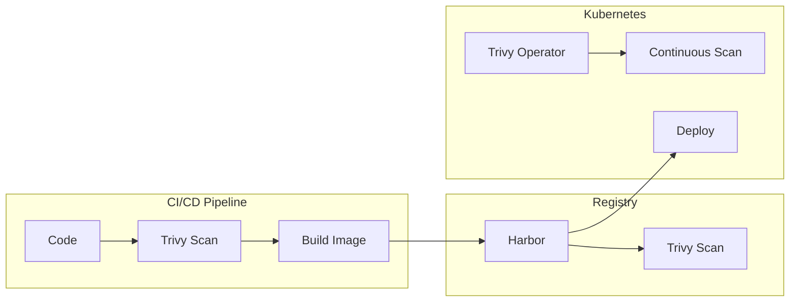
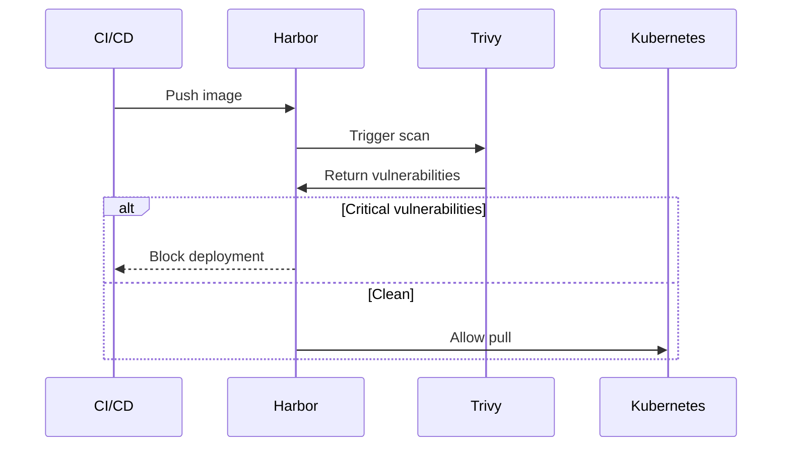

# ADR: Security Scanning with Trivy

**Status:** Accepted
**Date:** 2024-06-01
**Updated:** 2026-01-16

## Context

Container images and Kubernetes configurations require vulnerability scanning for:
- Supply chain security
- Compliance requirements
- Shift-left security practices

## Decision

Use **Trivy** for security scanning at multiple levels:

| Level | Integration | Trigger |
|-------|-------------|---------|
| CI/CD | GitHub Actions / GitLab CI | On push/PR |
| Registry | Harbor (built-in) | On push |
| Runtime | Trivy Operator | Continuous |

## Architecture



## Scanning Capabilities

| Target | Trivy Feature |
|--------|---------------|
| Container images | `trivy image` |
| Kubernetes manifests | `trivy config` |
| IaC (Terraform) | `trivy config` |
| SBOM generation | `trivy sbom` |
| Secrets detection | `trivy fs --scanners secret` |

## Harbor Integration

Since Harbor is mandatory, Trivy scanning is built-in:



## Scan Policies

| Severity | CI/CD Action | Harbor Action |
|----------|--------------|---------------|
| Critical | Fail build | Block pull |
| High | Warn | Allow (configurable) |
| Medium | Info | Allow |
| Low | Info | Allow |

## Trivy Operator (Runtime)

Continuous scanning in cluster:

```yaml
# Installed automatically with OpenOva
# Scans all workloads and reports to Grafana
apiVersion: aquasecurity.github.io/v1alpha1
kind: VulnerabilityReport
# Generated automatically for each workload
```

## Consequences

**Positive:**
- Unified scanning across CI/CD, registry, and runtime
- Integrated with Harbor (mandatory component)
- Shift-left security with fast feedback
- SBOM generation for compliance

**Negative:**
- False positives require triage
- Scan time adds to CI/CD pipeline
- Operator resources in cluster

## Related

- [ADR-IMAGE-REGISTRY](./ADR-IMAGE-REGISTRY.md)
