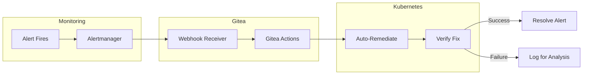

# ADR: Zero Human Intervention Operations

**Status:** Accepted
**Date:** 2024-09-01
**Updated:** 2026-01-17

## Context

With a single-developer team, manual operations are unsustainable.

## Decision

Implement fully automated operations:
- **Auto-remediation** via Gitea Actions triggered by Alertmanager
- **Cost control** with automated budget enforcement
- **Secret rotation** via CronJobs
- **Compliance automation** for data subject requests

## Rationale

Single developer cannot be on-call 24/7. Full automation provides consistent incident response with near-zero ops burden.

## Architecture



## Auto-Remediation Strategy

| Alert | Auto-Action |
|-------|-------------|
| HighMemoryUsage | Scale up deployment |
| PodCrashLoopBackOff | Restart pod |
| HighErrorRate | Trigger rollback |
| CertificateExpiringSoon | Trigger renewal |
| BudgetExceeded | Block scale-up |
| GslbEndpointDown | Verify k8gb status |
| SplitBrainWitnessUnreachable | Log and alert |

## Gitea Actions Integration

```yaml
# .gitea/workflows/auto-remediation.yaml
name: Auto-Remediation
on:
  repository_dispatch:
    types: [alertmanager]

jobs:
  remediate:
    runs-on: ubuntu-latest
    steps:
      - name: Parse alert
        id: alert
        run: |
          echo "alert_name=${{ github.event.client_payload.alertname }}" >> $GITHUB_OUTPUT

      - name: Remediate HighMemoryUsage
        if: steps.alert.outputs.alert_name == 'HighMemoryUsage'
        run: |
          kubectl scale deployment ${{ github.event.client_payload.deployment }} --replicas=+1

      - name: Remediate PodCrashLoopBackOff
        if: steps.alert.outputs.alert_name == 'PodCrashLoopBackOff'
        run: |
          kubectl delete pod ${{ github.event.client_payload.pod }}
```

## Cost Control

- **Monthly Budget:** €15 (~$16.50)
- **Warning threshold:** 80%
- **Block threshold:** 100%

## Alertmanager Webhook Configuration

```yaml
receivers:
  - name: gitea-actions
    webhook_configs:
      - url: https://gitea.<domain>/api/v1/repos/<org>/platform/actions/dispatches
        http_config:
          authorization:
            type: Bearer
            credentials_file: /etc/alertmanager/gitea-token
        send_resolved: true
```

## Consequences

**Positive:** No on-call burden, consistent response, cost predictability
**Negative:** Complex setup, risk of automated issues, may miss novel failures

## Related Documents

- [SPEC-AUTO-REMEDIATION](../specs/SPEC-AUTO-REMEDIATION.md)
- [RUNBOOK-PLATFORM](../runbooks/RUNBOOK-PLATFORM.md)
- [ADR-GITEA](../../gitea/docs/ADR-GITEA.md)
