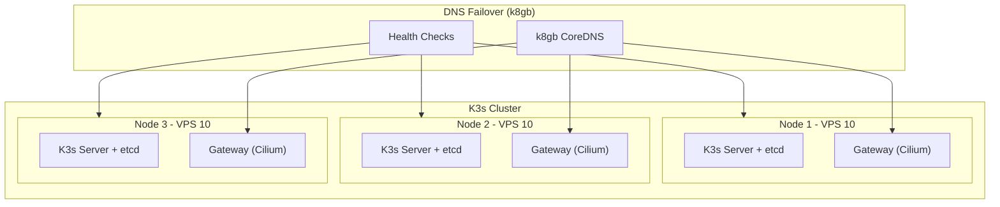

# BLUEPRINT: Deployment Architecture

## Overview

Multi-node K3s cluster deployment on Contabo VPS.

## Cluster Architecture



## K3s Installation

### First Control Plane

```bash
curl -sfL https://get.k3s.io | sh -s - server \
  --cluster-init \
  --disable traefik \
  --disable servicelb \
  --disable local-storage \
  --flannel-backend=none \
  --disable-network-policy \
  --kube-controller-manager-arg="node-monitor-period=5s" \
  --kube-controller-manager-arg="node-monitor-grace-period=20s" \
  --kube-apiserver-arg="default-watch-cache-size=50" \
  --etcd-arg="quota-backend-bytes=1073741824" \
  --kubelet-arg="max-pods=50"
```

### Additional Control Planes

```bash
curl -sfL https://get.k3s.io | K3S_URL=https://<first-node-ip>:6443 \
  K3S_TOKEN=<token> sh -s - server \
  --disable traefik \
  --disable servicelb \
  --disable local-storage \
  --flannel-backend=none \
  --disable-network-policy \
  --kube-controller-manager-arg="node-monitor-period=5s" \
  --kube-controller-manager-arg="node-monitor-grace-period=20s" \
  --kube-apiserver-arg="default-watch-cache-size=50" \
  --kubelet-arg="max-pods=50"
```

### Install Cilium CNI + Service Mesh

```bash
helm repo add cilium https://helm.cilium.io/
helm install cilium cilium/cilium \
  --namespace kube-system \
  --set kubeProxyReplacement=true \
  --set k8sServiceHost=${API_SERVER_IP} \
  --set k8sServicePort=6443 \
  --set hubble.enabled=true \
  --set hubble.relay.enabled=true \
  --set hubble.ui.enabled=true \
  --set encryption.enabled=true \
  --set encryption.type=wireguard \
  --set gatewayAPI.enabled=true \
  --set envoy.enabled=true \
  --set loadBalancer.l7.backend=envoy
```

## Resource Allocation

| Node | vCPU | RAM | SSD | Cost |
|------|------|-----|-----|------|
| Node 1 | 4 | 8GB | 200GB | €4.50 |
| Node 2 | 4 | 8GB | 200GB | €4.50 |
| Node 3 | 4 | 8GB | 200GB | €4.50 |
| **Total** | 12 | 24GB | 600GB | €13.50 |

## Disabled Components

| Component | Replacement |
|-----------|-------------|
| traefik | Gateway API (Cilium) |
| servicelb | DNS-based failover (k8gb) |
| local-storage | Application-level replication |
| flannel | Cilium CNI |
| network-policy | Cilium policies |

## Related

- [SPEC-PLATFORM-TECH-STACK](../specs/SPEC-PLATFORM-TECH-STACK.md)
- [BLUEPRINT-NAMESPACE](./BLUEPRINT-NAMESPACE.md)
