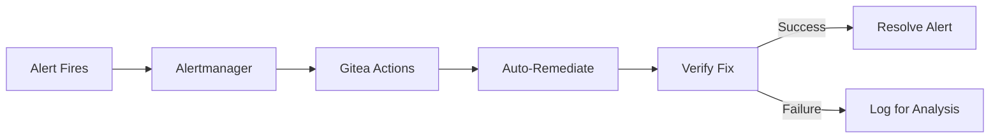

# RUNBOOK: Platform Operations

## Overview

Operational procedures for the OpenOva platform. Most incidents are handled automatically via Gitea Actions. Manual procedures are for edge cases only.

## Automated Operations

### Auto-Remediation Flow



### Check Automation Status

```bash
# Recent auto-remediation actions (via Gitea API)
curl -H "Authorization: token $GITEA_TOKEN" \
  https://gitea.<domain>/api/v1/repos/<org>/platform/actions/runs

# Pending alerts
curl -s http://alertmanager.monitoring:9093/api/v2/alerts | jq '.[] | select(.status.state=="active")'

# Current estimated cost
kubectl get nodes | wc -l | xargs -I {} echo "Estimated: €$(echo '{} * 4.50' | bc)"
```

## When Manual Intervention is Needed

- Unknown alert types (not in playbook)
- Repeated auto-remediation failures
- Security incidents requiring investigation
- Data recovery from backup
- Infrastructure changes (node replacement)

## Service Operations

### Cilium Gateway

```bash
# Check Gateway status
kubectl get gateway -n cilium-gateway

# Check HTTPRoutes
kubectl get httproute -A

# Check Cilium Gateway pods
kubectl get pods -l io.cilium.gateway/owning-gateway -n cilium-gateway

# View Envoy config
kubectl exec -it -n cilium-gateway deploy/cilium-gateway -- \
  curl localhost:19000/config_dump | jq

# Rolling restart
kubectl rollout restart deployment/cilium-gateway -n cilium-gateway
```

| Issue | Symptoms | Resolution |
|-------|----------|------------|
| 502 Bad Gateway | Upstream unavailable | Check backend service |
| 503 Service Unavailable | Rate limited | Check CiliumEnvoyConfig |
| 504 Gateway Timeout | Slow upstream | Scale backend |

### Cilium CNI & Service Mesh

```bash
# Check Cilium pods
kubectl get pods -n kube-system -l k8s-app=cilium

# Check Cilium status
cilium status --wait

# Check connectivity
cilium connectivity test

# Check network flows
hubble observe --namespace <tenant>-prod

# Check mTLS status
cilium encryption status

# Check L7 policies
kubectl get ciliumenvoyconfigs -A
```

### Gitea

```bash
# Check Gitea pods
kubectl get pods -n gitea

# Check Gitea logs
kubectl logs -l app=gitea -n gitea --tail=100

# Check Gitea Actions runners
kubectl get pods -n gitea -l app=gitea-actions-runner

# Test Gitea API
curl -H "Authorization: token $GITEA_TOKEN" \
  https://gitea.<domain>/api/v1/user

# Check mirroring status
curl -H "Authorization: token $GITEA_TOKEN" \
  https://gitea.<domain>/api/v1/repos/<org>/<repo>/mirror-sync
```

## Database Operations

### PostgreSQL (CNPG)

```bash
# Check cluster status
kubectl get cluster -n databases

# Test connection
kubectl exec -it <cluster>-1 -n databases -- psql -c "SELECT 1"

# Check connections
kubectl exec -it <cluster>-1 -n databases -- psql -c "SELECT count(*) FROM pg_stat_activity"

# Slow queries
kubectl exec -it <cluster>-1 -n databases -- psql -c "
  SELECT query, calls, mean_time
  FROM pg_stat_statements
  ORDER BY mean_time DESC LIMIT 10"

# Check replication status
kubectl exec -it <cluster>-1 -n databases -- psql -c "SELECT * FROM pg_stat_replication"
```

### MongoDB

```bash
# Check replica set
kubectl exec -it mongodb-0 -n databases -- mongosh --eval "rs.status()"

# Test connection
kubectl exec -it mongodb-0 -n databases -- mongosh --eval "db.runCommand({ping: 1})"
```

### Dragonfly (Redis)

```bash
# Test connection
kubectl exec -it dragonfly-0 -n databases -- redis-cli ping

# Check memory
kubectl exec -it dragonfly-0 -n databases -- redis-cli info memory

# Check clients
kubectl exec -it dragonfly-0 -n databases -- redis-cli info clients

# Check replication
kubectl exec -it dragonfly-0 -n databases -- redis-cli info replication
```

### Redpanda

```bash
# List topics
kubectl exec -it redpanda-0 -n databases -- rpk topic list

# Check consumer lag
kubectl exec -it redpanda-0 -n databases -- rpk group describe <group>

# Cluster health
kubectl exec -it redpanda-0 -n databases -- rpk cluster health

# MirrorMaker2 status (cross-region)
kubectl get kafkamirrormaker2 -n databases
```

## Common Issues

### High Error Rate

```bash
# Check recent errors
kubectl logs -l app=<service> -n <tenant>-prod --since=30m | grep ERROR

# Error rate metric
curl -s "http://mimir.monitoring:9090/api/v1/query?query=sum(rate(http_requests_total{status=~\"5..\"}[5m]))"
```

### High Latency

```bash
# Check P95 latency
curl -s "http://mimir.monitoring:9090/api/v1/query?query=histogram_quantile(0.95,rate(http_request_duration_seconds_bucket[5m]))"

# Check Hubble for network latency
hubble observe --namespace <tenant>-prod --type l7 --output json | jq '.flow.l7.latency_ns'
```

### Pod CrashLoopBackOff

```bash
# Check pod status
kubectl describe pod <pod> -n <tenant>-prod

# Check previous logs
kubectl logs <pod> -n <tenant>-prod --previous

# Check events
kubectl get events -n <tenant>-prod --sort-by='.lastTimestamp' | tail -20
```

### OOMKilled

```bash
# Check memory usage
kubectl top pod -n <tenant>-prod

# Check OOM events
kubectl get events -n <tenant>-prod | grep OOMKilled

# Increase limits (VPA should handle this automatically)
kubectl patch deployment <deployment> -n <tenant>-prod -p '
spec:
  template:
    spec:
      containers:
      - name: app
        resources:
          limits:
            memory: 2Gi'
```

### Certificate Issues

```bash
# Check expiry
kubectl get secret <tenant>-tls -n <tenant>-prod -o jsonpath='{.data.tls\.crt}' | \
  base64 -d | openssl x509 -noout -dates

# Force renewal
kubectl delete secret <tenant>-tls -n <tenant>-prod
kubectl delete certificate <tenant>-tls -n <tenant>-prod

# Check cert-manager logs
kubectl logs -l app=cert-manager -n cert-manager
```

## Flux GitOps Operations

```bash
# Check Flux status
flux get all -A

# Force reconciliation
flux reconcile source git <repo> -n flux-system

# Suspend reconciliation (for maintenance)
flux suspend kustomization <name> -n flux-system

# Resume reconciliation
flux resume kustomization <name> -n flux-system

# Check Gitea connectivity
flux get source git -A
```

## Routine Maintenance

### Daily
- Check dashboard for anomalies
- Review error logs
- Verify backup completion
- Check certificate expiry

### Weekly
- Review performance metrics
- Check disk usage
- Review security alerts

### Monthly
- Database optimization (VACUUM)
- Review and rotate credentials
- Capacity planning review

### Quarterly
- Disaster recovery test
- Security audit
- Performance testing

## Related

- [SPEC-AUTO-REMEDIATION](../specs/SPEC-AUTO-REMEDIATION.md)
- [ADR-ZERO-HUMAN-INTERVENTION-OPS](../adrs/ADR-ZERO-HUMAN-INTERVENTION-OPS.md)
- [ADR-CILIUM-SERVICE-MESH](../../cilium/docs/ADR-CILIUM-SERVICE-MESH.md)
- [ADR-GITEA](../../gitea/docs/ADR-GITEA.md)
