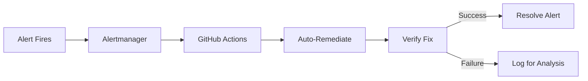

# SPEC: Auto-Remediation System

## Overview

Fully automated incident response via GitHub Actions triggered by Alertmanager webhooks.

## Architecture



## Alert-to-Action Mapping

| Alert | Auto-Action | Verification | Fallback |
|-------|-------------|--------------|----------|
| HighMemoryUsage | Scale up deployment | Check memory usage | Log |
| PodCrashLoopBackOff | Restart pod | Check pod status | Check deployments |
| HighErrorRate | Trigger Flagger rollback | Check error rate | Log |
| DatabaseConnectionExhausted | Restart PgBouncer | Check connections | Alert |
| CertificateExpiringSoon | Trigger renewal | Check cert expiry | Alert |
| HighLatency | Scale affected service | Check latency | Log |
| BudgetWarning | Log warning | N/A | Block scale-up |
| BudgetExceeded | Block scale-up | N/A | Alert |

## Budget Control

| Threshold | Action |
|-----------|--------|
| 80% of €15 | Warning log |
| 100% of €15 | Block scale-up |

## Secret Rotation Schedule

| Secret Type | Frequency | Method |
|-------------|-----------|--------|
| Database credentials | Monthly | CronJob |
| JWT signing keys | 30 days | CronJob |
| TLS certificates | Auto | cert-manager |
| SOPS age keys | Yearly | Manual |

## GDPR Automation

| Process | Schedule | CronJob |
|---------|----------|---------|
| Data subject requests | Daily 2 AM | `process-data-requests` |
| Data retention | Weekly Sunday 3 AM | `enforce-data-retention` |
| Audit log cleanup | Monthly | `cleanup-audit-logs` |

## Alertmanager Webhook Configuration

```yaml
receivers:
  - name: github-actions
    webhook_configs:
      - url: https://api.github.com/repos/openova-io/platform/dispatches
        http_config:
          authorization:
            type: Bearer
            credentials_file: /etc/alertmanager/github-token
        send_resolved: true
```

## Related

- [ADR-ZERO-HUMAN-INTERVENTION-OPS](../adrs/ADR-ZERO-HUMAN-INTERVENTION-OPS.md)
- [RUNBOOK-PLATFORM](../runbooks/RUNBOOK-PLATFORM.md)
