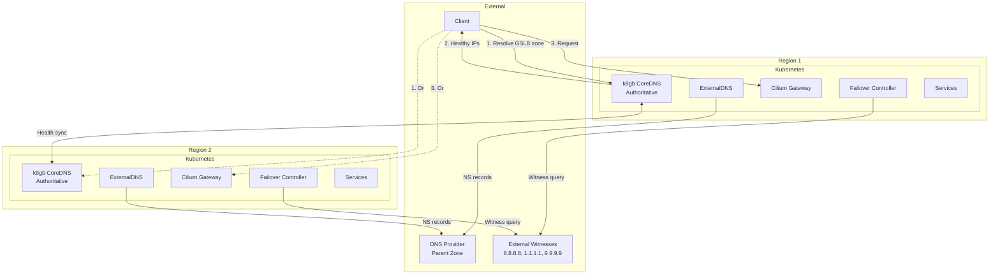
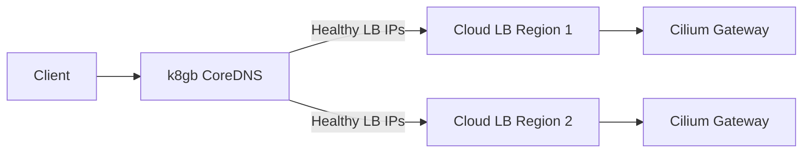
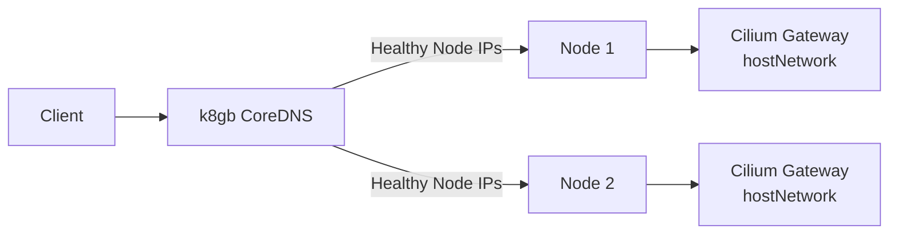
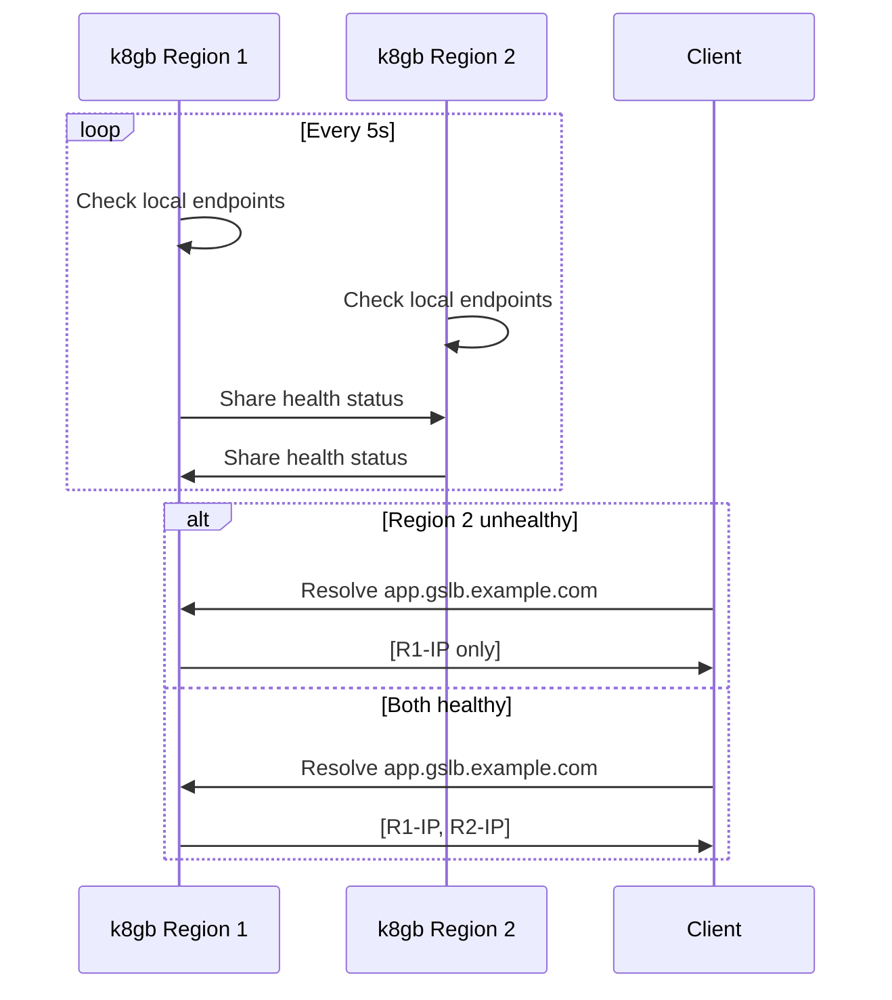
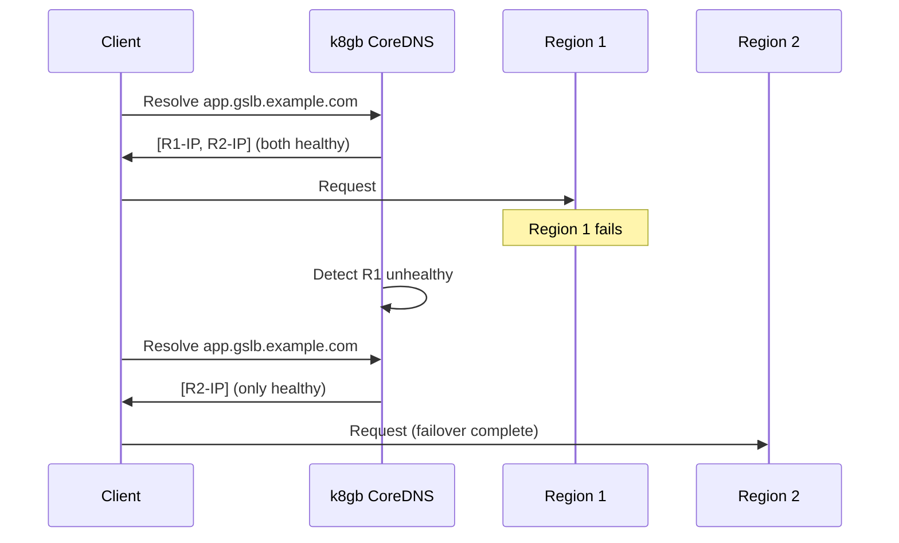
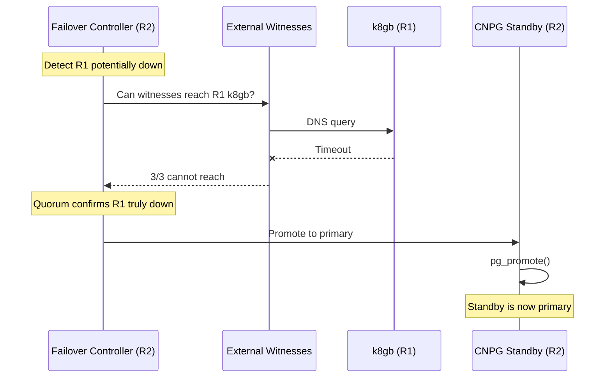

# SPEC: DNS Failover with k8gb

**Updated:** 2026-01-17

## Overview

DNS-based failover system using **k8gb** (Kubernetes Global Balancer) as **authoritative DNS** for cross-region load balancing, integrated with **ExternalDNS** for parent zone management, and **Failover Controller** with external DNS witnesses for split-brain protection.

## Architecture



## Components

### k8gb (Kubernetes Global Balancer)

CNCF project serving as **authoritative DNS** for GSLB zone:

| Feature | Description |
|---------|-------------|
| Authoritative DNS | k8gb CoreDNS serves the GSLB zone directly |
| Health-based routing | Routes only to healthy endpoints |
| Geo-based routing | Route by geography (optional) |
| Weighted routing | Distribute traffic by weight |
| Failover | Automatic DNS failover for stateless services |

### ExternalDNS

Syncs Kubernetes resources to DNS providers (parent zone):

| Feature | Description |
|---------|-------------|
| NS record sync | Creates NS records pointing to k8gb |
| Provider support | Cloudflare, Hetzner, Route53, etc. |

### Failover Controller

Orchestrates **stateful** service failover with split-brain protection:

| Feature | Description |
|---------|-------------|
| External witness verification | Queries 8.8.8.8, 1.1.1.1, 9.9.9.9 |
| Quorum-based decision | 2/3 witnesses must agree |
| CNPG promotion | Promotes PostgreSQL standby to primary |
| Event-driven | Triggered via Redpanda events |

## k8gb as Authoritative DNS

### DNS Hierarchy

```
example.com                    → DNS Provider (Cloudflare, Hetzner)
  └── gslb.example.com (NS)    → k8gb CoreDNS (authoritative)
        ├── app.gslb.example.com     → R1, R2 IPs (health-based)
        ├── api.gslb.example.com     → R1, R2 IPs (health-based)
        └── web.gslb.example.com     → R1, R2 IPs (health-based)
```

### Why Authoritative?

| Approach | Pros | Cons | Selected |
|----------|------|------|----------|
| ExternalDNS only | Simple | No health-based routing | ❌ |
| External GSLB | Feature-rich | Cost, dependency | ❌ |
| **k8gb Authoritative** | Self-hosted, health-based | Requires NS delegation | ✅ |

## DNS Provider Options

| Provider | Availability | ExternalDNS Support |
|----------|--------------|---------------------|
| Cloudflare | Always | ✅ |
| Hetzner DNS | If Hetzner chosen | ✅ |
| AWS Route53 | If AWS chosen | ✅ |
| GCP Cloud DNS | If GCP chosen | ✅ |
| Azure DNS | If Azure chosen | ✅ |

## LoadBalancer Options

### Option 1: Cloud Provider LB (Recommended)



- Cloud LB (Hetzner LB, OCI LB, etc.) in front of Cilium Gateway
- k8gb manages which LB IPs are returned based on health
- Cost: ~€5-10/mo per region

### Option 2: k8gb DNS-based LB (Free Alternative)



- Cilium Gateway uses `hostNetwork: true`
- k8gb health-checks Gateway endpoints
- k8gb CoreDNS returns only healthy node IPs
- Cost: Free

### Option 3: Cilium L2 Mode

- Cilium provides LoadBalancer IP via ARP
- Works only within same L2 subnet
- Single region only
- Cost: Free

## Split-Brain Protection

### External DNS Witnesses

Before promoting stateful services, Failover Controller queries external witnesses:

| Resolver | Provider | Purpose |
|----------|----------|---------|
| 8.8.8.8 | Google | Primary witness |
| 1.1.1.1 | Cloudflare | Secondary witness |
| 9.9.9.9 | Quad9 | Tertiary witness |

### Quorum Decision Matrix

| 8.8.8.8 | 1.1.1.1 | 9.9.9.9 | Decision |
|---------|---------|---------|----------|
| ✅ | ✅ | ✅ | Region UP - no action |
| ✅ | ✅ | ❌ | Region UP - no action |
| ✅ | ❌ | ❌ | **Region DOWN** - 2/3 agree |
| ❌ | ❌ | ❌ | **Region DOWN** - 3/3 agree |

### What Gets Protected

| Service Type | Failover Method | Split-Brain Protection |
|--------------|-----------------|------------------------|
| Stateless apps | k8gb DNS (automatic) | Not needed |
| CNPG (Postgres) | Failover Controller | Yes - witness verified |
| MongoDB | Failover Controller | Yes - witness verified |
| Dragonfly | Failover Controller | Yes - witness verified |

See [SPEC-SPLIT-BRAIN-PROTECTION](./SPEC-SPLIT-BRAIN-PROTECTION.md) for detailed algorithm.

## k8gb Configuration

### Gslb Custom Resource

```yaml
apiVersion: k8gb.absa.oss/v1beta1
kind: Gslb
metadata:
  name: app-gslb
  namespace: app
spec:
  ingress:
    ingressClassName: cilium
    rules:
      - host: app.gslb.example.com
        http:
          paths:
            - path: /
              pathType: Prefix
              backend:
                service:
                  name: app-service
                  port:
                    number: 80
  strategy:
    type: roundRobin  # or failover, geoip
    splitBrainThresholdSeconds: 300
    dnsTtlSeconds: 30
```

### Strategy Options

| Strategy | Description | Use Case |
|----------|-------------|----------|
| `roundRobin` | Even distribution | Active-Active |
| `failover` | Primary/Secondary | Active-Passive |
| `geoip` | Geographic routing | Latency optimization |

## Health Checking

k8gb performs health checks on Gslb endpoints:



## TTL Configuration

| Setting | Value | Purpose |
|---------|-------|---------|
| DNS TTL | 30s | Balance caching vs failover |
| Health check interval | 5s | Detect failures quickly |
| Split-brain threshold | 300s | Prevent flapping |

**Failover time:** 30-60 seconds (DNS TTL + propagation)

## ExternalDNS Configuration

ExternalDNS creates NS records in parent zone:

```yaml
apiVersion: apps/v1
kind: Deployment
metadata:
  name: external-dns
spec:
  template:
    spec:
      containers:
        - name: external-dns
          image: registry.k8s.io/external-dns/external-dns:latest
          args:
            - --source=ingress
            - --source=service
            - --source=crd
            - --crd-source-apiversion=k8gb.absa.oss/v1beta1
            - --crd-source-kind=Gslb
            - --provider=cloudflare  # or hetzner, aws, gcp, azure
            - --policy=sync
            - --txt-owner-id=openova-cluster-1
```

## Monitoring

### Grafana Dashboard

k8gb exposes metrics for monitoring:

| Metric | Description |
|--------|-------------|
| `k8gb_gslb_healthy_records` | Healthy endpoint count |
| `k8gb_gslb_status` | GSLB status (0=unhealthy, 1=healthy) |
| `k8gb_gslb_reconcile_*` | Reconciliation metrics |

### Alerts

| Alert | Condition | Severity |
|-------|-----------|----------|
| GslbEndpointDown | healthy_records < expected | Warning |
| GslbAllEndpointsDown | healthy_records = 0 | Critical |
| DNSSyncFailed | sync errors > 0 | Warning |
| SplitBrainWitnessUnreachable | witness unreachable > 5m | Warning |

## Multi-Region Failover Flow

### Stateless Services (Automatic)



### Stateful Services (Witness-Verified)



## Related

- [ADR-K8GB-GSLB](../../k8gb/docs/ADR-K8GB-GSLB.md)
- [ADR-FAILOVER-CONTROLLER](../../failover-controller/docs/ADR-FAILOVER-CONTROLLER.md)
- [SPEC-SPLIT-BRAIN-PROTECTION](./SPEC-SPLIT-BRAIN-PROTECTION.md)
- [ADR-MULTI-REGION-STRATEGY](../adrs/ADR-MULTI-REGION-STRATEGY.md)
- [SPEC-PLATFORM-TECH-STACK](./SPEC-PLATFORM-TECH-STACK.md)
- [RUNBOOK-DNS-FAILOVER](../runbooks/RUNBOOK-DNS-FAILOVER.md)
