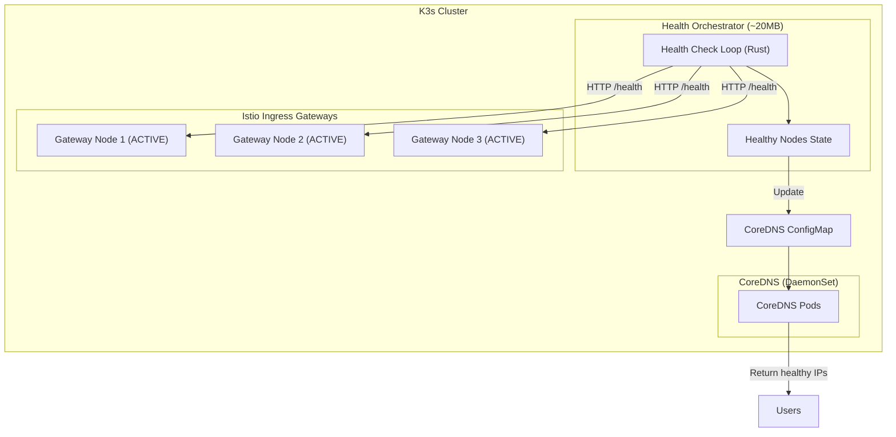

# SPEC: DNS Failover Service

## Overview

DNS-based failover system replacing traditional load balancers (kube-vip, MetalLB) with a lightweight approach using CoreDNS and a custom Health Orchestrator.

This is a **platform service** available to all tenants.

## Architecture



## Design Principles

1. **No dedicated load balancer** - DNS returns only healthy node IPs
2. **All Istio Gateways active** - No idle resources
3. **Sub-second health detection** - Fast failover
4. **Zero external dependencies** - Self-hosted
5. **Multi-tenant** - Supports multiple tenants with own domains

## Health Orchestrator

### Service Specification

| Property | Value |
|----------|-------|
| Language | Rust |
| Framework | tokio + axum |
| Memory | ~20MB |
| CPU | <10m idle, <50m during checks |
| Replicas | 1 |
| Namespace | `dns-failover` |

### Configuration

```yaml
nodes:
  - name: node-1
    ip: "10.0.0.1"
    health_endpoint: "http://10.0.0.1:15021/healthz/ready"
  - name: node-2
    ip: "10.0.0.2"
    health_endpoint: "http://10.0.0.2:15021/healthz/ready"
  - name: node-3
    ip: "10.0.0.3"
    health_endpoint: "http://10.0.0.3:15021/healthz/ready"

tenants:
  - name: <tenant>
    domains:
      - api.<tenant>.io
      - app.<tenant>.io
    hosts_key: "<tenant>.hosts"

health_check:
  interval_seconds: 5
  timeout_seconds: 2
  failure_threshold: 2
  success_threshold: 1
```

## Health Check Protocol

| Response | Meaning | Action |
|----------|---------|--------|
| `200 OK` | Gateway ready | Include in DNS |
| `503` | Gateway not ready | Exclude from DNS |
| Timeout | Node unreachable | Exclude from DNS |

## TTL Configuration

| Level | TTL | Purpose |
|-------|-----|---------|
| DNS A record | 30 seconds | Balance caching vs failover |
| CoreDNS cache | 30 seconds | Match A record TTL |
| Browser cache | ~60 seconds | Client-side |

**Worst-case failover:** ~90 seconds
**Best-case failover:** ~10 seconds

## Metrics (Prometheus)

| Metric | Type | Description |
|--------|------|-------------|
| `health_orchestrator_healthy_nodes` | Gauge | Healthy node count |
| `health_orchestrator_check_duration_seconds` | Histogram | Check duration |
| `health_orchestrator_dns_updates_total` | Counter | ConfigMap updates |
| `health_orchestrator_node_status` | Gauge | Per-node status |

## Resource Summary

| Component | Memory | CPU | Replicas |
|-----------|--------|-----|----------|
| Health Orchestrator | ~20MB | ~10m | 1 |
| CoreDNS (DaemonSet) | ~50MB per node | ~50m | N |

## Tenant Onboarding

To add a new tenant:

1. Add tenant config to `health-orchestrator-config` ConfigMap
2. Add hosts entry to CoreDNS Corefile
3. Restart Health Orchestrator

## Related

- [BLUEPRINT-DNS-FAILOVER](../blueprints/BLUEPRINT-DNS-FAILOVER.md)
- [RUNBOOK-DNS-FAILOVER](../runbooks/RUNBOOK-DNS-FAILOVER.md)
