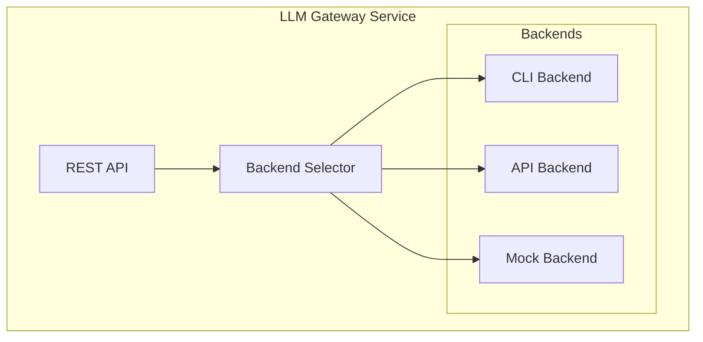

# SPEC: LLM Gateway Service

## Overview

Platform service providing an OpenAI-compatible API for LLM access. Supports multiple backends including CLI-based session pooling for zero-cost development.

## Design Goals

1. **OpenAI-Compatible API** - Standard interface
2. **Backend Abstraction** - Switch between CLI, API, or mock
3. **Session Pooling** - Pre-warmed sessions for low latency
4. **Cost Optimization** - Zero-cost development with CLI backend
5. **Observability** - Prometheus metrics and structured logging

## Architecture



## API Specification

### Chat Completions

```
POST /v1/chat/completions
```

**Request:**
```json
{
  "model": "claude-sonnet",
  "messages": [
    {"role": "system", "content": "You are a helpful assistant."},
    {"role": "user", "content": "Hello!"}
  ],
  "max_tokens": 4096,
  "temperature": 0.7
}
```

**Response:**
```json
{
  "id": "chatcmpl-abc123",
  "object": "chat.completion",
  "model": "claude-sonnet",
  "choices": [{
    "index": 0,
    "message": {
      "role": "assistant",
      "content": "Hello! How can I help you today?"
    },
    "finish_reason": "stop"
  }],
  "usage": {
    "prompt_tokens": 12,
    "completion_tokens": 8,
    "total_tokens": 20
  }
}
```

### Health Check

```
GET /health
```

### Session Management

```
GET /sessions
```

## Configuration

| Variable | Description | Default |
|----------|-------------|---------|
| `LLM_BACKEND` | Backend type: cli, api, mock | cli |
| `LLM_POOL_SIZE` | Warm sessions | 2 |
| `LLM_KEEP_ALIVE_INTERVAL` | Keep-alive interval (seconds) | 300 |
| `LLM_REQUEST_TIMEOUT` | Request timeout (seconds) | 60 |
| `ANTHROPIC_API_KEY` | API key (for api backend) | - |

## Session Pool Manager

The CLI backend uses a session pool:

- **Pre-warming** - Sessions spawned on startup
- **Keep-alive** - Periodic pings prevent timeout
- **Auto-recovery** - Failed sessions restarted
- **Overflow handling** - Cold start fallback

### Latency Characteristics

| Scenario | Latency |
|----------|---------|
| Warm session | 500-700ms |
| Cold start | ~13s |
| API backend | 500-700ms |

## Metrics

| Metric | Type | Description |
|--------|------|-------------|
| `llm_requests_total` | Counter | Requests by status |
| `llm_request_duration_seconds` | Histogram | Request latency |
| `llm_sessions_total` | Gauge | Sessions by status |
| `llm_cache_hits_total` | Counter | Cache hits |

## Tenant Integration

Internal service URL:
```
http://llm-gateway.platform-services.svc.cluster.local:5005/v1/chat/completions
```

Example usage:
```python
import openai

client = openai.OpenAI(
    base_url="http://llm-gateway.platform-services:5005/v1",
    api_key="not-required-for-cli-backend"
)

response = client.chat.completions.create(
    model="claude-sonnet",
    messages=[{"role": "user", "content": "Hello!"}]
)
```

## Related

- [BLUEPRINT-LLM-GATEWAY](../blueprints/BLUEPRINT-LLM-GATEWAY.md)
