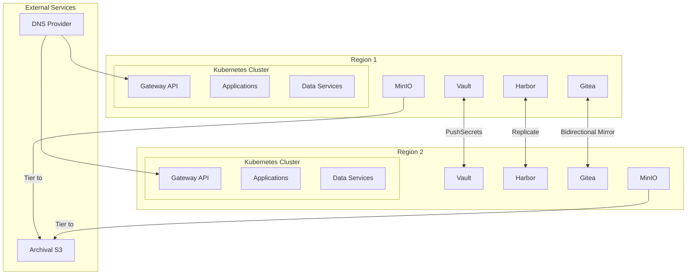
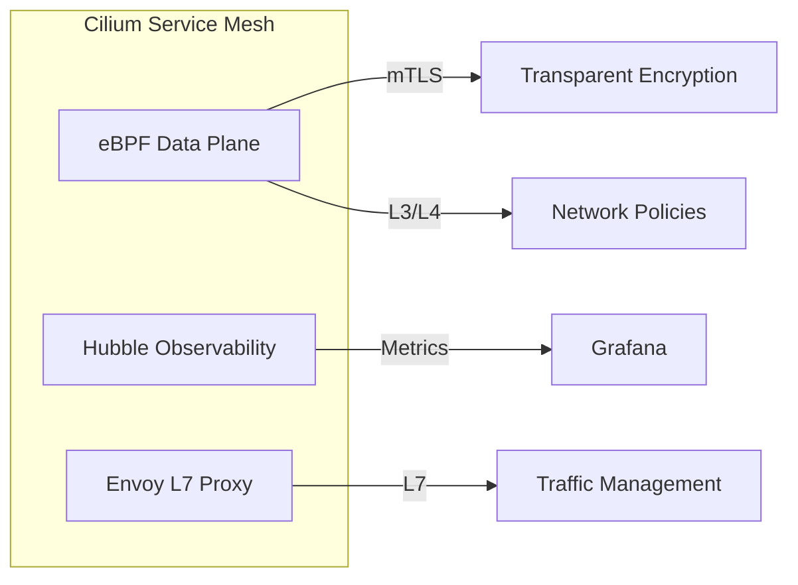
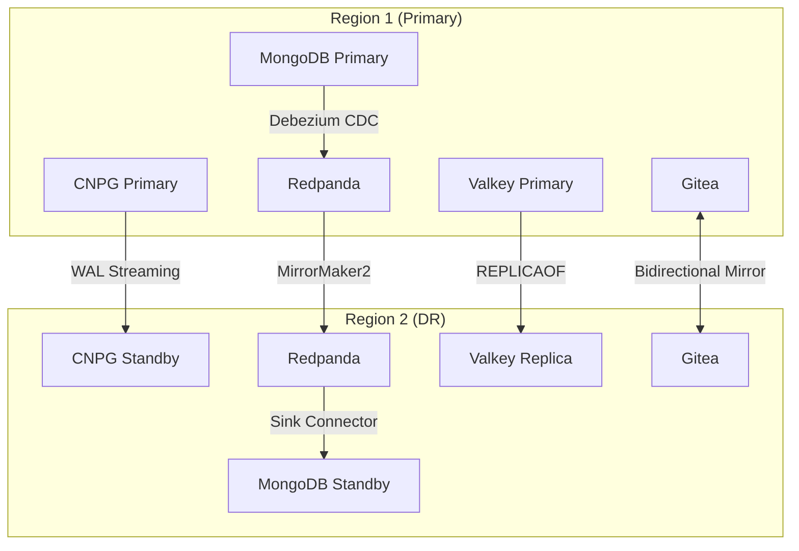

# SPEC: Platform Technology Stack

**Updated:** 2026-01-17

## Overview

Technology stack for the OpenOva Kubernetes platform. Components are categorized as **Mandatory** (always installed) or **User Choice** (options available).

## Architecture Overview

## Mandatory Components

### Infrastructure & Provisioning

| Component | Purpose | Notes |
|-----------|---------|-------|
| Terraform | Bootstrap IaC | Initial cluster provisioning only |
| Crossplane | Day-2 IaC | Cloud resource provisioning post-bootstrap |

### Networking & Service Mesh

| Component | Purpose | Notes |
|-----------|---------|-------|
| Cilium | CNI + Service Mesh | eBPF networking, mTLS, L7 policies |
| Coraza | WAF | OWASP CRS, integrated with Gateway API |
| ExternalDNS | DNS sync | Syncs K8s resources to DNS provider |
| k8gb | GSLB | Authoritative DNS for cross-region load balancing |

### Cilium Service Mesh Features

| Feature | How It Works |
|---------|--------------|
| mTLS | eBPF + WireGuard encryption |
| L7 Policies | CiliumEnvoyConfig |
| Traffic Management | HTTPRoute (Gateway API) |
| Observability | Hubble + OpenTelemetry |

### GitOps, Git & IDP

| Component | Purpose | Notes |
|-----------|---------|-------|
| Flux | GitOps engine | ArgoCD as future option |
| Gitea | Internal Git | Bidirectional mirror, Gitea Actions |
| Backstage | Developer portal | Service catalog, templates |

### Security

| Component | Purpose | Notes |
|-----------|---------|-------|
| cert-manager | TLS certificates | Let's Encrypt integration |
| External Secrets (ESO) | Secrets operator | Manages secrets lifecycle |
| Vault | Secrets backend | One per cluster, synced via PushSecrets |
| Kyverno | Policy engine | Auto-generate PDBs, NetworkPolicies |
| Trivy | Security scanning | CI/CD + Harbor + Runtime |

### Scaling

| Component | Purpose | Notes |
|-----------|---------|-------|
| VPA | Vertical autoscaling | Right-sizing pods |
| KEDA | Horizontal autoscaling | Event-driven, scale-to-zero |

### Observability

| Component | Purpose | Notes |
|-----------|---------|-------|
| Grafana Alloy | Telemetry collector | Unified metrics/logs/traces |
| Loki | Log aggregation | Query via LogQL |
| Mimir | Metrics storage | Prometheus-compatible |
| Tempo | Distributed tracing | OpenTelemetry native |
| Grafana | Visualization | Dashboards and alerting |
| OpenTelemetry | Application tracing | Auto-instrumentation (independent of mesh) |

### Storage & Registry

| Component | Purpose | Notes |
|-----------|---------|-------|
| Harbor | Container registry | Trivy scanning, cross-region replication |
| MinIO | Object storage | Tiered to archival S3 |
| Velero | Backup/restore | Backs up to archival S3 |

### Failover & Resilience

| Component | Purpose | Notes |
|-----------|---------|-------|
| Failover Controller | Failover orchestration | Generic, event-driven |

## User Choice Options

### Cloud Provider

| Provider | Status | Crossplane Provider |
|----------|--------|---------------------|
| Hetzner Cloud | ✅ Available | hcloud |
| Huawei Cloud | 🔜 Coming | huaweicloud |
| Oracle Cloud (OCI) | 🔜 Coming | oci |

### Regions

| Option | Description |
|--------|-------------|
| 1 region | Allowed (no DR) |
| 2 regions | Recommended (multi-region DR) |

### LoadBalancer

| Option | How It Works | Cost |
|--------|--------------|------|
| Cloud Provider LB | Native LB (Hetzner LB, etc.) | ~€5-10/mo |
| k8gb DNS-based LB | Gateway API (hostNetwork) + k8gb health-checks | Free |
| Cilium L2 Mode | ARP-based (same subnet only) | Free |

### DNS Provider

| Provider | Availability | Cost |
|----------|--------------|------|
| Cloudflare | Always | Free |
| Hetzner DNS | If Hetzner chosen | Free |
| AWS Route53 | If AWS chosen | ~$0.50/zone |
| GCP Cloud DNS | If GCP chosen | ~$0.20/zone |
| Azure DNS | If Azure chosen | ~$0.50/zone |

### Secrets Backend

| Option | Type | Notes |
|--------|------|-------|
| Vault self-hosted | Self-hosted | One per cluster, ESO PushSecrets sync |
| HCP Vault | Managed | HashiCorp Cloud Platform |
| Infisical | Managed | Developer-friendly |
| AWS Secrets Manager | Managed | If AWS chosen |
| GCP Secret Manager | Managed | If GCP chosen |
| Azure Key Vault | Managed | If Azure chosen |

### Archival S3 Storage

Used for backup and MinIO tiering:

| Provider | Availability |
|----------|--------------|
| Cloudflare R2 | Always |
| AWS S3 | If AWS chosen |
| GCP GCS | If GCP chosen |
| Azure Blob | If Azure chosen |
| OCI Object Storage | If OCI chosen |
| Huawei OBS | If Huawei chosen |

### WAF Options

| Option | Type | Notes |
|--------|------|-------|
| Coraza | Self-hosted | Free, OWASP CRS |
| Cloudflare WAF | External | Pro tier ($20/mo) |
| AWS WAF | External | If AWS chosen |
| Both (layered) | Hybrid | Defense in depth |

## À La Carte Data Services

| Component | Purpose | DR Strategy |
|-----------|---------|-------------|
| CNPG | PostgreSQL operator | WAL streaming (async primary-replica) |
| MongoDB | Document database | CDC via Debezium → Redpanda |
| Redpanda | Event streaming | MirrorMaker2 |
| Valkey | Redis-compatible cache (BSD-3) | REPLICAOF |

## À La Carte Communication

| Component | Purpose |
|-----------|---------|
| Stalwart | Email server (JMAP/IMAP/SMTP) |
| STUNner | WebRTC gateway |

## Multi-Region Data Flow

## Resource Estimates (Per Region)

| Category | Components | Estimated Resources |
|----------|------------|---------------------|
| Core Platform | Cilium, Flux, ESO, Kyverno | ~2GB RAM |
| Observability | Grafana Stack + Alloy | ~3GB RAM |
| Storage | Harbor, MinIO, Velero | ~4GB RAM |
| Security | Vault, cert-manager, Trivy | ~1GB RAM |
| Git & IDP | Gitea, Backstage | ~2GB RAM |
| **Minimum Total** | | ~12GB RAM |

**Recommended minimum:** 3 nodes × 8GB RAM = 24GB per region

## Related

- [ADR-PLATFORM-ENGINEERING-TOOLS](../adrs/ADR-PLATFORM-ENGINEERING-TOOLS.md)
- [ADR-MULTI-REGION-STRATEGY](../adrs/ADR-MULTI-REGION-STRATEGY.md)
- [ADR-CILIUM-SERVICE-MESH](../../cilium/docs/ADR-CILIUM-SERVICE-MESH.md)
