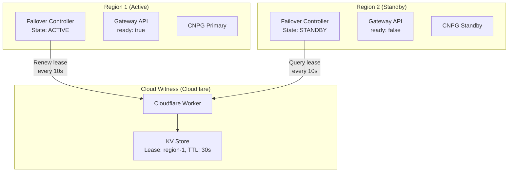
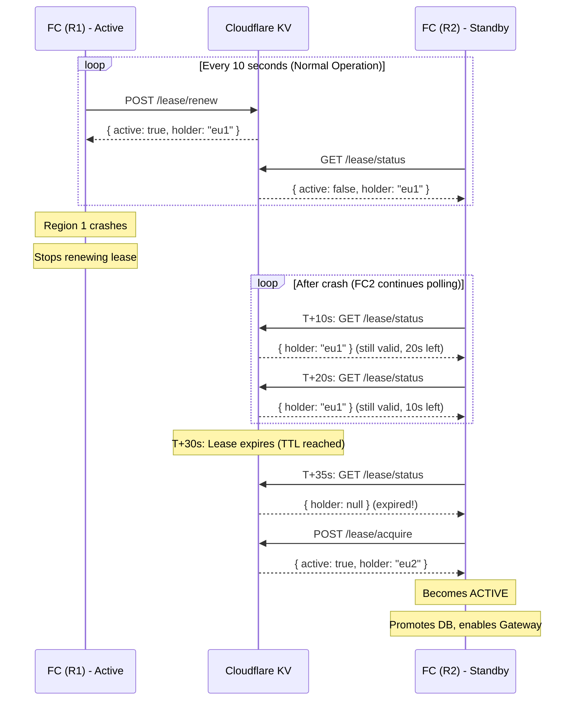

# SPEC: Split-Brain Protection

**Updated:** 2026-01-18

## Overview

Split-brain protection using a **cloud witness** (Cloudflare Workers + KV) to safely coordinate failover and prevent data corruption during network partitions.

## Problem Statement

In multi-region deployments, network partitions can cause "split-brain" scenarios where:
- Both regions think the other is down
- Both regions promote themselves to primary
- Data diverges and becomes inconsistent
- Recovery requires manual intervention and data loss

### Why k8gb Alone Is Insufficient

Deep analysis of k8gb source code revealed that k8gb clusters operate **independently** with **DNS-based discovery only**:

| Aspect | k8gb Behavior |
|--------|---------------|
| Local health | Direct check of Ingress/Gateway endpoints |
| Cross-cluster "health" | DNS query to `localtargets-*` record |
| Communication | DNS only - no direct health checks |

**Critical Problem**: k8gb cannot distinguish between:
- "Region is down" (failover needed)
- "Network partition" (failover NOT wanted)

Both produce the same symptom: DNS query fails or times out.

## Solution: Cloud Witness (Cloudflare Workers + KV)

Use a **third-party cloud service** as a witness to determine who should be active.

### Why Cloud Witness?

| Approach | Automatic? | Split-brain Safe? | Dependency |
|----------|------------|-------------------|------------|
| **Cloud Witness (selected)** | Yes | Yes | Cloudflare reachability |
| External DNS resolvers | Partial | Partial | Can verify reachability but not authority |
| 3-region quorum | Yes | Yes | Third region (expensive) |
| Manual DR | No | Yes | Human operator |

### Architecture



## Lease Mechanism

### How It Works

1. **Active region holds lease**: Renews every 10s, lease TTL is 30s
2. **Standby region queries**: Checks who holds the lease
3. **Failover on expiry**: If lease expires, standby can acquire it



## Cloudflare Worker Implementation

```javascript
export default {
  async fetch(request, env) {
    const url = new URL(request.url);
    const region = request.headers.get("X-Region-ID");
    const domain = url.searchParams.get("domain") || "default";
    const key = `lease:${domain}:active-region`;

    if (url.pathname === "/lease/renew" && request.method === "POST") {
      const current = await env.LEASE_KV.get(key);
      if (current === region || current === null) {
        await env.LEASE_KV.put(key, region, { expirationTtl: 30 });
        return Response.json({ active: true, holder: region });
      }
      return Response.json({ active: false, holder: current });
    }

    if (url.pathname === "/lease/acquire" && request.method === "POST") {
      const current = await env.LEASE_KV.get(key);
      if (!current) {
        await env.LEASE_KV.put(key, region, { expirationTtl: 30 });
        return Response.json({ active: true, holder: region });
      }
      return Response.json({ active: false, holder: current });
    }

    if (url.pathname === "/lease/status") {
      const current = await env.LEASE_KV.get(key);
      return Response.json({
        active: current === region,
        holder: current || null
      });
    }

    if (url.pathname === "/lease/release" && request.method === "POST") {
      const current = await env.LEASE_KV.get(key);
      if (current === region) {
        await env.LEASE_KV.delete(key);
        return Response.json({ released: true });
      }
      return Response.json({ released: false, holder: current });
    }

    return new Response("Not found", { status: 404 });
  }
}
```

## Scenarios

### Scenario 1: True Region Failure

```
Region 1 completely fails (power, network, etc.)

Timeline:
T+0s:   Region 1 crashes, Failover Controller stops renewing
T+10s:  Region 2 queries → lease still valid (20s left)
T+20s:  Region 2 queries → lease still valid (10s left)
T+30s:  Lease expires in Cloudflare KV
T+35s:  Region 2 queries → lease is null
T+36s:  Region 2 acquires lease
T+37s:  Region 2 promotes CNPG, enables Gateway
T+40s:  k8gb sees endpoints in R2, updates DNS

Result: Clean failover, no split-brain
```

### Scenario 2: Network Partition (Split-Brain Risk)

```
Network partition between R1 and R2 (both still running, both reach Cloudflare)

R1 (Active):
- Continues renewing lease every 10s
- Cloudflare accepts renewal
- Stays ACTIVE

R2 (Standby):
- Queries lease status every 10s
- Sees R1 still holds lease
- Cannot acquire lease
- Stays STANDBY

Result: NO split-brain - witness is single source of truth
```

### Scenario 3: Witness Unavailable

```
Cloudflare Workers temporarily unavailable

R1 (Active):
- Cannot renew lease → keeps current state (ACTIVE)
- Does NOT demote itself

R2 (Standby):
- Cannot query status → keeps current state (STANDBY)
- Does NOT try to acquire

Result: NO failover possible, but NO split-brain either (safe failure mode)
```

### Scenario 4: Planned Failover (DR Test)

```yaml
# Operator applies FailoverCommand
apiVersion: failover.openova.io/v1
kind: FailoverCommand
metadata:
  name: dr-test
spec:
  domain: acme-production
  action: failover
  targetRegion: eu2
  reason: "Quarterly DR test"
  approvedBy: "sre@acme.com"
```

```
1. R1 FC receives command
2. R1 FC releases lease (POST /lease/release)
3. R1 FC demotes DB, disables Gateway
4. R1 FC transitions to STANDBY
5. R2 FC sees lease available
6. R2 FC acquires lease
7. R2 FC promotes DB, enables Gateway
8. R2 FC transitions to ACTIVE

Result: Controlled failover with audit trail
```

## Configuration

```yaml
apiVersion: failover.openova.io/v1
kind: FailoverDomain
metadata:
  name: acme-production
spec:
  witness:
    type: cloudflare-kv
    cloudflareKV:
      workerUrl: https://failover-witness.openova.workers.dev
      secretRef:
        name: cloudflare-credentials
    leaseTimeout: 30s
    renewInterval: 10s

  region: eu1
  priority: 1

  mode: automatic  # automatic | semi-automatic | manual
```

## Failure Scenario Matrix

| Scenario | R1 FC | R2 FC | Witness | Result |
|----------|-------|-------|---------|--------|
| Normal operation | Renews, ACTIVE | Queries, STANDBY | Accessible | Traffic to R1 |
| R1 crashes | Dead | Acquires after 30s | Accessible | Failover to R2 |
| R1 network down | Can't renew | Acquires after 30s | Accessible | Failover to R2 |
| R1↔R2 partition | Renews, ACTIVE | Queries, STANDBY | Accessible | **No split-brain** |
| Witness down | Keeps ACTIVE | Keeps STANDBY | Inaccessible | No change (safe) |
| R1 + witness down | Dead | Can't acquire | Inaccessible | **Manual intervention** |

## Monitoring

### Metrics

| Metric | Description |
|--------|-------------|
| `failover_lease_holder` | Current lease holder region (label) |
| `failover_lease_ttl_seconds` | Time until lease expires |
| `failover_witness_reachable` | Witness reachability (0/1) |
| `failover_controller_state` | Current state (0=standby, 1=active, 2=failing_over) |

### Alerts

| Alert | Condition | Severity |
|-------|-----------|----------|
| FailoverWitnessUnreachable | witness_reachable == 0 for > 5m | Critical |
| FailoverLeaseExpiringSoon | lease_ttl < 10s AND state == active | Warning |
| FailoverBothRegionsStandby | Both regions in STANDBY state | Critical |
| FailoverBothRegionsActive | Both regions in ACTIVE state | Critical |

### Grafana Dashboard

```promql
# Current active region
failover_controller_state{state="active"}

# Lease TTL
failover_lease_ttl_seconds

# Witness health
failover_witness_reachable
```

## Comparison with Alternatives

| Approach | Split-brain Safe | Automatic | Cost | Complexity |
|----------|-----------------|-----------|------|------------|
| **Cloudflare Witness** | Yes | Yes | Free tier | Low |
| External DNS resolvers | Partial | Yes | Free | Low |
| Dedicated witness servers | Yes | Yes | $$$ | High |
| 3-region quorum | Yes | Yes | $$$ | High |
| Manual runbook | Yes | No | Free | Low |

## Limitations

1. **Cloudflare dependency**: Both regions must reach Cloudflare (mitigated by Cloudflare's 99.99% SLA)
2. **Minimum 30s failover time**: Lease TTL determines minimum time to detect failure
3. **Cannot handle witness + primary down**: Requires manual intervention

## Best Practices

1. **Test failover regularly**: Run DR tests monthly using FailoverCommand
2. **Monitor witness health**: Alert if witness unreachable
3. **Log all lease operations**: Audit trail for compliance
4. **Use semi-automatic for critical workloads**: Require human approval
5. **Implement fencing at data layer**: CNPG fencing as defense-in-depth

## Related

- [ADR-FAILOVER-CONTROLLER](../../failover-controller/docs/ADR-FAILOVER-CONTROLLER.md)
- [ADR-K8GB-GSLB](../../k8gb/docs/ADR-K8GB-GSLB.md)
- [SPEC-DNS-FAILOVER](./SPEC-DNS-FAILOVER.md)
- [ADR-MULTI-REGION-STRATEGY](../adrs/ADR-MULTI-REGION-STRATEGY.md)
