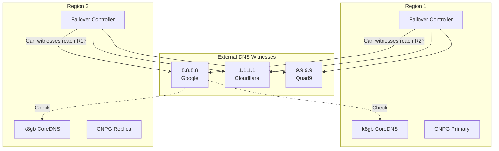
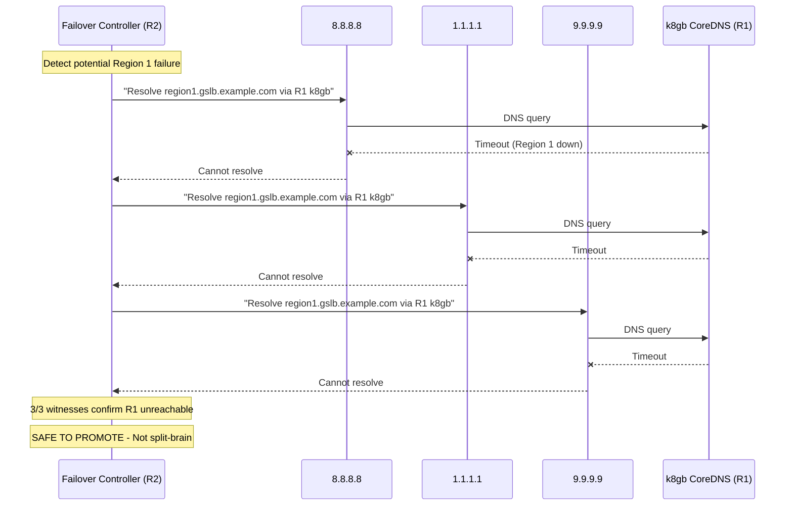

# SPEC: Split-Brain Protection

**Updated:** 2026-01-17

## Overview

Split-brain protection using external DNS witnesses to safely detect region failures and prevent data corruption during failover.

## Problem Statement

In multi-region deployments, network partitions can cause "split-brain" scenarios where:
- Both regions think the other is down
- Both regions promote themselves to primary
- Data diverges and becomes inconsistent
- Recovery requires manual intervention and data loss

## Solution: External DNS Witnesses

Use public DNS resolvers as independent witnesses to verify region availability before triggering failover.

## Architecture



## Witness Selection

| Resolver | Provider | Location | Purpose |
|----------|----------|----------|---------|
| 8.8.8.8 | Google | Global anycast | Primary witness |
| 1.1.1.1 | Cloudflare | Global anycast | Secondary witness |
| 9.9.9.9 | Quad9 | Global anycast | Tertiary witness |

### Why These Resolvers

- **Independent**: Not hosted on same infrastructure as either region
- **Reliable**: 99.99%+ uptime, anycast for global availability
- **Diverse**: Different providers reduce correlated failures
- **Free**: No cost, no API keys required

## Quorum-Based Detection

### Decision Matrix

| 8.8.8.8 | 1.1.1.1 | 9.9.9.9 | Decision |
|---------|---------|---------|----------|
| ✅ | ✅ | ✅ | Region UP - no action |
| ✅ | ✅ | ❌ | Region UP - no action |
| ✅ | ❌ | ❌ | **Region DOWN** - 2/3 agree |
| ❌ | ✅ | ❌ | **Region DOWN** - 2/3 agree |
| ❌ | ❌ | ✅ | **Region DOWN** - 2/3 agree |
| ❌ | ❌ | ❌ | **Region DOWN** - 3/3 agree |

**Quorum requirement**: 2 out of 3 witnesses must agree the other region is unreachable.

## Detection Flow



## Implementation

### Detection Algorithm

```go
package splitbrain

import (
    "context"
    "net"
    "time"
)

type WitnessConfig struct {
    Resolvers       []string      // ["8.8.8.8", "1.1.1.1", "9.9.9.9"]
    TargetHostname  string        // "region1.gslb.example.com"
    QueryTimeout    time.Duration // 10s
    Quorum          int           // 2
}

func IsOtherRegionTrulyDown(ctx context.Context, config WitnessConfig) (bool, error) {
    unreachableCount := 0
    results := make(map[string]bool)

    for _, resolver := range config.Resolvers {
        reachable := canResolverReachTarget(ctx, resolver, config.TargetHostname, config.QueryTimeout)
        results[resolver] = reachable
        if !reachable {
            unreachableCount++
        }
    }

    // Need quorum (default 2/3) to agree region is down
    isTrulyDown := unreachableCount >= config.Quorum

    return isTrulyDown, nil
}

func canResolverReachTarget(ctx context.Context, resolver, hostname string, timeout time.Duration) bool {
    r := &net.Resolver{
        PreferGo: true,
        Dial: func(ctx context.Context, network, address string) (net.Conn, error) {
            d := net.Dialer{Timeout: timeout}
            return d.DialContext(ctx, "udp", resolver+":53")
        },
    }

    queryCtx, cancel := context.WithTimeout(ctx, timeout)
    defer cancel()

    _, err := r.LookupHost(queryCtx, hostname)
    return err == nil
}
```

### Configuration

```yaml
apiVersion: failover.openova.io/v1alpha1
kind: FailoverConfig
metadata:
  name: split-brain-protection
spec:
  witnesses:
    externalDNS:
      resolvers:
        - 8.8.8.8
        - 1.1.1.1
        - 9.9.9.9
      targetHostname: region-1.gslb.example.com
      queryTimeout: 10s
      quorum: 2

  healthCheck:
    interval: 10s
    failureThreshold: 3  # 3 consecutive failures before checking witnesses
```

## Scenarios

### Scenario 1: True Region Failure

```
Region 1 completely fails (power, network, etc.)

1. Region 2 Failover Controller detects R1 unhealthy (local check)
2. Failover Controller queries all 3 witnesses
3. All 3 witnesses report: "Cannot reach R1 k8gb CoreDNS"
4. Quorum met (3/3 > 2)
5. Decision: SAFE TO PROMOTE
6. CNPG replica promoted to primary
7. DNS failover (k8gb already handled this independently)
```

### Scenario 2: Network Partition (Split-Brain Risk)

```
Network partition between R1 and R2 (both still running)

1. Region 2 Failover Controller detects R1 unhealthy (local check)
2. Failover Controller queries all 3 witnesses
3. Witness results:
   - 8.8.8.8: "Can reach R1 k8gb" ✅
   - 1.1.1.1: "Can reach R1 k8gb" ✅
   - 9.9.9.9: "Can reach R1 k8gb" ✅
4. Quorum NOT met (0/3 < 2)
5. Decision: DO NOT PROMOTE - This is a network partition, not failure
6. Wait for partition to heal
```

### Scenario 3: Witness Unavailability

```
One or more witnesses temporarily unavailable

1. Region 2 Failover Controller queries witnesses
2. Results:
   - 8.8.8.8: "Cannot reach R1" ❌
   - 1.1.1.1: Query timeout (witness unreachable) ⚠️
   - 9.9.9.9: "Cannot reach R1" ❌
3. Treat timeout as "unknown" (not counted either way)
4. 2 out of 2 responding witnesses agree R1 down
5. Decision: SAFE TO PROMOTE (quorum met with responding witnesses)
```

## Monitoring

### Metrics

| Metric | Description |
|--------|-------------|
| `splitbrain_witness_reachable` | Witness reachability (0/1) per resolver |
| `splitbrain_witness_latency_seconds` | Query latency per resolver |
| `splitbrain_other_region_status` | Other region status per witness (0/1) |
| `splitbrain_quorum_reached` | Whether quorum was reached (0/1) |
| `splitbrain_checks_total` | Total split-brain checks |
| `splitbrain_promotions_total` | Total promotions triggered |

### Alerts

| Alert | Condition | Severity |
|-------|-----------|----------|
| SplitBrainWitnessUnreachable | witness_reachable == 0 for > 5m | Warning |
| SplitBrainAllWitnessesUnreachable | All witnesses unreachable | Critical |
| SplitBrainQuorumDegraded | Only 1 witness responding | Warning |

### Grafana Dashboard

```promql
# Witness health
sum(splitbrain_witness_reachable) by (resolver)

# Other region status as seen by witnesses
sum(splitbrain_other_region_status) by (resolver)

# Promotion decisions
rate(splitbrain_promotions_total[5m])
```

## Comparison with Alternatives

| Approach | Pros | Cons | Selected |
|----------|------|------|----------|
| **External DNS Witnesses** | Simple, reliable, free | Depends on public DNS | ✅ |
| Cloudflare Worker | More control | Cost, complexity | ❌ |
| Dedicated witness servers | Full control | Cost, maintenance | ❌ |
| Raft consensus | Proven | Requires odd # of regions | ❌ |

## Limitations

1. **DNS Propagation**: Witnesses check DNS, so detection depends on k8gb updating records
2. **Anycast Routing**: Witnesses may route through different paths than user traffic
3. **Partial Failures**: May not detect partial failures within a region
4. **Witness Reliability**: Depends on public DNS resolvers being available

## Best Practices

1. **Never promote without witness confirmation**
2. **Log all witness responses** for post-incident analysis
3. **Monitor witness health** independently
4. **Test failover regularly** in non-production
5. **Have manual override** for edge cases

## Related

- [ADR-FAILOVER-CONTROLLER](../../failover-controller/docs/ADR-FAILOVER-CONTROLLER.md)
- [ADR-K8GB-GSLB](../../k8gb/docs/ADR-K8GB-GSLB.md)
- [SPEC-DNS-FAILOVER](./SPEC-DNS-FAILOVER.md)
