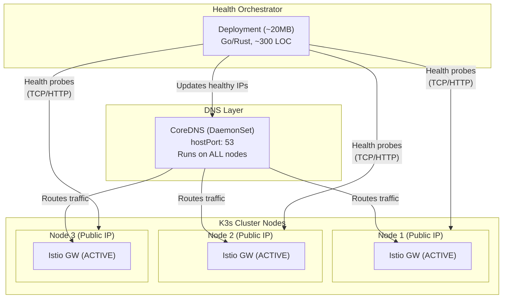

# Infrastructure Agreements - Contabo Migration

**Purpose:** Document all infrastructure decisions and agreements made during the Contabo migration planning session, and identify all existing documentation that requires updates.

**Created:** January 2026

---

## Table of Contents

1. [Executive Summary](#executive-summary)
2. [Infrastructure Agreements](#infrastructure-agreements)
3. [K3s Configuration Agreements](#k3s-configuration-agreements)
4. [Networking Agreements](#networking-agreements)
5. [Service Mesh Agreements](#service-mesh-agreements)
6. [Storage Agreements](#storage-agreements)
7. [Terraform & IaC Agreements](#terraform--iac-agreements)
8. [Documents Requiring Updates](#documents-requiring-updates)
9. [Migration Checklist](#migration-checklist)

---

## Executive Summary

### Key Decision: Oracle Cloud to Contabo Migration

**Previous State:** Oracle Cloud Always Free tier with Tailscale mesh VPN
**New State:** Contabo VPS (Europe initially) with public IPs and self-hosted DNS failover

**Rationale:**
- Oracle Cloud Always Free has severe ARM capacity issues (weeks of waiting)
- Abu Dhabi region lock-in with no capacity
- Contabo provides immediate provisioning with excellent value (~$0.54-0.62/GB RAM)
- Public IPs eliminate need for Tailscale mesh VPN complexity

**Scope:** This infrastructure will serve as the foundation for 10+ future projects, not just Talent Mesh.

---

## Infrastructure Agreements

### 1. Cloud Provider Selection

| Decision | Value | Rationale |
|----------|-------|-----------|
| **Primary Provider** | Contabo | Best $/GB RAM value, official Terraform provider |
| **Initial Region** | Europe (Germany) | Lowest latency to development team |
| **Future Region** | India | 40-60ms to UAE/Oman when ME latency critical |
| **Commitment** | Start monthly, commit 12-months after validation | Avoid lock-in during testing |

### 2. Cluster Configuration

| Decision | Value | Rationale |
|----------|-------|-----------|
| **Node Count** | 3 nodes | Required for etcd quorum (HA) |
| **Node Type** | VPS 10 | Best value: 4 vCPU, 8GB RAM, 200GB SSD |
| **Node Roles** | All nodes: Control Plane + Worker | Maximizes resource utilization |
| **Total Resources** | 12 vCPU, 24GB RAM, 600GB SSD | Sufficient for MVP |
| **Monthly Cost** | ~€13.50 (~$15) | 3x VPS 10 @ €4.50 each |

### 3. Control Plane Strategy

| Decision | Value | Rationale |
|----------|-------|-----------|
| **Architecture** | 3 Control Planes | Enterprise-grade HA with etcd quorum |
| **Quorum** | 3-node etcd | Tolerates 1 node failure |
| **Why not 1 CP?** | Acceptable but IaC rebuild ~20-30 min | User preference for HA |
| **Why not 2 CPs?** | Worse than 1 CP (split-brain risk) | Invalid etcd configuration |

---

## K3s Configuration Agreements

### 4. K3s Installation Command (Optimized)

```bash
# First control plane node
curl -sfL https://get.k3s.io | sh -s - server \
  --cluster-init \
  --disable traefik \
  --disable servicelb \
  --disable local-storage \
  --kube-controller-manager-arg="node-monitor-period=5s" \
  --kube-controller-manager-arg="node-monitor-grace-period=20s" \
  --kube-apiserver-arg="default-watch-cache-size=50" \
  --etcd-arg="quota-backend-bytes=1073741824" \
  --kubelet-arg="max-pods=50" \
  --kubelet-arg="image-gc-high-threshold=70" \
  --kubelet-arg="image-gc-low-threshold=50"

# Additional control plane nodes (join existing cluster)
curl -sfL https://get.k3s.io | K3S_URL=https://<first-node-ip>:6443 \
  K3S_TOKEN=<token> sh -s - server \
  --disable traefik \
  --disable servicelb \
  --disable local-storage \
  --kube-controller-manager-arg="node-monitor-period=5s" \
  --kube-controller-manager-arg="node-monitor-grace-period=20s" \
  --kube-apiserver-arg="default-watch-cache-size=50" \
  --kubelet-arg="max-pods=50" \
  --kubelet-arg="image-gc-high-threshold=70" \
  --kubelet-arg="image-gc-low-threshold=50"
```

### 5. K3s Disabled Components

| Component | Status | Rationale |
|-----------|--------|-----------|
| `traefik` | **DISABLED** | Istio Ingress Gateway handles all ingress |
| `servicelb` | **DISABLED** | Using DNS-based failover, not LoadBalancer |
| `local-storage` | **DISABLED** | Application-level storage replication |
| `metrics-server` | **KEEP ENABLED** | Required for HPA and monitoring |

### 6. K3s Optimization Parameters

| Parameter | Value | Purpose |
|-----------|-------|---------|
| `node-monitor-period` | 5s | Faster node health detection |
| `node-monitor-grace-period` | 20s | Faster failover |
| `default-watch-cache-size` | 50 | Reduced memory usage |
| `quota-backend-bytes` | 1GB | etcd storage limit |
| `max-pods` | 50 | Per-node pod limit |
| `image-gc-high-threshold` | 70% | Garbage collection trigger |
| `image-gc-low-threshold` | 50% | Post-GC target |

---

## Networking Agreements

### 7. No Tailscale Required

| Decision | Value | Rationale |
|----------|-------|-----------|
| **Tailscale** | **NOT USED** | Public IPs on Contabo nodes |
| **Inter-node traffic** | Direct over public IPs | Cilium CNI over public network |
| **Security** | K8s NetworkPolicies + Istio mTLS | Encryption at application layer |

### 8. Load Balancing Strategy

| Decision | Value | Rationale |
|----------|-------|-----------|
| **MetalLB** | **NOT USED** | Doesn't work on VPS (virtualized ARP) |
| **kube-vip** | **NOT USED** | Causes idle Istio Ingress Gateways |
| **Cloudflare LB** | **NOT USED** | Health checks cost $5+/month |
| **Solution** | Self-hosted DNS + Health Orchestrator | All Istio Gateways ACTIVE |

### 9. Self-Hosted DNS Failover Architecture



**Key Properties:**
- All Istio Ingress Gateways are **ACTIVE** (no idle resources)
- DNS returns only healthy node IPs
- ~20MB additional memory overhead
- Pure IaC management (Helm chart)
- No manual intervention required

### 10. DNS Failover Components

| Component | Deployment | Resource |
|-----------|------------|----------|
| CoreDNS | DaemonSet (hostPort 53) | Built into K3s |
| Health Orchestrator | Deployment (1 replica) | ~20MB RAM |
| ConfigMap | Dynamic IP list | Updated by orchestrator |

---

## Service Mesh Agreements

### 11. Istio Configuration

| Decision | Value | Rationale |
|----------|-------|-----------|
| **Mode** | **Ambient Mode** (sidecar-less) | Reduced memory overhead |
| **Ingress** | Istio Ingress Gateway | All external traffic |
| **mTLS** | Enabled (STRICT) | Service-to-service encryption |
| **Gateways** | DaemonSet on all nodes | All gateways active |

### 12. Why Istio Ambient Mode?

**Benefits:**
- No sidecar containers (saves ~50MB per pod)
- Simplified debugging
- Faster pod startup
- Same mTLS and traffic management capabilities
- L4 and L7 processing via ztunnel and waypoint proxies

**Trade-offs:**
- Newer feature (verify stability)
- Some advanced L7 features require waypoint proxies

### 13. Internal Service Load Balancing

Istio handles internal service load balancing automatically:

```
Service A --> Envoy (ztunnel) --> Service B (multiple pods)
                                      │
                                      ├── Pod B-1
                                      ├── Pod B-2
                                      └── Pod B-3
```

- Automatic round-robin across healthy pods
- Circuit breaking and retry policies
- No additional configuration needed

---

## Storage Agreements

### 14. Storage Strategy

| Component | Storage | Replication |
|-----------|---------|-------------|
| **Boot Disk** | 200GB SSD per node (600GB total) | N/A |
| **MinIO** | Deployed on boot disks | Erasure coding across nodes |
| **PostgreSQL** | Boot disk | Streaming replication (app-level) |
| **MongoDB** | Boot disk | Replica set (app-level) |
| **Redis** | Boot disk | Single instance (MVP) |

### 15. No CSI Required

| Decision | Value | Rationale |
|----------|-------|-----------|
| **Block Storage** | **NOT USED** | Boot disk sufficient for MVP |
| **CSI Driver** | **NOT NEEDED** | Application-level replication |
| **Longhorn** | **NOT USED** | Adds complexity, not needed |

---

## Terraform & IaC Agreements

### 16. Terraform Provider Status

| Provider | Status | Notes |
|----------|--------|-------|
| **Contabo** | Official provider available | Known issues: #36 (multi-server), #38 (import) |
| **Hetzner** | Official provider (mature) | Fallback option |

**Contabo Provider Issues to Monitor:**
- Issue #36: Single apply may create multiple servers
- Issue #38: Cannot destroy imported instances
- Workaround: Careful state management, avoid imports

### 17. Terraform Module Structure

```
terraform/
├── modules/
│   ├── contabo-vm/           # Contabo VPS provisioning
│   ├── hetzner-vm/           # Hetzner fallback
│   ├── k3s-cluster/          # K3s installation
│   ├── dns-failover/         # CoreDNS + Health Orchestrator
│   └── istio-ambient/        # Istio Ambient Mode setup
├── environments/
│   ├── contabo/              # Primary (Europe)
│   ├── contabo-india/        # Future (ME latency)
│   └── hetzner/              # Fallback
└── main.tf
```

### 18. Helm Charts Required

| Chart | Purpose | Source |
|-------|---------|--------|
| `dns-failover` | CoreDNS + Health Orchestrator | Custom (to create) |
| `istio` | Ambient mode installation | istio.io |
| `minio` | Object storage | minio.io |
| `postgresql` | Database with replication | bitnami |
| `mongodb` | Replica set | bitnami |

---

## Documents Requiring Updates

### Critical Updates (Core Principles Changed)

| Document | Current State | Required Changes |
|----------|---------------|------------------|
| **CLAUDE.md** | Oracle Cloud, Tailscale, 2 nodes | Contabo, public IPs, 3 nodes, Istio Ambient |
| **INDEX.md** | Oracle Cloud Always Free via Tailscale | Contabo VPS, remove Tailscale references |
| **ADR-011** | Oracle Cloud specific | **Supersede with new Contabo ADR** |

### Architecture Documents

| Document | Current State | Required Changes |
|----------|---------------|------------------|
| **DEPLOYMENT_ARCHITECTURE.md** | Entirely Oracle-based, Tailscale | Complete rewrite for Contabo |
| **SYSTEM_OVERVIEW.md** | Oracle Cloud references | Update to Contabo |

### Operations Documents

| Document | Current State | Required Changes |
|----------|---------------|------------------|
| **INFRASTRUCTURE_SETUP.md** | Oracle Cloud, Tailscale setup | Rewrite for Contabo |
| **DEPLOYMENT_GUIDE.md** | Oracle Cloud, Tailscale | Update for Contabo |
| **VENDOR_EVALUATION.md** | Contabo as recommendation | Update final recommendation |
| **CLOUD_PROVIDER_COST_COMPARISON.md** | Good analysis | Minor updates to reflect decision |

### Technical Specifications

| Document | Current State | Required Changes |
|----------|---------------|------------------|
| **TECH_STACK.md** | Oracle Cloud, Tailscale, Istio sidecars | Contabo, public IPs, Istio Ambient |
| **SECRETS_MANAGEMENT.md** | Oracle-specific examples | Update for Contabo |

### ADRs

| Document | Current State | Required Changes |
|----------|---------------|------------------|
| **ADR-008** | Istio with sidecars | Add Istio Ambient Mode section |
| **ADR-011** | Oracle Cloud | **Create new ADR-014 for Contabo** |

---

## Conflict Summary

### Removed Technologies

| Technology | Status | Replaced By |
|------------|--------|-------------|
| Oracle Cloud Always Free | **REMOVED** | Contabo VPS |
| Tailscale Mesh VPN | **REMOVED** | Public IPs + Flannel |
| Traefik (K3s default) | **REMOVED** | Istio Ingress Gateway |
| servicelb (K3s default) | **REMOVED** | DNS-based failover |
| local-storage (K3s default) | **REMOVED** | Application-level storage |
| Istio Sidecars | **REMOVED** | Istio Ambient Mode |
| kube-vip | **NOT USED** | DNS-based failover |
| MetalLB | **NOT USED** | DNS-based failover |

### Architecture Changes

| Aspect | Before | After |
|--------|--------|-------|
| Cloud Provider | Oracle Cloud Always Free | Contabo VPS |
| Node Count | 2 nodes (1 CP + 1 Worker) | 3 nodes (all CP + Worker) |
| Networking | Tailscale mesh (100.x.x.x) | Public IPs + Flannel |
| Load Balancing | Not specified | DNS + Health Orchestrator |
| Istio Mode | Sidecar injection | Ambient Mode |
| Storage | Block storage + MinIO | Boot disk + MinIO |

---

## Migration Checklist

### Phase 1: Documentation Updates

- [ ] Update CLAUDE.md with new principles
- [ ] Update INDEX.md references
- [ ] Create ADR-014: Contabo VPS Infrastructure
- [ ] Update ADR-008 for Istio Ambient Mode
- [ ] Update DEPLOYMENT_ARCHITECTURE.md
- [ ] Update TECH_STACK.md
- [ ] Update INFRASTRUCTURE_SETUP.md
- [ ] Update DEPLOYMENT_GUIDE.md

### Phase 2: Terraform Development

- [ ] Create Contabo VM module
- [ ] Create K3s cluster module (3 CPs)
- [ ] Create DNS failover Helm chart
- [ ] Create Istio Ambient installation module
- [ ] Test in Contabo Europe region

### Phase 3: Validation

- [ ] Provision 3-node cluster
- [ ] Verify etcd quorum
- [ ] Test DNS failover
- [ ] Validate Istio Ambient Mode
- [ ] Run load tests

### Phase 4: Commitment

- [ ] If validation passes, commit to 12-month plan
- [ ] Document lessons learned

---

## References

### Conversation Agreements Source

All agreements documented here were made during the infrastructure planning session covering:
- Contabo Terraform provider evaluation
- Load balancing options analysis
- K3s control plane strategy
- DNS failover architecture design
- Istio Ambient Mode decision

### Related Documents

- [CLOUD_PROVIDER_COST_COMPARISON.md](./CLOUD_PROVIDER_COST_COMPARISON.md)
- [VENDOR_EVALUATION.md](./VENDOR_EVALUATION.md)
- [ADR-008: Istio Only](../09-adrs/ADR-008-REMOVE-KONG-USE-ISTIO.md)
- [ADR-014: Contabo VPS Infrastructure](../09-adrs/ADR-014-CONTABO-VPS-INFRASTRUCTURE.md)

---

*Document Version: 1.0*
*Created: January 2026*
*Status: Pending Implementation*
