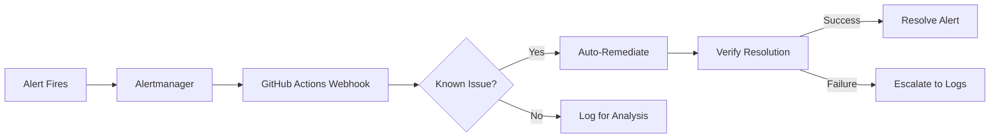
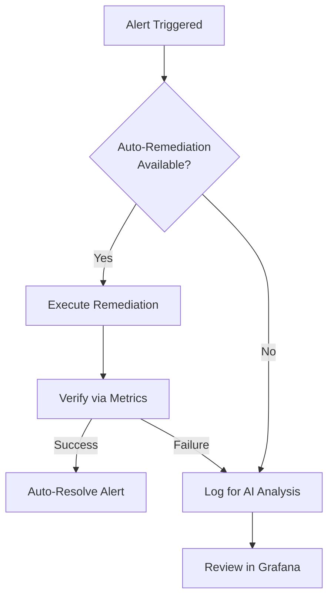
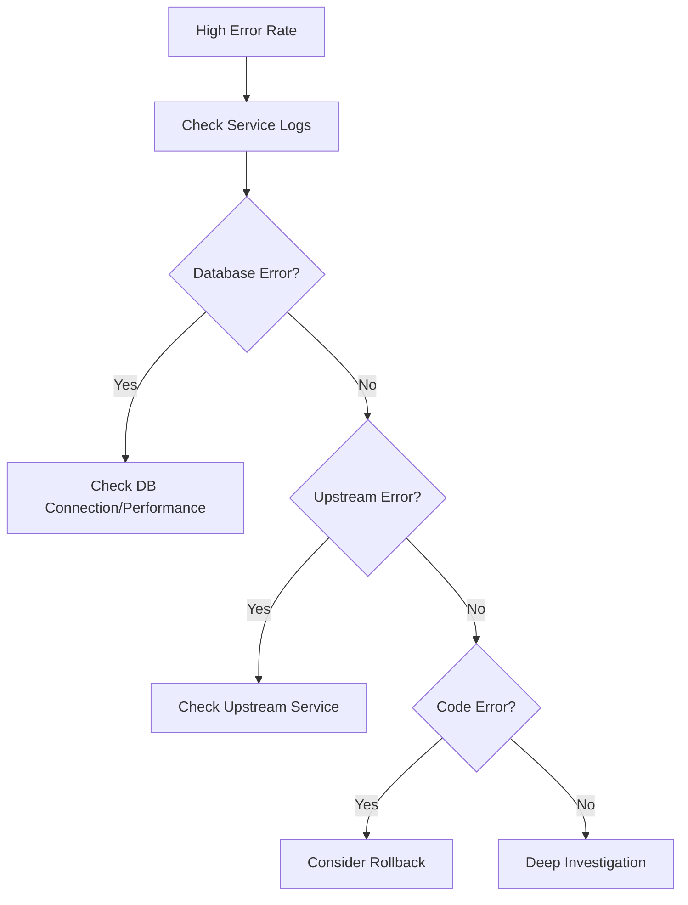
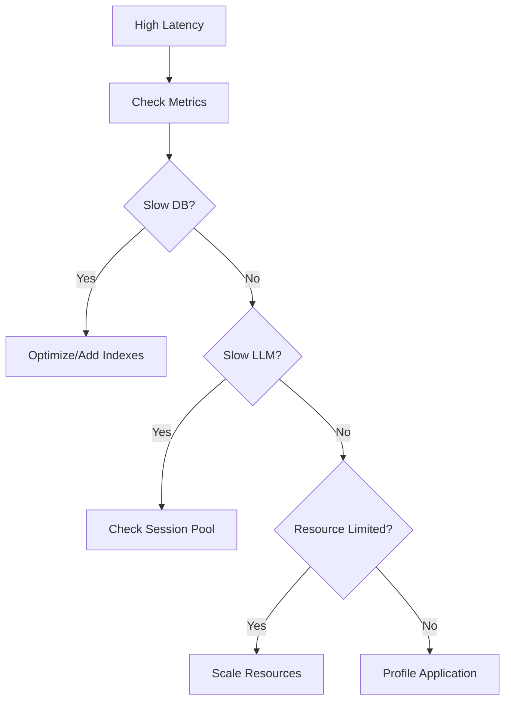

# Talent Mesh Operations Runbook

## Overview

This runbook provides operational procedures for managing Talent Mesh in production.

> **IMPORTANT: Zero-Human-Intervention Operations**
>
> Talent Mesh is a **100% vibe coding** project with fully automated operations. Most incidents are handled automatically via GitHub Actions workflows triggered by Alertmanager webhooks. Manual procedures in this runbook are for reference and edge cases only.
>
> See [ADR-037: Zero-Human-Intervention Ops](/docs/09-adrs/ADR-037-ZERO-HUMAN-INTERVENTION-OPS.md) for complete automation details.

> **Infrastructure:** Unified K3s cluster on Contabo VPS (3 nodes), with DNS-based failover and Istio Ambient Mode.

---

## Table of Contents

1. [Automated Operations](#automated-operations)
2. [Incident Response](#incident-response)
3. [Service-Specific Procedures](#service-specific-procedures)
4. [Database Operations](#database-operations)
5. [Common Issues & Resolutions](#common-issues--resolutions)
6. [Routine Maintenance](#routine-maintenance)
7. [Logging Verbosity](#logging-verbosity)
8. [Metrics Cardinality](#metrics-cardinality)

---

## Automated Operations

### Auto-Remediation Flow

Most alerts trigger automated remediation via GitHub Actions:



### Automated Actions by Alert Type

| Alert | Auto-Action | Fallback |
|-------|-------------|----------|
| HighMemoryUsage | Scale up deployment | Log for analysis |
| PodCrashLoopBackOff | Restart pod | Check recent deployments |
| HighErrorRate | Check/trigger Flagger rollback | Log for analysis |
| DatabaseConnectionExhausted | Restart PgBouncer | Alert and log |
| CertificateExpiringSoon | Trigger cert-manager renewal | Alert |
| HighLatency (API) | Scale affected service | Check for canary |
| HighLatency (AI) | Scale STT/TTS services | Log for analysis |
| BudgetWarning | Log warning | Block further scale-up |
| BudgetExceeded | Block scale-up | Alert |

### Monitoring Automation Status

```bash
# Check recent auto-remediation actions
gh run list --repo talent-mesh/platform --workflow auto-remediation.yaml --limit 10

# Check pending alerts (not yet auto-remediated)
curl -s http://alertmanager.monitoring:9093/api/v2/alerts | jq '.[] | select(.status.state=="active")'

# Check Alertmanager webhook delivery status
curl -s http://alertmanager.monitoring:9093/api/v2/status | jq '.config.route'
```

### Cost Control Automation

Monthly budget: **€15 (~$16.50)**

```bash
# Check current estimated cost
kubectl get nodes | wc -l | xargs -I {} echo "Estimated cost: €$(echo '{} * 4.50' | bc)"

# Check if scale-up is blocked due to budget
gh run list --repo talent-mesh/platform --workflow node-autoscaler.yaml --limit 5

# View budget alerts
curl -s "http://mimir.monitoring:9090/api/v1/query?query=monthly_infrastructure_cost_euros" | jq
```

### Automated Secret Rotation

| Secret Type | Rotation Frequency | CronJob |
|-------------|-------------------|---------|
| PostgreSQL credentials | Monthly | `rotate-db-credentials` |
| MongoDB credentials | Monthly | `rotate-db-credentials` |
| LinkedIn OAuth tokens | Every 6 hours | `refresh-linkedin-token` |
| TLS certificates | Auto (cert-manager) | N/A |
| SOPS age keys | Yearly (manual) | N/A |

```bash
# Check secret rotation job status
kubectl get cronjobs -n secrets

# View last rotation
kubectl logs -n secrets job/rotate-db-credentials-$(date +%Y%m%d) --tail=50
```

### GDPR Automation

| Process | Schedule | CronJob |
|---------|----------|---------|
| Data subject requests | Daily 2 AM | `process-data-requests` |
| Data retention enforcement | Weekly Sunday 3 AM | `enforce-data-retention` |
| Audit log cleanup | Monthly | `cleanup-audit-logs` |

```bash
# Check pending data requests
psql $DATABASE_URL -c "SELECT * FROM data_subject_requests WHERE status = 'pending'"

# Check retention job status
kubectl logs -n platform-services job/enforce-data-retention-latest --tail=50
```

---

## Incident Response

> **Note:** Most incidents are handled automatically. This section documents manual procedures for edge cases and reference.

### Severity Levels

| Level | Description | Response Time | Auto-Remediation |
|-------|-------------|---------------|------------------|
| P1 | Service down, data loss | Immediate | ✅ Auto-scale, auto-rollback |
| P2 | Major degradation | 5 min | ✅ Auto-scale, circuit breaker |
| P3 | Minor issues | 30 min | ✅ Auto-restart pods |
| P4 | Low impact | 4 hours | ❌ Logged for analysis |

### Incident Response Flow (Automated)



### When Manual Intervention is Needed

Manual procedures are only needed for:
- Unknown alert types (not in auto-remediation playbook)
- Repeated auto-remediation failures (same issue recurring)
- Security incidents requiring investigation
- Data recovery from backup
- Infrastructure changes (node replacement)

### On-Call Checklist (For Edge Cases)

```
□ Check if auto-remediation was attempted (gh run list)
□ Review Grafana dashboards for root cause
□ Check Loki logs for error patterns
□ If needed, execute manual fix (documented below)
□ Document new automation opportunity
```

---

## Service-Specific Procedures

### API Gateway (Istio Ingress Gateway)

> **Note:** As per [ADR-008](/docs/09-adrs/ADR-008-REMOVE-KONG-USE-ISTIO.md), we use Istio/Envoy as the API gateway. Kong has been removed.

#### Check Status
```bash
# Check Istio ingress gateway status
kubectl get pods -l istio=ingressgateway -n istio-system

# Check gateway configuration
kubectl get gateway -n talent-mesh

# Check virtual services
kubectl get virtualservice -n talent-mesh

# View ingress logs
kubectl logs -l istio=ingressgateway -n istio-system --tail=100

# Check Envoy proxy config
istioctl proxy-config routes deploy/istio-ingressgateway -n istio-system
```

#### Restart
```bash
# Rolling restart
kubectl rollout restart deployment/istio-ingressgateway -n istio-system

# Verify
kubectl rollout status deployment/istio-ingressgateway -n istio-system
```

#### Common Issues

| Issue | Symptoms | Resolution |
|-------|----------|------------|
| 502 Bad Gateway | Upstream unavailable | Check backend service health, verify VirtualService |
| 503 Service Unavailable | Rate limited or circuit open | Check EnvoyFilter rate limits, DestinationRule |
| 504 Gateway Timeout | Slow upstream | Increase timeout in VirtualService or scale backend |
| 404 Not Found | Route not matched | Check VirtualService path matching |

---

### Auth Service

#### Check Status
```bash
# Health check
curl -s http://auth-service:5001/health | jq

# Check database connection
kubectl exec -it auth-service-0 -n talent-mesh -- \
  node -e "require('./db').test().then(console.log)"

# View logs
kubectl logs -l app=auth-service -n talent-mesh --tail=100
```

#### JWT Issues
```bash
# Verify JWT signing key
kubectl exec -it auth-service-0 -n talent-mesh -- \
  node -e "console.log(process.env.JWT_SECRET ? 'Set' : 'Missing')"

# Decode JWT (development only)
echo $TOKEN | cut -d. -f2 | base64 -d | jq
```

#### Session Issues
```bash
# Check Redis sessions
kubectl exec -it redis-0 -n talent-mesh -- redis-cli keys "session:*" | wc -l

# Clear specific session
kubectl exec -it redis-0 -n talent-mesh -- redis-cli del "session:$SESSION_ID"

# Clear all sessions (careful!)
kubectl exec -it redis-0 -n talent-mesh -- redis-cli keys "session:*" | xargs redis-cli del
```

---

### Assessment Service

#### Check Status
```bash
# Health check
curl -s http://assessment-service:5003/health | jq

# Check MongoDB connection
kubectl exec -it assessment-service-0 -n talent-mesh -- \
  python -c "from app.db import client; print(client.admin.command('ping'))"

# Active assessments
kubectl exec -it assessment-service-0 -n talent-mesh -- \
  python -c "from app.db import db; print(db.assessments.count_documents({'status': 'in_progress'}))"
```

#### Assessment Stuck
```bash
# Find stuck assessments
kubectl exec -it assessment-service-0 -n talent-mesh -- \
  python -c "
from app.db import db
from datetime import datetime, timedelta
stuck = db.assessments.find({
    'status': 'in_progress',
    'updated_at': {'\$lt': datetime.utcnow() - timedelta(hours=2)}
})
for a in stuck:
    print(f\"{a['_id']}: {a['user_id']} - started {a['created_at']}\")
"

# Force complete assessment
curl -X POST http://assessment-service:5003/internal/assessments/$ID/force-complete \
  -H "X-Internal-Token: $INTERNAL_TOKEN"
```

---

### LLM Gateway

#### Check Status
```bash
# Health check
curl -s http://llm-gateway:5005/health | jq

# Session pool status
curl -s http://llm-gateway:5005/sessions | jq

# View logs
kubectl logs -l app=llm-gateway -n talent-mesh --tail=100
```

#### Session Pool Issues
```bash
# Check session status
curl -s http://llm-gateway:5005/sessions | jq '.sessions[] | {id, status, error_count}'

# Force session restart
curl -X POST http://llm-gateway:5005/sessions/restart/$SESSION_ID

# Warmup additional sessions
curl -X POST http://llm-gateway:5005/sessions/warmup?count=2
```

#### High Latency
```bash
# Check current latency
curl -s http://llm-gateway:5005/metrics | grep llm_request_duration

# If CLI backend, check Claude sessions
kubectl exec -it llm-gateway-0 -n talent-mesh -- \
  ps aux | grep claude

# Switch to API backend (if configured)
kubectl set env deployment/llm-gateway LLM_BACKEND=api -n talent-mesh
```

---

### Agent Service (Pod Orchestration)

#### Check Status
```bash
# Health check
curl -s http://agent-service:5008/health | jq

# AI Agent Pod pool status
curl -s http://agent-service:5008/pods | jq

# Queue depth
kubectl exec -it redis-0 -n talent-mesh -- \
  redis-cli xlen assessment-queue
```

#### AI Agent Pod Issues
```bash
# List all pods
curl -s http://agent-service:5008/pods | jq

# Pod details
curl -s http://agent-service:5008/pods/$POD_ID | jq

# Force release stuck pod
curl -X POST http://agent-service:5008/pods/$POD_ID/release

# Scale AI Agent Pods (for handling more concurrent assessments)
kubectl scale deployment/ai-agent-pod --replicas=5 -n talent-mesh

# Check pod metrics
curl -s http://agent-service:5008/pods/$POD_ID/metrics | jq
```

---

### Signaling Service (Rust/WebRTC)

#### Check Status
```bash
# Health check
curl -s http://signaling-service:5009/health | jq

# Active sessions
curl -s http://signaling-service:5009/sessions | jq

# View logs
kubectl logs -l app=signaling-service -n talent-mesh --tail=100
```

#### WebRTC Issues
```bash
# Check STUNner status (K8s-native TURN)
kubectl get pods -l app=stunner -n stunner-system

# Check TURN credentials
kubectl get secret stunner-auth -n stunner-system -o yaml

# ICE connection stats
curl -s http://signaling-service:5009/metrics | grep ice_

# Scale signaling for more concurrent connections
kubectl scale deployment/signaling-service --replicas=3 -n talent-mesh
```

---

### Cilium CNI (Cluster Networking)

#### Check Status
```bash
# Check Cilium pods
kubectl get pods -n kube-system -l k8s-app=cilium

# Check Cilium status
cilium status --wait

# Check node IPs (public IPs on Contabo)
kubectl get nodes -o wide

# Check Cilium connectivity
cilium connectivity test
```

#### Connectivity Issues
```bash
# Check connectivity between nodes
ssh contabo-node-1 'ping contabo-node-2'

# Restart Cilium on a node
kubectl delete pod -n kube-system -l k8s-app=cilium --field-selector spec.nodeName=contabo-node-1

# Check Hubble network flows
hubble observe --namespace talent-mesh

# Verify K3s uses public IPs
kubectl get nodes -o jsonpath='{.items[*].status.addresses}'
```

---

### STT Service (Rust/whisper-rs)

#### Check Status
```bash
# Health check
curl -s http://stt-service:5006/health | jq

# Model status
curl -s http://stt-service:5006/model | jq

# Test transcription
curl -X POST http://stt-service:5006/transcribe \
  -F "audio=@test.wav" | jq
```

#### Performance Issues
```bash
# Check CPU/Memory (x86_64 optimized)
kubectl top pod -l app=stt-service -n talent-mesh

# Check model loaded (whisper-rs)
kubectl logs -l app=stt-service -n talent-mesh | grep "model loaded"

# Scale for demand (within cluster capacity)
kubectl scale deployment/stt-service --replicas=3 -n talent-mesh

# Check Rust service metrics
curl -s http://stt-service:5006/metrics | grep stt_
```

---

### TTS Service (Rust/piper-rs)

#### Check Status
```bash
# Health check
curl -s http://tts-service:5007/health | jq

# Test synthesis
curl -X POST http://tts-service:5007/synthesize \
  -d '{"text": "Hello, this is a test"}' \
  -o test.wav
```

#### Voice Issues
```bash
# List available voices
curl -s http://tts-service:5007/voices | jq

# Check voice model (x86_64 optimized)
kubectl exec -it deploy/tts-service -n talent-mesh -- \
  ls -la /models/

# Check Rust service metrics
curl -s http://tts-service:5007/metrics | grep tts_

# Reload voice model
curl -X POST http://tts-service:5007/reload
```

---

## Database Operations

### PostgreSQL

#### Connection Issues
```bash
# Test connection
kubectl exec -it postgres-0 -n talent-mesh -- \
  psql -U talent_mesh -d auth -c "SELECT 1"

# Check connections
kubectl exec -it postgres-0 -n talent-mesh -- \
  psql -U talent_mesh -d auth -c "SELECT count(*) FROM pg_stat_activity"

# Kill long-running queries
kubectl exec -it postgres-0 -n talent-mesh -- \
  psql -U talent_mesh -d auth -c "
    SELECT pg_terminate_backend(pid)
    FROM pg_stat_activity
    WHERE duration > interval '30 minutes'
  "
```

#### Backup & Restore
```bash
# Create backup
kubectl exec -it postgres-0 -n talent-mesh -- \
  pg_dump -U talent_mesh auth > backup_$(date +%Y%m%d_%H%M).sql

# Restore backup
kubectl exec -i postgres-0 -n talent-mesh -- \
  psql -U talent_mesh auth < backup.sql
```

#### Performance
```bash
# Slow queries
kubectl exec -it postgres-0 -n talent-mesh -- \
  psql -U talent_mesh -d auth -c "
    SELECT query, calls, mean_time, total_time
    FROM pg_stat_statements
    ORDER BY mean_time DESC
    LIMIT 10
  "

# Table sizes
kubectl exec -it postgres-0 -n talent-mesh -- \
  psql -U talent_mesh -d auth -c "
    SELECT relname, pg_size_pretty(pg_total_relation_size(relid))
    FROM pg_catalog.pg_statio_user_tables
    ORDER BY pg_total_relation_size(relid) DESC
    LIMIT 10
  "

# Vacuum analyze
kubectl exec -it postgres-0 -n talent-mesh -- \
  psql -U talent_mesh -d auth -c "VACUUM ANALYZE"
```

---

### MongoDB

#### Connection Issues
```bash
# Test connection
kubectl exec -it mongodb-0 -n talent-mesh -- \
  mongosh --eval "db.runCommand({ping: 1})"

# Check replica set status
kubectl exec -it mongodb-0 -n talent-mesh -- \
  mongosh --eval "rs.status()"
```

#### Backup & Restore
```bash
# Create backup
kubectl exec -it mongodb-0 -n talent-mesh -- \
  mongodump --out=/tmp/backup_$(date +%Y%m%d)

# Copy backup locally
kubectl cp mongodb-0:/tmp/backup_$(date +%Y%m%d) ./backup -n talent-mesh

# Restore
kubectl exec -it mongodb-0 -n talent-mesh -- \
  mongorestore /tmp/backup_20240115
```

#### Performance
```bash
# Current operations
kubectl exec -it mongodb-0 -n talent-mesh -- \
  mongosh --eval "db.currentOp()"

# Index usage
kubectl exec -it mongodb-0 -n talent-mesh -- \
  mongosh talent_mesh --eval "
    db.assessments.aggregate([
      {\$indexStats: {}}
    ])
  "

# Collection stats
kubectl exec -it mongodb-0 -n talent-mesh -- \
  mongosh talent_mesh --eval "db.assessments.stats()"
```

---

### Redis

#### Connection Issues
```bash
# Test connection
kubectl exec -it redis-0 -n talent-mesh -- redis-cli ping

# Check memory
kubectl exec -it redis-0 -n talent-mesh -- redis-cli info memory

# Check connected clients
kubectl exec -it redis-0 -n talent-mesh -- redis-cli info clients
```

#### Memory Issues
```bash
# Memory usage by key pattern
kubectl exec -it redis-0 -n talent-mesh -- redis-cli --bigkeys

# Clear specific keys
kubectl exec -it redis-0 -n talent-mesh -- redis-cli keys "cache:*" | xargs redis-cli del

# Flush cache only (careful!)
kubectl exec -it redis-0 -n talent-mesh -- redis-cli flushdb
```

---

### Redpanda (Event Streaming)

#### Topic Issues
```bash
# List all topics
kubectl exec -it redpanda-0 -n talent-mesh -- \
  rpk topic list

# Check topic details
kubectl exec -it redpanda-0 -n talent-mesh -- \
  rpk topic describe assessment-events

# Check consumer lag
kubectl exec -it redpanda-0 -n talent-mesh -- \
  rpk group describe scoring-service-group
```

#### Message Issues
```bash
# Consume messages for debugging
kubectl exec -it redpanda-0 -n talent-mesh -- \
  rpk topic consume assessment-events --num 10

# Produce test message
kubectl exec -it redpanda-0 -n talent-mesh -- \
  rpk topic produce test-topic <<< '{"event": "test"}'

# Check cluster health
kubectl exec -it redpanda-0 -n talent-mesh -- \
  rpk cluster health
```

---

## Common Issues & Resolutions

### High Error Rate



**Commands:**
```bash
# Check recent errors
kubectl logs -l app=assessment-service -n talent-mesh --since=30m | grep ERROR

# Error rate metric
curl -s "http://prometheus:9090/api/v1/query?query=sum(rate(http_requests_total{status=~\"5..\"}[5m]))"
```

---

### High Latency



**Commands:**
```bash
# Check P95 latency
curl -s "http://prometheus:9090/api/v1/query?query=histogram_quantile(0.95,rate(http_request_duration_seconds_bucket[5m]))"

# Check slow queries
kubectl exec -it postgres-0 -n talent-mesh -- \
  psql -U talent_mesh -d auth -c "SELECT * FROM pg_stat_statements ORDER BY mean_time DESC LIMIT 5"
```

---

### Pod CrashLoopBackOff

```bash
# Check pod status
kubectl describe pod $POD_NAME -n talent-mesh

# Check logs
kubectl logs $POD_NAME -n talent-mesh --previous

# Common causes:
# 1. Missing environment variables
# 2. Database connection failure
# 3. Out of memory (OOMKilled)
# 4. Liveness probe failing

# Check events
kubectl get events -n talent-mesh --sort-by='.lastTimestamp' | tail -20
```

---

### Memory Issues (OOMKilled)

```bash
# Check memory usage
kubectl top pod -n talent-mesh

# Check OOM events
kubectl get events -n talent-mesh | grep OOMKilled

# Increase limits
kubectl patch deployment $DEPLOYMENT -n talent-mesh -p '
spec:
  template:
    spec:
      containers:
      - name: app
        resources:
          limits:
            memory: 2Gi
'
```

---

### Certificate Issues

```bash
# Check certificate expiry
kubectl get secret talentmesh-tls -n talent-mesh -o jsonpath='{.data.tls\.crt}' | \
  base64 -d | openssl x509 -noout -dates

# Force certificate renewal (cert-manager)
kubectl delete secret talentmesh-tls -n talent-mesh
kubectl delete certificate talentmesh-tls -n talent-mesh

# Check cert-manager logs
kubectl logs -l app=cert-manager -n cert-manager
```

---

## Routine Maintenance

### Daily

- [ ] Check dashboard for anomalies
- [ ] Review error logs
- [ ] Verify backup completion
- [ ] Check certificate expiry (< 30 days)

### Weekly

- [ ] Review performance metrics
- [ ] Check disk usage
- [ ] Review security alerts
- [ ] Update documentation if needed

### Monthly

- [ ] Database optimization (VACUUM, indexes)
- [ ] Review and rotate credentials
- [ ] Capacity planning review
- [ ] Dependency updates assessment

### Quarterly

- [ ] Disaster recovery test
- [ ] Security audit
- [ ] Performance testing
- [ ] Documentation review

---

## Logging Verbosity

### Log Levels

| Level | Use Case | Production Default |
|-------|----------|-------------------|
| ERROR | Unexpected failures requiring attention | ✅ Always on |
| WARN | Potential issues, degraded behavior | ✅ Always on |
| INFO | Normal operational events | ✅ On |
| DEBUG | Detailed diagnostic information | ❌ Off |
| TRACE | Very detailed (request bodies, SQL) | ❌ Off |

### Changing Log Levels at Runtime

**Platform Services (Node.js - Pino):**

```bash
# Check current log level
kubectl exec -it deploy/auth-service -n platform-services -- \
  curl -s localhost:3000/admin/log-level

# Set to DEBUG temporarily
kubectl set env deployment/auth-service LOG_LEVEL=debug -n platform-services

# Or use ConfigMap for persistent change
kubectl patch configmap service-config -n platform-services --type merge \
  -p '{"data":{"LOG_LEVEL":"debug"}}'

# Restart pods to pick up change
kubectl rollout restart deployment/auth-service -n platform-services

# Revert to INFO after debugging
kubectl set env deployment/auth-service LOG_LEVEL=info -n platform-services
```

**AI Services (Python - structlog):**

```bash
# Set LLM Gateway to DEBUG
kubectl set env deployment/llm-gateway LOG_LEVEL=DEBUG -n ai-services

# View structured logs with jq
kubectl logs -l app=llm-gateway -n ai-services | jq 'select(.level == "debug")'
```

**AI Services (Rust - tracing):**

```bash
# Set STT Service to DEBUG
kubectl set env deployment/stt-service RUST_LOG=stt_service=debug -n ai-services

# More granular control
kubectl set env deployment/stt-service \
  RUST_LOG="stt_service=debug,whisper_rs=info,tower_http=debug" -n ai-services
```

### Service-Specific Log Settings

| Service | Env Var | Default | Debug Value |
|---------|---------|---------|-------------|
| Auth Service | `LOG_LEVEL` | info | debug |
| User Service | `LOG_LEVEL` | info | debug |
| Assessment Service | `LOG_LEVEL` | info | debug |
| LLM Gateway | `LOG_LEVEL` | INFO | DEBUG |
| STT Service | `RUST_LOG` | info | debug |
| TTS Service | `RUST_LOG` | info | debug |
| Signaling Service | `RUST_LOG` | info | debug |

### Loki Log Queries (LogQL)

```promql
# All errors in last hour
{namespace="platform-services"} |= "error" | json | level="error"

# Auth service debug logs
{app="auth-service"} | json | level="debug"

# Slow requests (> 1s)
{namespace="platform-services"} | json | response_time > 1000

# Correlation ID trace
{namespace=~"platform-services|ai-services"} |= "correlation_id=abc123"

# Rate of errors
sum(rate({namespace="platform-services"} |= "error" [5m])) by (app)
```

### Log Retention

| Log Type | Retention | Storage |
|----------|-----------|---------|
| Application logs | 7 days | Loki (MinIO) |
| Audit logs | 365 days | Redpanda + MinIO |
| Security logs | 90 days | Loki (MinIO) |
| Debug logs | 24 hours | Loki (auto-delete) |

### Enabling Debug Logging Safely

```bash
# 1. Enable for single pod only (for investigation)
kubectl label pod auth-service-abc123 debug=true -n platform-services

# 2. Create debug ConfigMap
cat <<EOF | kubectl apply -f -
apiVersion: v1
kind: ConfigMap
metadata:
  name: debug-logging
  namespace: platform-services
data:
  LOG_LEVEL: debug
EOF

# 3. Patch specific deployment
kubectl patch deployment auth-service -n platform-services --type merge \
  -p '{"spec":{"template":{"spec":{"containers":[{"name":"auth-service","envFrom":[{"configMapRef":{"name":"debug-logging"}}]}]}}}}'

# 4. After debugging, remove patch
kubectl patch deployment auth-service -n platform-services --type json \
  -p '[{"op":"remove","path":"/spec/template/spec/containers/0/envFrom"}]'
```

---

## Metrics Cardinality

### Understanding Cardinality

**Cardinality** = unique combinations of label values. High cardinality = expensive storage and slow queries.

| Cardinality | Example | Risk |
|-------------|---------|------|
| Low (< 100) | `{service="auth"}` | ✅ Safe |
| Medium (100-1000) | `{endpoint="/users"}` | ⚠️ Monitor |
| High (1000+) | `{user_id="..."}` | 🔴 Dangerous |
| Unbounded | `{request_id="..."}` | ❌ Never |

### Cardinality Best Practices

**DO:**
```yaml
# Good: Bounded labels
http_requests_total{
  service="auth-service",      # ~10 services
  endpoint="/auth/login",      # ~50 endpoints
  method="POST",               # ~5 methods
  status_code="200"            # ~20 status codes
}
# Total cardinality: 10 × 50 × 5 × 20 = 50,000 (acceptable)
```

**DON'T:**
```yaml
# Bad: Unbounded labels
http_requests_total{
  user_id="uuid-...",          # Millions of users
  request_id="uuid-...",       # Billions of requests
  ip_address="192.168.1.1"     # Thousands of IPs
}
# Total cardinality: UNBOUNDED (will crash Mimir)
```

### Checking Current Cardinality

```bash
# Check highest cardinality metrics in Mimir
curl -s "http://mimir.monitoring:9090/api/v1/status/tsdb" | jq '.data.seriesCountByMetricName | to_entries | sort_by(-.value) | .[0:20]'

# Check label cardinality for specific metric
curl -s "http://mimir.monitoring:9090/api/v1/label/__name__/values" | jq '.data | length'

# Query cardinality for a metric
promtool query cardinality http://mimir.monitoring:9090 http_requests_total

# Using Mimir's cardinality API
curl -s "http://mimir.monitoring:9090/api/v1/cardinality/label_names" | jq
```

### Cardinality Limits (Mimir)

```yaml
# k8s/monitoring/mimir-config.yaml
limits:
  # Per-tenant limits
  max_label_names_per_series: 30
  max_label_value_length: 2048
  max_series_per_user: 5000000
  max_series_per_metric: 50000

  # Ingestion limits
  ingestion_rate: 25000
  ingestion_burst_size: 50000

  # Query limits
  max_fetched_series_per_query: 50000
```

### Reducing Cardinality

**1. Drop High-Cardinality Labels in Alloy:**

```river
// k8s/monitoring/alloy-config.river
prometheus.relabel "drop_high_cardinality" {
  rule {
    // Drop user_id label (if accidentally added)
    action        = "labeldrop"
    regex         = "user_id|request_id|trace_id"
  }

  rule {
    // Replace specific paths with patterns
    source_labels = ["path"]
    regex         = "/users/[a-f0-9-]+"
    replacement   = "/users/:id"
    target_label  = "path"
  }

  rule {
    // Bucket IP addresses to /24 networks (remove last octet)
    source_labels = ["client_ip"]
    regex         = "([0-9]+\\.[0-9]+\\.[0-9]+)\\.[0-9]+"
    replacement   = "$1.0/24"
    target_label  = "client_network"
  }

  rule {
    // Drop original high-cardinality IP
    action       = "labeldrop"
    regex        = "client_ip"
  }
}
```

**2. Use Histograms Instead of Recording Every Value:**

```typescript
// Instead of recording each response time
metrics.gauge('response_time', responseTimeMs, { endpoint });

// Use histogram buckets
const histogram = new Histogram({
  name: 'http_request_duration_seconds',
  help: 'HTTP request duration',
  labelNames: ['service', 'endpoint', 'status'],
  buckets: [0.01, 0.05, 0.1, 0.25, 0.5, 1, 2.5, 5, 10]
});
```

**3. Aggregate at Source:**

```typescript
// Don't: Individual metrics per user
metrics.counter('user_actions', 1, { user_id: userId, action });

// Do: Aggregated metrics
metrics.counter('user_actions', 1, { action });
// Store per-user data in database, not metrics
```

### Cardinality Alerts

```yaml
# k8s/monitoring/cardinality-alerts.yaml
apiVersion: monitoring.coreos.com/v1
kind: PrometheusRule
metadata:
  name: cardinality-alerts
  namespace: monitoring
spec:
  groups:
    - name: cardinality
      rules:
        - alert: HighCardinalityMetric
          expr: |
            count by (__name__) ({__name__=~".+"}) > 10000
          for: 10m
          labels:
            severity: warning
          annotations:
            summary: "Metric {{ $labels.__name__ }} has high cardinality"
            description: "Metric has {{ $value }} unique series"

        - alert: CardinalityExplosion
          expr: |
            increase(prometheus_tsdb_head_series[1h]) > 100000
          for: 5m
          labels:
            severity: critical
          annotations:
            summary: "Rapid cardinality increase detected"
            description: "100k+ new series in last hour"

        - alert: NearSeriesLimit
          expr: |
            prometheus_tsdb_head_series / mimir_limits_max_series * 100 > 80
          for: 15m
          labels:
            severity: warning
          annotations:
            summary: "Approaching series limit ({{ $value | humanizePercentage }})"
```

### Cardinality Dashboard Panels

| Panel | PromQL Query | Purpose |
|-------|--------------|---------|
| Total Series | `prometheus_tsdb_head_series` | Overall cardinality |
| Top 10 Metrics | `topk(10, count by(__name__)({__name__=~".+"}))` | Highest cardinality |
| Series Growth | `rate(prometheus_tsdb_head_series_created_total[5m])` | New series rate |
| Ingestion Rate | `rate(prometheus_remote_storage_samples_total[5m])` | Samples/sec |

### Emergency: Cardinality Explosion

```bash
# 1. Identify the problematic metric
curl -s "http://mimir.monitoring:9090/api/v1/status/tsdb" | \
  jq '.data.seriesCountByMetricName | to_entries | sort_by(-.value) | .[0:5]'

# 2. Find which labels are causing explosion
curl -s "http://mimir.monitoring:9090/api/v1/series?match[]=problematic_metric" | \
  jq '.data[0:10]'

# 3. Drop the metric immediately in Alloy
# Edit Alloy config to add drop rule:
# prometheus.relabel "emergency_drop" {
#   rule {
#     source_labels = ["__name__"]
#     regex         = "problematic_metric"
#     action        = "drop"
#   }
# }

# 4. Restart Alloy to apply
kubectl rollout restart daemonset/alloy -n monitoring

# 5. Clear old data (if needed)
# Note: This requires Mimir admin access
curl -X POST "http://mimir.monitoring:9009/api/v1/admin/tsdb/delete_series?match[]=problematic_metric"
```

---

## Emergency Contacts

| Role | Name | Contact |
|------|------|---------|
| On-Call Primary | Rotation | PagerDuty |
| On-Call Secondary | Rotation | PagerDuty |
| Database Admin | TBD | TBD |
| Security | TBD | TBD |
| Management | TBD | TBD |

---

*Document Version: 4.0*
*Last Updated: 2026-01-08*
*Owner: SRE Team*
