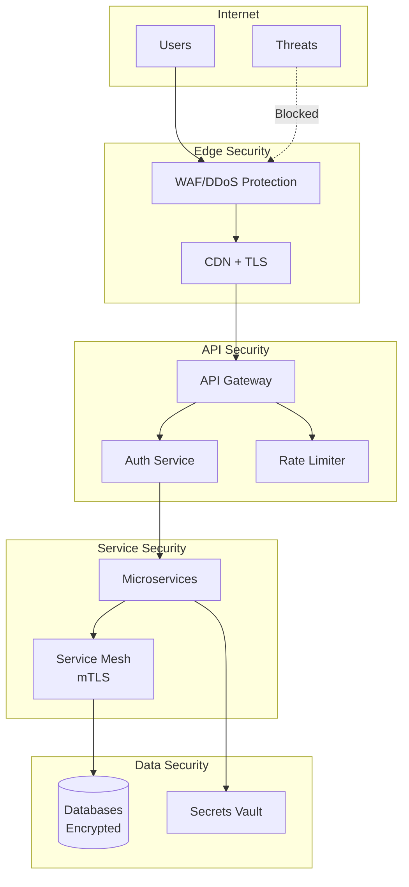
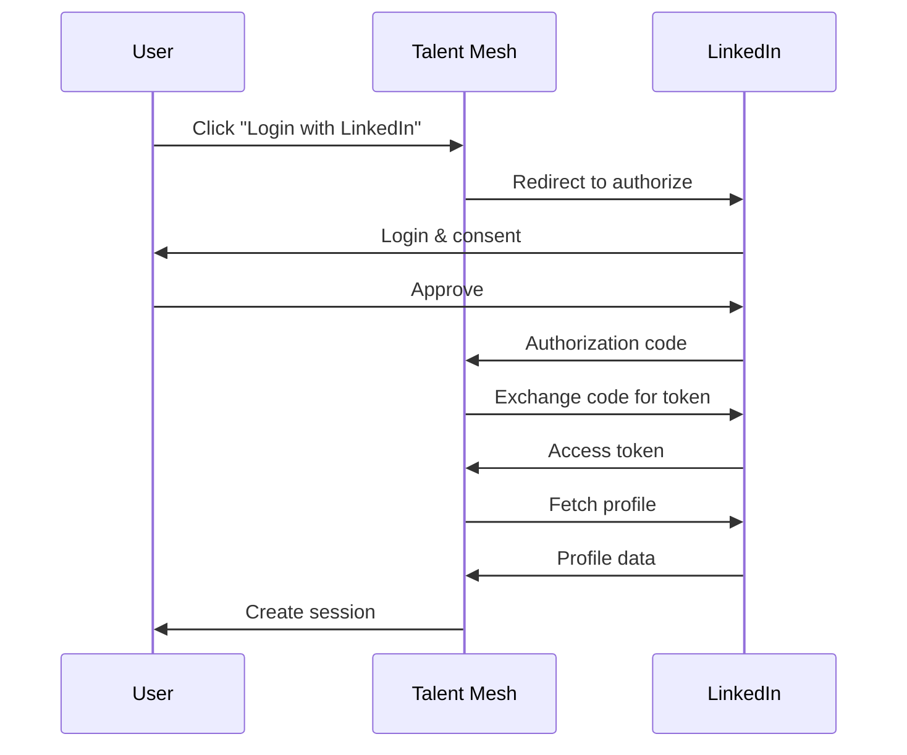
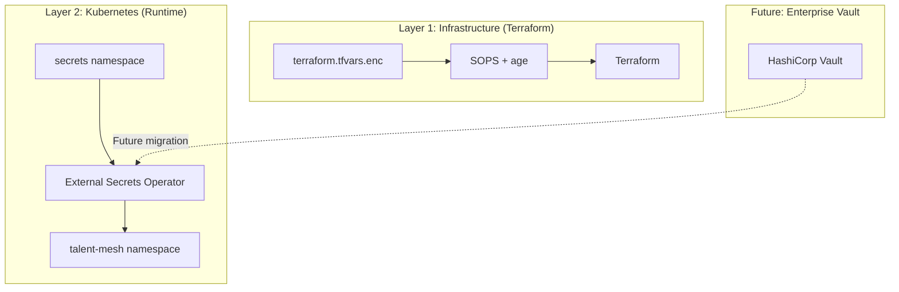
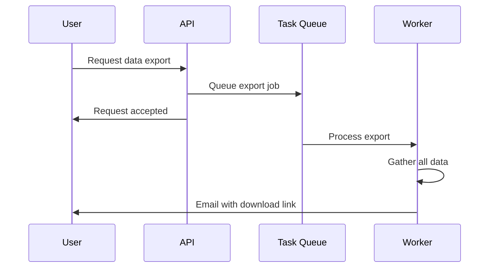
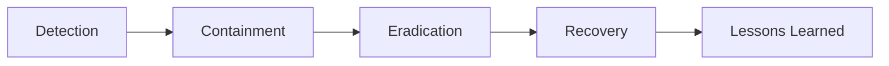

# Talent Mesh Security Architecture

## Overview

This document defines the security architecture for Talent Mesh, covering authentication, authorization, data protection, and compliance.

---

## Security Principles

1. **Defense in Depth** - Multiple layers of security controls
2. **Least Privilege** - Minimum necessary access
3. **Zero Trust** - Verify explicitly, never trust implicitly
4. **Secure by Default** - Security built into design
5. **Privacy by Design** - Data protection from the start

---

## Architecture Overview



---

## Authentication

### JWT-Based Authentication

**Token Type:** RS256 signed JWTs

**Token Structure:**
```json
{
  "header": {
    "alg": "RS256",
    "typ": "JWT",
    "kid": "key-id-001"
  },
  "payload": {
    "sub": "usr_abc123",
    "linkedin_id": "john-doe-12345",
    "name": "John Doe",
    "org_id": "org_xyz789",
    "roles": ["recruiter"],
    "iat": 1704067200,
    "exp": 1704070800,
    "iss": "https://api.talentmesh.io",
    "aud": "talent-mesh"
  }
}
```

**Token Lifecycle:**
| Token | Expiration | Storage | Refresh |
|-------|------------|---------|---------|
| Access Token | 1 hour | Memory | Via refresh token |
| Refresh Token | 7 days | HttpOnly cookie | Rotation on use |

### LinkedIn-Only Authentication

> **Note:** As per [ADR-006](/docs/09-adrs/ADR-006-LINKEDIN-ONLY-AUTH.md), Talent Mesh uses LinkedIn OAuth as the sole authentication method. No password storage is required.

**Benefits:**
- No password storage liability
- Verified professional identity
- Pre-validated email addresses
- Reduced attack surface (no password-based attacks)

### OAuth 2.0 (LinkedIn)



**Scopes Requested:**
- `r_liteprofile` - Basic profile
- `r_emailaddress` - Email

---

## Authorization

### Role-Based Access Control (RBAC)

**Roles:**
| Role | Description | Default Permissions |
|------|-------------|---------------------|
| candidate | Job seeker | Profile RW, Assessment R |
| recruiter | Hiring team | Candidates R, Assessments RW |
| admin | Org admin | All org resources |
| super_admin | Platform admin | All resources |

**Permission Matrix:**

| Resource | Candidate | Recruiter | Admin |
|----------|-----------|-----------|-------|
| Own profile | RW | - | - |
| Other profiles | - | R | R |
| Own assessments | R | - | - |
| Org assessments | - | RW | RW |
| Templates | - | RW | RW |
| Users | - | R | RW |
| Settings | - | R | RW |

### Organization Scoping

All data access is scoped to organization:

```python
async def get_assessments(
    user_id: str,
    org_id: str,
    role: str
) -> list[Assessment]:
    # Always filter by organization
    query = {"organization_id": org_id}

    if role == "candidate":
        # Candidates only see their own
        query["user_id"] = user_id
    elif role in ["recruiter", "admin"]:
        # Recruiters see all in org
        pass

    return await db.assessments.find(query)
```

### Permission Enforcement

```python
from functools import wraps
from fastify import HTTPException

def require_permission(permission: str):
    def decorator(func):
        @wraps(func)
        async def wrapper(request, *args, **kwargs):
            user = request.state.user

            if not has_permission(user, permission):
                raise HTTPException(
                    status_code=403,
                    detail=f"Permission denied: {permission}"
                )

            return await func(request, *args, **kwargs)
        return wrapper
    return decorator

@app.get("/assessments")
@require_permission("assessments:read")
async def list_assessments(request):
    pass
```

---

## Data Protection

### Encryption at Rest

| Data Store | Encryption | Key Management |
|------------|------------|----------------|
| PostgreSQL | AES-256 (TDE) | Vault |
| MongoDB | AES-256 | Vault |
| Redis | AES-256 | Vault |
| MinIO | AES-256 (SSE) | Vault |
| Backups | AES-256 | Separate key |

### Encryption in Transit

| Connection | Protocol | Certificate |
|------------|----------|-------------|
| External → Gateway | TLS 1.3 | Let's Encrypt |
| Gateway → Services | mTLS | Istio CA (Ambient Mode) |
| Service → Database | TLS | Internal CA |
| Service → Redis | Password + TLS | Internal CA |

### mTLS Configuration (Istio)

```yaml
apiVersion: security.istio.io/v1beta1
kind: PeerAuthentication
metadata:
  name: default
  namespace: talent-mesh
spec:
  mtls:
    mode: STRICT
---
apiVersion: security.istio.io/v1beta1
kind: AuthorizationPolicy
metadata:
  name: deny-all
  namespace: talent-mesh
spec:
  {}
---
apiVersion: security.istio.io/v1beta1
kind: AuthorizationPolicy
metadata:
  name: allow-auth-service
  namespace: talent-mesh
spec:
  selector:
    matchLabels:
      app: auth-service
  action: ALLOW
  rules:
  - from:
    - source:
        principals: ["cluster.local/ns/talent-mesh/sa/api-gateway"]
```

### Data Classification

| Classification | Examples | Handling |
|----------------|----------|----------|
| Public | Company name, job titles | No restrictions |
| Internal | Assessment templates | Org-scoped access |
| Confidential | User PII, CV data | Encrypted, logged access |
| Restricted | Passwords, API keys | Encrypted, never logged |

### PII Handling

| PII Type | Collection | Storage | Retention |
|----------|------------|---------|-----------|
| Name | Required | Encrypted | Account lifetime |
| Email | Required | Encrypted | Account lifetime |
| Phone | Optional | Encrypted | Account lifetime |
| CV | Optional | Encrypted | 2 years or deletion |
| Recordings | Auto | Encrypted | 90 days |

---

## API Security

### Rate Limiting

> **Note:** Rate limiting is handled by Istio/Envoy (Kong removed per [ADR-008](/docs/09-adrs/ADR-008-REMOVE-KONG-USE-ISTIO.md))

```yaml
# Istio EnvoyFilter rate limiting configuration
apiVersion: networking.istio.io/v1alpha3
kind: EnvoyFilter
metadata:
  name: rate-limit
  namespace: talent-mesh
spec:
  workloadSelector:
    labels:
      istio: ingressgateway
  configPatches:
    - applyTo: HTTP_FILTER
      match:
        context: GATEWAY
      patch:
        operation: INSERT_BEFORE
        value:
          name: envoy.filters.http.local_ratelimit
          typed_config:
            "@type": type.googleapis.com/udpa.type.v1.TypedStruct
            type_url: type.googleapis.com/envoy.extensions.filters.http.local_ratelimit.v3.LocalRateLimit
            value:
              stat_prefix: http_local_rate_limiter
              token_bucket:
                max_tokens: 100
                tokens_per_fill: 100
                fill_interval: 60s
```

**Limits by Endpoint:**
| Endpoint | Limit | Window |
|----------|-------|--------|
| POST /auth/linkedin | 10 | 1 minute |
| GET /* | 100 | 1 minute |
| POST /* | 30 | 1 minute |

### Input Validation

```typescript
// Using Zod for validation
import { z } from 'zod';

const UserRegistrationSchema = z.object({
  email: z.string().email().max(255),
  password: z.string().min(8).max(128)
    .regex(/[A-Z]/, 'Must contain uppercase')
    .regex(/[a-z]/, 'Must contain lowercase')
    .regex(/[0-9]/, 'Must contain number'),
  name: z.string().min(2).max(100).trim()
});

// Sanitize inputs
function sanitize(input: string): string {
  return input
    .replace(/[<>]/g, '')  // Remove HTML tags
    .trim();
}
```

### Security Headers

```typescript
// Fastify security headers plugin
app.register(helmet, {
  contentSecurityPolicy: {
    directives: {
      defaultSrc: ["'self'"],
      scriptSrc: ["'self'"],
      styleSrc: ["'self'", "'unsafe-inline'"],
      imgSrc: ["'self'", "data:", "https:"],
      connectSrc: ["'self'", "https://api.talentmesh.io"],
      fontSrc: ["'self'"],
      objectSrc: ["'none'"],
      mediaSrc: ["'self'"],
      frameSrc: ["'none'"]
    }
  },
  hsts: {
    maxAge: 31536000,
    includeSubDomains: true,
    preload: true
  },
  referrerPolicy: { policy: 'strict-origin-when-cross-origin' },
  noSniff: true,
  xssFilter: true
});
```

### CORS Configuration

```typescript
app.register(cors, {
  origin: [
    'https://app.talentmesh.io',
    'https://staging.talentmesh.io',
    ...(isDev ? ['http://localhost:3000'] : [])
  ],
  methods: ['GET', 'POST', 'PUT', 'DELETE', 'OPTIONS'],
  allowedHeaders: ['Authorization', 'Content-Type', 'X-Request-ID'],
  credentials: true,
  maxAge: 86400
});
```

---

## Secrets Management

> **Architecture Decision:** See [ADR-039: Secrets Management - Infisical](/docs/09-adrs/ADR-039-SECRETS-MANAGEMENT-INFISICAL.md) (supersedes ADR-013)

### Two-Layer Architecture

Talent Mesh uses a zero-cost secrets architecture designed for future scalability:



**MVP (Zero Cost):**
- SOPS + age encrypts secrets in git
- ESO with Kubernetes provider reads from `secrets` namespace
- No external vault service required

**Enterprise (Future):**
- Swap ESO backend to HashiCorp Vault
- No application changes required
- Only `ClusterSecretStore` configuration changes

### Secret Types

| Secret | Layer | Storage | Rotation |
|--------|-------|---------|----------|
| Contabo API credentials | Terraform | SOPS encrypted | On compromise |
| SSH keys | Terraform | SOPS encrypted | On compromise |
| Database passwords | K8s | ESO → Secrets | 90 days |
| API keys | K8s | ESO → Secrets | On compromise |
| JWT signing keys | K8s | ESO → Secrets | 30 days |
| TLS certificates | K8s | cert-manager | Auto (60 days) |

### Infrastructure Secrets (SOPS)

```bash
# Encrypt terraform secrets
sops --encrypt terraform.tfvars > terraform.tfvars.enc

# Decrypt for use
sops --decrypt terraform.tfvars.enc > terraform.tfvars
terraform apply
rm terraform.tfvars  # Never commit unencrypted
```

### Kubernetes Secrets (ESO)

```yaml
# ClusterSecretStore (MVP: Kubernetes provider)
apiVersion: external-secrets.io/v1beta1
kind: ClusterSecretStore
metadata:
  name: main-store
spec:
  provider:
    kubernetes:
      remoteNamespace: secrets
      server:
        caProvider:
          type: ConfigMap
          name: kube-root-ca.crt
          namespace: kube-system
          key: ca.crt
---
# ExternalSecret (same for MVP and Enterprise)
apiVersion: external-secrets.io/v1beta1
kind: ExternalSecret
metadata:
  name: auth-service-secrets
  namespace: talent-mesh
spec:
  refreshInterval: 1h
  secretStoreRef:
    name: main-store
    kind: ClusterSecretStore
  target:
    name: auth-service-secrets
  data:
  - secretKey: DATABASE_URL
    remoteRef:
      key: postgres-credentials
      property: url
  - secretKey: JWT_PRIVATE_KEY
    remoteRef:
      key: jwt-signing-key
      property: private_key
```

### Key Management

| Key | Location | Backup |
|-----|----------|--------|
| Age private key | `~/.config/sops/age/keys.txt` | Password manager + physical |
| Age public key | `.sops.yaml` (in git) | Git repository |

> **CRITICAL:** The age private key is the only secret that must be manually backed up. Losing it means all SOPS-encrypted secrets become unrecoverable.

---

## Audit Logging

### Audit Events

| Event | Logged Data | Retention |
|-------|-------------|-----------|
| Authentication | User, IP, result, timestamp | 7 years |
| Authorization | User, resource, action, result | 7 years |
| Data access | User, resource type, IDs | 7 years |
| Config changes | User, before, after | 7 years |
| Exports | User, data type, count | 7 years |

### Audit Log Format

```json
{
  "timestamp": "2024-01-15T10:30:00.000Z",
  "event_type": "data.accessed",
  "actor": {
    "id": "usr_abc123",
    "type": "user",
    "ip": "192.168.1.100",
    "user_agent": "Mozilla/5.0..."
  },
  "resource": {
    "type": "candidate_profile",
    "id": "prf_xyz789",
    "organization_id": "org_123"
  },
  "action": "read",
  "result": "success",
  "metadata": {
    "fields_accessed": ["name", "email", "cv"]
  }
}
```

### Immutability

- Audit logs stored in append-only storage
- Hash chain for tamper detection
- Separate backup with different access

---

## Compliance

### GDPR Compliance

| Requirement | Implementation |
|-------------|----------------|
| Lawful basis | Consent capture |
| Right to access | Data export API |
| Right to erasure | Account deletion |
| Data portability | JSON export |
| Breach notification | Incident process |

### Data Subject Requests



### CCPA Compliance

| Requirement | Implementation |
|-------------|----------------|
| Right to know | Privacy policy |
| Right to delete | Deletion API |
| Right to opt-out | Do Not Sell toggle |
| Non-discrimination | No service degradation |

### EEOC Compliance

| Control | Implementation |
|---------|----------------|
| No protected characteristics | Question review |
| Uniform criteria | Standardized scoring |
| Adverse impact monitoring | Analytics dashboard |
| Accommodation | Manual assessment option |

---

## Incident Response

### Security Incident Levels

| Level | Description | Response Time | Escalation |
|-------|-------------|---------------|------------|
| P1 | Data breach, system compromise | 15 minutes | Exec team |
| P2 | Attempted breach, vulnerability | 1 hour | Security team |
| P3 | Policy violation, anomaly | 4 hours | On-call |
| P4 | Security improvement | Next sprint | Backlog |

### Incident Response Process



### Breach Notification

- **Users:** Within 72 hours
- **Regulators:** Within 72 hours (GDPR)
- **Documentation:** Full incident report

---

## Security Testing

### Regular Testing

| Test Type | Frequency | Scope |
|-----------|-----------|-------|
| SAST | Every PR | All code |
| DAST | Weekly | Staging |
| Dependency scan | Daily | All deps |
| Penetration test | Quarterly | Production |
| Red team | Annually | Full scope |

### CI/CD Security

```yaml
# GitHub Actions security workflow
name: Security Scan
on: [push, pull_request]
jobs:
  security:
    runs-on: ubuntu-latest
    steps:
      - uses: actions/checkout@v4

      - name: Run Trivy vulnerability scanner
        uses: aquasecurity/trivy-action@master
        with:
          scan-type: 'fs'
          severity: 'CRITICAL,HIGH'

      - name: Run SAST
        uses: github/codeql-action/analyze@v2

      - name: Check secrets
        uses: trufflesecurity/trufflehog@main
        with:
          path: ./
```

---

*Document Version: 3.0*
*Last Updated: 2026-01-04*
*Owner: Security Team*
