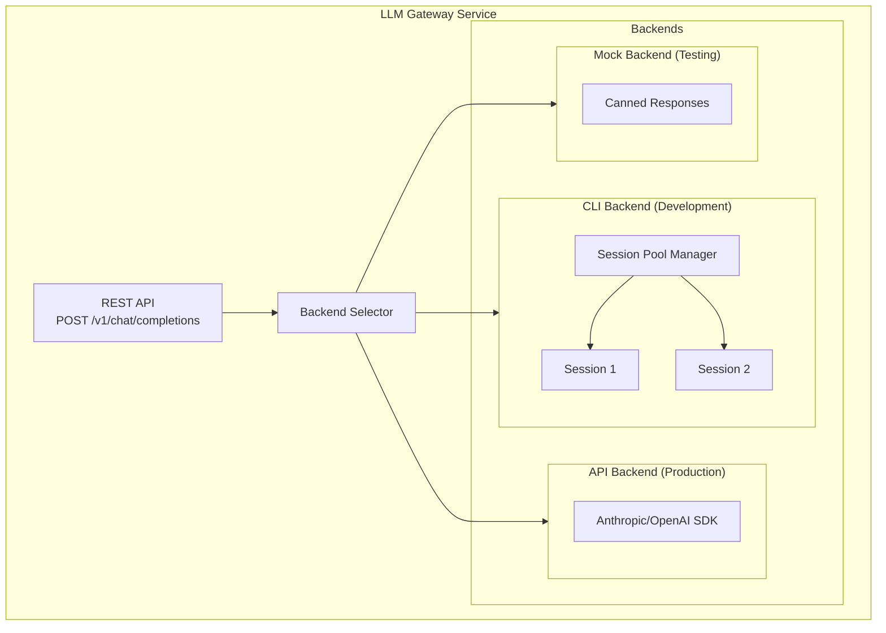

# LLM Gateway Service

## Overview

The LLM Gateway is a platform service provided by OpenOva that offers an OpenAI-compatible API for LLM access. It supports multiple backends including CLI-based session pooling for zero-cost development and API backends for production.

---

## Design Goals

1. **OpenAI-Compatible API** - Standard interface for easy integration and migration
2. **Backend Abstraction** - Switch between CLI, API, or mock backends via configuration
3. **Session Pooling** - Pre-warmed sessions to avoid cold start latency
4. **Cost Optimization** - Zero-cost development with CLI backend
5. **Observability** - Prometheus metrics and structured logging

---

## Architecture



---

## API Specification

### Chat Completions (OpenAI-Compatible)

```
POST /v1/chat/completions
```

**Request:**
```json
{
  "model": "claude-sonnet",
  "messages": [
    {"role": "system", "content": "You are a helpful assistant."},
    {"role": "user", "content": "Hello!"}
  ],
  "max_tokens": 4096,
  "temperature": 0.7
}
```

**Response:**
```json
{
  "id": "chatcmpl-abc123",
  "object": "chat.completion",
  "created": 1704067200,
  "model": "claude-sonnet",
  "choices": [{
    "index": 0,
    "message": {
      "role": "assistant",
      "content": "Hello! How can I help you today?"
    },
    "finish_reason": "stop"
  }],
  "usage": {
    "prompt_tokens": 12,
    "completion_tokens": 8,
    "total_tokens": 20
  }
}
```

### Health Check

```
GET /health
```

Returns service health status and session pool information.

### Session Management

```
GET /sessions
```

Lists all sessions and their status (for debugging).

---

## Configuration

### Environment Variables

| Variable | Description | Default |
|----------|-------------|---------|
| `LLM_BACKEND` | Backend type: `cli`, `api`, `mock` | `cli` |
| `LLM_POOL_SIZE` | Number of warm sessions | `2` |
| `LLM_KEEP_ALIVE_INTERVAL` | Keep-alive ping interval (seconds) | `300` |
| `LLM_REQUEST_TIMEOUT` | Request timeout (seconds) | `60` |
| `ANTHROPIC_API_KEY` | API key (for `api` backend) | - |
| `REDIS_URL` | Cache URL | `redis://localhost:6379` |

### Backend Selection

```bash
# Development (zero cost)
LLM_BACKEND=cli

# Production
LLM_BACKEND=api
ANTHROPIC_API_KEY=sk-ant-...

# Testing
LLM_BACKEND=mock
```

---

## Session Pool Manager

The CLI backend uses a session pool to avoid cold start latency:

- **Pre-warming**: Sessions are spawned on startup
- **Keep-alive**: Periodic pings prevent timeout
- **Auto-recovery**: Failed sessions are automatically restarted
- **Overflow handling**: Cold start fallback when pool exhausted

### Latency Characteristics

| Scenario | Latency |
|----------|---------|
| Warm session | 500-700ms |
| Cold start | ~13s |
| API backend | 500-700ms |

---

## Deployment

The LLM Gateway runs as a Kubernetes deployment:

```yaml
apiVersion: apps/v1
kind: Deployment
metadata:
  name: llm-gateway
  namespace: platform-services
spec:
  replicas: 1
  template:
    spec:
      containers:
      - name: llm-gateway
        image: ghcr.io/openova-io/llm-gateway:v1
        ports:
        - containerPort: 5005
        env:
        - name: LLM_BACKEND
          value: "cli"
        - name: LLM_POOL_SIZE
          value: "2"
        resources:
          requests:
            memory: "512Mi"
            cpu: "250m"
          limits:
            memory: "1Gi"
            cpu: "500m"
```

---

## Observability

### Prometheus Metrics

| Metric | Type | Description |
|--------|------|-------------|
| `llm_requests_total` | Counter | Total requests by status |
| `llm_request_duration_seconds` | Histogram | Request latency |
| `llm_sessions_total` | Gauge | Sessions by status |
| `llm_cache_hits_total` | Counter | Cache hit count |

### Logging

Structured JSON logs with:
- Request ID
- Session ID
- Latency
- Token counts

---

## Tenant Integration

Tenants consume the LLM Gateway via internal service URL:

```
http://llm-gateway.platform-services.svc.cluster.local:5005/v1/chat/completions
```

Example tenant usage:
```python
import openai

client = openai.OpenAI(
    base_url="http://llm-gateway.platform-services:5005/v1",
    api_key="not-required-for-cli-backend"
)

response = client.chat.completions.create(
    model="claude-sonnet",
    messages=[{"role": "user", "content": "Hello!"}]
)
```

---

## Related Documentation

- [ADR-038: Platform Engineering Tools](../adrs/ADR-038-PLATFORM-ENGINEERING-TOOLS.md)

---

*Document Version: 1.0*
*Last Updated: 2026-01-12*
*Owner: Platform Team*
