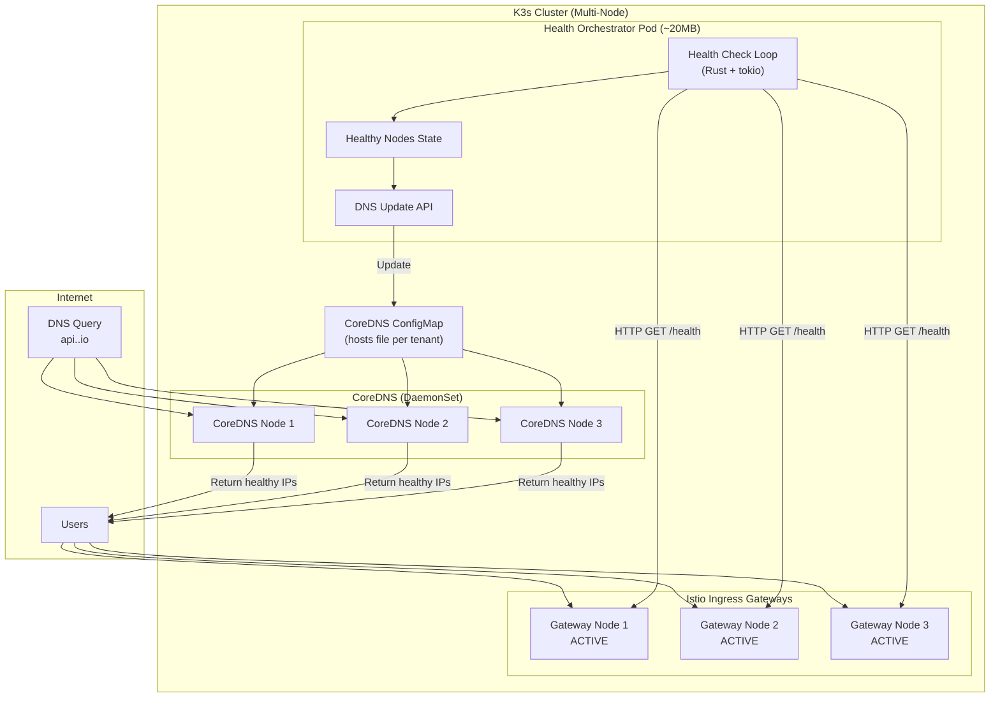
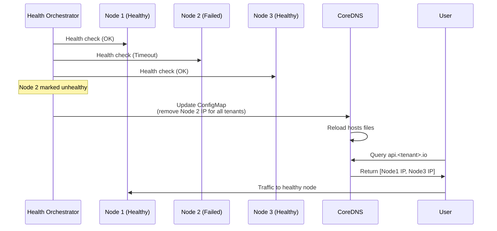
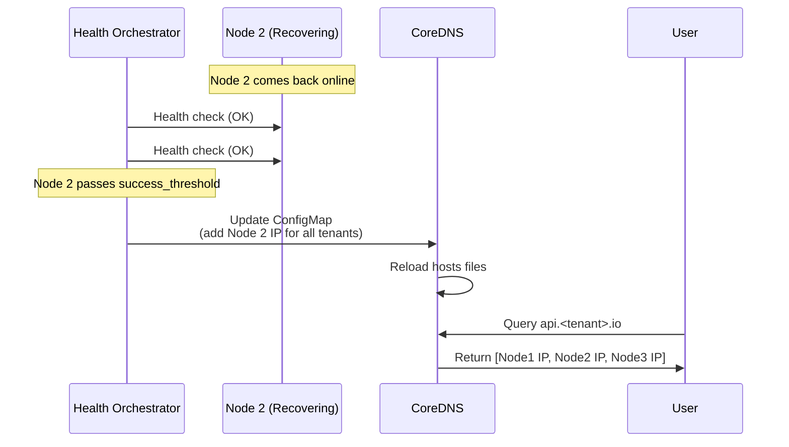

# DNS Failover Service Specification

## Overview

This document specifies the DNS-based failover system for the OpenOva platform. It replaces traditional load balancers (kube-vip, MetalLB) with a lightweight, cost-effective approach using CoreDNS and a custom Rust Health Orchestrator.

This is a **platform service** available to all tenants. Tenants configure their domains via the Health Orchestrator configuration.

---

## Architecture

### Design Principles

1. **No dedicated load balancer** - DNS returns only healthy node IPs
2. **All Istio Gateways active** - No idle resources, every node serves traffic
3. **Sub-second health detection** - Fast failover on node issues
4. **Zero external dependencies** - Self-hosted, no cloud provider lock-in
5. **Multi-tenant** - Supports multiple tenants with their own domains

### Component Overview



---

## Health Orchestrator

### Service Specification

| Property | Value |
|----------|-------|
| **Language** | Rust |
| **Framework** | tokio + axum |
| **Memory** | ~20MB |
| **CPU** | <10m idle, <50m during checks |
| **Replicas** | 1 (leader election optional) |
| **Namespace** | `dns-failover` |

### Rust Implementation

```rust
// src/main.rs
use std::collections::HashSet;
use std::sync::Arc;
use std::time::Duration;
use tokio::sync::RwLock;
use tokio::time::interval;
use axum::{Router, routing::get, Json, Extension};
use serde::{Deserialize, Serialize};

#[derive(Clone)]
struct AppState {
    healthy_nodes: Arc<RwLock<HashSet<String>>>,
    all_nodes: Vec<NodeConfig>,
    tenants: Vec<TenantConfig>,
    k8s_client: kube::Client,
}

#[derive(Clone, Deserialize)]
struct NodeConfig {
    name: String,
    ip: String,
    health_endpoint: String,
}

#[derive(Clone, Deserialize)]
struct TenantConfig {
    name: String,
    domains: Vec<String>,
    hosts_key: String,
}

#[derive(Serialize)]
struct HealthStatus {
    healthy_nodes: Vec<String>,
    total_nodes: usize,
    last_check: String,
}

#[tokio::main]
async fn main() -> Result<(), Box<dyn std::error::Error>> {
    tracing_subscriber::init();

    let config = load_config()?;
    let k8s_client = kube::Client::try_default().await?;

    let state = AppState {
        healthy_nodes: Arc::new(RwLock::new(HashSet::new())),
        all_nodes: config.nodes.clone(),
        tenants: config.tenants.clone(),
        k8s_client,
    };

    // Start health check loop
    let state_clone = state.clone();
    tokio::spawn(async move {
        health_check_loop(state_clone).await;
    });

    // Start API server
    let app = Router::new()
        .route("/health", get(self_health))
        .route("/status", get(get_status))
        .layer(Extension(state));

    let listener = tokio::net::TcpListener::bind("0.0.0.0:8080").await?;
    axum::serve(listener, app).await?;

    Ok(())
}

async fn health_check_loop(state: AppState) {
    let mut interval = interval(Duration::from_secs(5));
    let client = reqwest::Client::builder()
        .timeout(Duration::from_secs(2))
        .build()
        .unwrap();

    loop {
        interval.tick().await;

        let mut healthy = HashSet::new();

        for node in &state.all_nodes {
            match check_node_health(&client, &node.health_endpoint).await {
                Ok(true) => {
                    healthy.insert(node.ip.clone());
                    tracing::debug!("Node {} is healthy", node.name);
                }
                Ok(false) | Err(_) => {
                    tracing::warn!("Node {} is unhealthy", node.name);
                }
            }
        }

        // Update state
        let mut state_healthy = state.healthy_nodes.write().await;
        let changed = *state_healthy != healthy;
        *state_healthy = healthy.clone();
        drop(state_healthy);

        // Update CoreDNS ConfigMap for each tenant if changed
        if changed {
            for tenant in &state.tenants {
                if let Err(e) = update_tenant_dns(&state.k8s_client, tenant, &healthy).await {
                    tracing::error!("Failed to update DNS for {}: {}", tenant.name, e);
                }
            }
            tracing::info!("Updated CoreDNS with {} healthy nodes", healthy.len());
        }
    }
}

async fn update_tenant_dns(
    client: &kube::Client,
    tenant: &TenantConfig,
    healthy_nodes: &HashSet<String>,
) -> Result<(), kube::Error> {
    use k8s_openapi::api::core::v1::ConfigMap;
    use kube::api::{Api, Patch, PatchParams};

    let configmaps: Api<ConfigMap> = Api::namespaced(client.clone(), "kube-system");

    // Generate hosts file content for tenant domains
    let domains_str = tenant.domains.join(" ");
    let hosts_content = healthy_nodes
        .iter()
        .map(|ip| format!("{} {}", ip, domains_str))
        .collect::<Vec<_>>()
        .join("\n");

    let patch = serde_json::json!({
        "data": {
            &tenant.hosts_key: hosts_content
        }
    });

    configmaps
        .patch(
            "coredns-custom",
            &PatchParams::default(),
            &Patch::Merge(&patch),
        )
        .await?;

    Ok(())
}
```

### Configuration

```yaml
# config.yaml
nodes:
  - name: node-1
    ip: "10.0.0.1"
    health_endpoint: "http://10.0.0.1:15021/healthz/ready"
  - name: node-2
    ip: "10.0.0.2"
    health_endpoint: "http://10.0.0.2:15021/healthz/ready"
  - name: node-3
    ip: "10.0.0.3"
    health_endpoint: "http://10.0.0.3:15021/healthz/ready"

# Multi-tenant configuration
tenants:
  - name: tenant-a
    domains:
      - api.tenant-a.io
      - app.tenant-a.io
    hosts_key: "tenant-a.hosts"
  - name: tenant-b
    domains:
      - api.tenant-b.io
      - app.tenant-b.io
    hosts_key: "tenant-b.hosts"

health_check:
  interval_seconds: 5
  timeout_seconds: 2
  failure_threshold: 2
  success_threshold: 1

coredns:
  configmap_name: "coredns-custom"
  configmap_namespace: "kube-system"
```

---

## CoreDNS Configuration

### Corefile Extension

```
# CoreDNS Corefile with custom hosts plugin
.:53 {
    errors
    health {
       lameduck 5s
    }
    ready

    # Custom hosts per tenant - loaded from ConfigMap
    hosts /etc/coredns/tenant-a.hosts {
        fallthrough
        reload 5s
    }
    hosts /etc/coredns/tenant-b.hosts {
        fallthrough
        reload 5s
    }

    kubernetes cluster.local in-addr.arpa ip6.arpa {
       pods insecure
       fallthrough in-addr.arpa ip6.arpa
       ttl 30
    }

    prometheus :9153
    forward . /etc/resolv.conf {
       max_concurrent 1000
    }
    cache 30
    loop
    reload
    loadbalance
}
```

### Dynamic Hosts File (Per Tenant)

The Health Orchestrator updates hosts files in the ConfigMap for each tenant:

```
# /etc/coredns/tenant-a.hosts
# Updated by Health Orchestrator
# Last update: 2026-01-12T12:00:00Z

10.0.0.1 api.tenant-a.io app.tenant-a.io
10.0.0.2 api.tenant-a.io app.tenant-a.io
10.0.0.3 api.tenant-a.io app.tenant-a.io
```

When a node becomes unhealthy, its line is removed from all tenant hosts files.

---

## Kubernetes Manifests

### Health Orchestrator Deployment

```yaml
apiVersion: apps/v1
kind: Deployment
metadata:
  name: health-orchestrator
  namespace: dns-failover
spec:
  replicas: 1
  selector:
    matchLabels:
      app: health-orchestrator
  template:
    metadata:
      labels:
        app: health-orchestrator
    spec:
      serviceAccountName: health-orchestrator
      containers:
        - name: health-orchestrator
          image: ghcr.io/openova-io/health-orchestrator:latest
          ports:
            - containerPort: 8080
          resources:
            requests:
              memory: "16Mi"
              cpu: "10m"
            limits:
              memory: "32Mi"
              cpu: "100m"
          env:
            - name: RUST_LOG
              value: "info"
          volumeMounts:
            - name: config
              mountPath: /etc/health-orchestrator
          livenessProbe:
            httpGet:
              path: /health
              port: 8080
            initialDelaySeconds: 5
            periodSeconds: 10
          readinessProbe:
            httpGet:
              path: /health
              port: 8080
            initialDelaySeconds: 5
            periodSeconds: 5
      volumes:
        - name: config
          configMap:
            name: health-orchestrator-config
---
apiVersion: v1
kind: ServiceAccount
metadata:
  name: health-orchestrator
  namespace: dns-failover
---
apiVersion: rbac.authorization.k8s.io/v1
kind: ClusterRole
metadata:
  name: health-orchestrator
rules:
  - apiGroups: [""]
    resources: ["configmaps"]
    verbs: ["get", "patch", "update"]
  - apiGroups: [""]
    resources: ["nodes"]
    verbs: ["list", "watch"]
---
apiVersion: rbac.authorization.k8s.io/v1
kind: ClusterRoleBinding
metadata:
  name: health-orchestrator
roleRef:
  apiGroup: rbac.authorization.k8s.io
  kind: ClusterRole
  name: health-orchestrator
subjects:
  - kind: ServiceAccount
    name: health-orchestrator
    namespace: dns-failover
```

---

## Failover Scenarios

### Scenario 1: Single Node Failure



### Scenario 2: Node Recovery



---

## Health Check Protocol

### Istio Gateway Health Endpoint

The Health Orchestrator checks the Istio Ingress Gateway's health endpoint:

```
GET http://<node-ip>:15021/healthz/ready
```

| Response | Meaning | Action |
|----------|---------|--------|
| `200 OK` | Gateway ready | Include in DNS |
| `503` | Gateway not ready | Exclude from DNS |
| Timeout | Node unreachable | Exclude from DNS |

### Health Check Parameters

| Parameter | Value | Rationale |
|-----------|-------|-----------|
| **Interval** | 5 seconds | Balance between detection speed and overhead |
| **Timeout** | 2 seconds | Fast failure detection |
| **Failure Threshold** | 2 | Avoid false positives from network blips |
| **Success Threshold** | 1 | Quick recovery when node is back |

### TTL Configuration

| Level | TTL | Purpose |
|-------|-----|---------|
| DNS A record | 30 seconds | Balance caching vs. failover speed |
| CoreDNS cache | 30 seconds | Match A record TTL |
| Browser DNS cache | ~60 seconds | Client-side caching |

**Worst-case failover time:** ~90 seconds (DNS TTL + browser cache)
**Best-case failover time:** ~10 seconds (health check interval x failure threshold)

---

## Monitoring & Alerting

### Metrics (Prometheus)

```yaml
# Health Orchestrator exposes these metrics
metrics:
  - name: health_orchestrator_healthy_nodes
    type: gauge
    description: "Number of currently healthy nodes"

  - name: health_orchestrator_check_duration_seconds
    type: histogram
    description: "Duration of health check round"

  - name: health_orchestrator_dns_updates_total
    type: counter
    description: "Total number of DNS ConfigMap updates"

  - name: health_orchestrator_node_status
    type: gauge
    labels: [node_name, node_ip]
    description: "Node health status (1=healthy, 0=unhealthy)"
```

### Alert Rules

```yaml
groups:
  - name: dns-failover
    rules:
      - alert: LowHealthyNodes
        expr: health_orchestrator_healthy_nodes < 2
        for: 1m
        labels:
          severity: warning
        annotations:
          summary: "Only {{ $value }} healthy nodes"

      - alert: AllNodesDown
        expr: health_orchestrator_healthy_nodes == 0
        for: 30s
        labels:
          severity: critical
        annotations:
          summary: "No healthy nodes available"

      - alert: HealthCheckSlow
        expr: health_orchestrator_check_duration_seconds > 10
        for: 2m
        labels:
          severity: warning
        annotations:
          summary: "Health check taking too long"
```

---

## Resource Summary

| Component | Memory | CPU | Replicas |
|-----------|--------|-----|----------|
| Health Orchestrator | ~20MB | ~10m | 1 |
| CoreDNS (DaemonSet) | ~50MB per node | ~50m | N (per node) |

**Comparison with alternatives:**

| Solution | Memory | Complexity |
|----------|--------|------------|
| DNS Failover (this) | ~170MB | Low |
| kube-vip | ~100MB | Medium (VRRP) |
| MetalLB | ~200MB | Medium (BGP/L2) |
| External LB (cloud) | 0 (external) | Low ($$) |

---

## Tenant Onboarding

To add a new tenant to DNS failover:

1. Add tenant configuration to `health-orchestrator-config` ConfigMap
2. Add hosts entry to CoreDNS Corefile
3. Restart Health Orchestrator to pick up changes

```yaml
# Add to health-orchestrator-config
tenants:
  - name: new-tenant
    domains:
      - api.new-tenant.io
      - app.new-tenant.io
    hosts_key: "new-tenant.hosts"
```

---

## References

- [CoreDNS Hosts Plugin](https://coredns.io/plugins/hosts/)
- [Istio Gateway Health](https://istio.io/latest/docs/ops/common-problems/network-issues/)
- [Deployment Architecture](../architecture/DEPLOYMENT_ARCHITECTURE.md)

---

*Document Version: 2.0*
*Last Updated: 2026-01-12*
*Owner: Platform Team*
