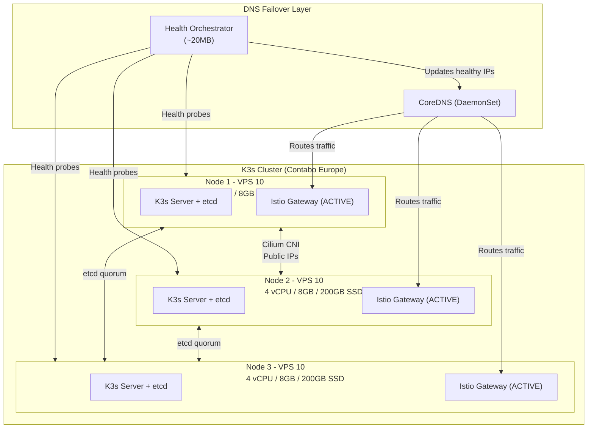

# openova Platform Technology Stack

## Overview

This document details the platform-level technology choices for openova, the kubernetes-based cloud infrastructure that hosts multiple products.

---

## Infrastructure Summary

| Category | Technology | Version | Purpose |
|----------|------------|---------|---------|
| **Orchestration** | K3s | 1.28+ | Lightweight Kubernetes |
| **CNI** | Cilium | Latest | eBPF-based networking with Hubble |
| **Service Mesh** | Istio (Ambient) | 1.20+ | Sidecar-less traffic management |
| **GitOps** | Flux | 2.x | Continuous delivery (~200MB) |
| **TLS** | cert-manager | 1.x | Automated certificates (Let's Encrypt) |
| **Registry** | ghcr.io | - | Container images (no Harbor for MVP) |
| **Security Scanning** | Trivy | Latest | CI/CD vulnerability scanning |
| **DB Operators** | CNPG + MongoDB | Latest | Kubernetes-native database management |
| **Cache** | Dragonfly | Latest | Redis-compatible cache (3 replicas) |
| **Events** | Redpanda | 5.x | Kafka-compatible event streaming |
| **Objects** | MinIO | Latest | S3-compatible storage on local SSD |
| **Email** | Stalwart | Latest | Self-hosted JMAP/IMAP/SMTP server |
| **Backup** | Velero + R2 | Latest | Kubernetes backup to Cloudflare R2 |
| **Logging** | Grafana Loki | Latest | Log aggregation (LogQL) |
| **Tracing** | Grafana Tempo | Latest | Distributed tracing (TraceQL) |
| **Metrics** | Mimir | Latest | Prometheus-compatible metrics |
| **Collector** | Grafana Alloy | Latest | Unified telemetry (OTLP) |

---

## Kubernetes Cluster (K3s on Contabo VPS)

### Cluster Architecture



### Contabo VPS 10 Resources

| Resource | Per Node | With 3 Nodes |
|----------|----------|--------------|
| vCPU | 4 | 12 |
| RAM | 8 GB | 24 GB |
| SSD Storage | 200 GB | 600 GB |
| Bandwidth | 200 Mbit/s | 200 Mbit/s |
| Traffic | 32 TB/month | 32 TB/month |
| **Cost** | €4.50/month | **€13.50/month (~$15)** |

### K3s Installation

```bash
# First control plane node (cluster initialization)
curl -sfL https://get.k3s.io | sh -s - server \
  --cluster-init \
  --disable traefik \
  --disable servicelb \
  --disable local-storage \
  --flannel-backend=none \
  --disable-network-policy \
  --kube-controller-manager-arg="node-monitor-period=5s" \
  --kube-controller-manager-arg="node-monitor-grace-period=20s" \
  --kube-apiserver-arg="default-watch-cache-size=50" \
  --etcd-arg="quota-backend-bytes=1073741824" \
  --kubelet-arg="max-pods=50"

# Install Cilium CNI after K3s
helm repo add cilium https://helm.cilium.io/
helm install cilium cilium/cilium \
  --namespace kube-system \
  --set kubeProxyReplacement=true \
  --set k8sServiceHost=${API_SERVER_IP} \
  --set k8sServicePort=6443 \
  --set hubble.enabled=true \
  --set hubble.relay.enabled=true \
  --set hubble.ui.enabled=true
```

### Disabled Components

| Component | Reason |
|-----------|--------|
| `traefik` | Istio Ingress Gateway handles all ingress |
| `servicelb` | DNS-based failover instead |
| `local-storage` | Application-level storage replication |
| `flannel` | Cilium CNI for eBPF networking |
| `network-policy` | Cilium provides L3-L7 network policies |

---

## Service Mesh (Istio Ambient Mode)

### Why Ambient Mode (Sidecar-less)?

- No sidecar containers (saves ~50MB per pod)
- Simplified debugging (application logs not mixed with Envoy)
- Faster pod startup (no sidecar injection delay)
- Same mTLS and traffic management capabilities

### Ambient Mode Components

| Component | Deployment | Purpose |
|-----------|------------|---------|
| `ztunnel` | DaemonSet | L4 proxy - mTLS, TCP metrics (~100MB x3 nodes) |
| Istio Ingress Gateway | DaemonSet | External traffic ingress |

> **Note:** We do NOT use waypoint proxies. L7 observability (HTTP metrics, traces) is handled by **Application OTel SDKs** instead.

### Installation

```bash
istioctl install --set profile=ambient -y
kubectl label namespace <namespace> istio.io/dataplane-mode=ambient
```

---

## Database Operators

### CloudNativePG (PostgreSQL)

- Kubernetes-native PostgreSQL operator
- Automatic failover, rolling updates
- Built-in backup to S3-compatible storage
- 3-instance HA configuration

### MongoDB Community Operator

- 3-node replica set
- Automatic failover
- Kubernetes-native management

### Dragonfly (Cache)

- 3 replicas with StatefulSet
- 100% Redis-compatible
- 30-40% more memory efficient than Redis

### Redpanda (Event Streaming)

- 3 brokers with built-in Raft consensus
- Kafka-compatible API
- Tiered storage to MinIO for long retention

---

## Observability Stack (Grafana LGTM)

| Component | Role | Memory |
|-----------|------|--------|
| **L**oki | Log aggregation | ~500MB |
| **G**rafana | Visualization | ~200MB |
| **T**empo | Distributed tracing | ~300MB |
| **M**etrics (Mimir) | Metrics storage | ~500MB |
| **Alloy** | Unified collector (DaemonSet) | ~400MB x3 |
| **ztunnel** | L4 mesh metrics (DaemonSet) | ~100MB x3 |
| **Total** | | **~3GB** |

### Grafana Alloy

Single binary replaces Promtail + node_exporter + OTel Collector:
- OTLP receiver for application traces/metrics
- Prometheus scraping for Kubernetes metrics
- Loki pipeline for log processing
- Trace-to-log correlation via trace_id

---

## GitOps (Flux)

### Why Flux over ArgoCD?

- Lower resource overhead (~200MB vs 500-800MB)
- Kubernetes-native CRDs
- Native SOPS integration for secrets
- CLI-focused fits "vibe coding" workflow

### Components

| Controller | Memory | Purpose |
|------------|--------|---------|
| source-controller | 64MB | Git/Helm repo sync |
| kustomize-controller | 64MB | Kustomization apply |
| helm-controller | 64MB | HelmRelease management |
| notification-controller | 32MB | Alerts (Slack/Discord) |

---

## TLS Certificates (cert-manager)

- HTTP-01 ACME challenge with Let's Encrypt
- Individual certificates per service (not wildcards)
- Automatic renewal 30 days before expiry

### Resource Overhead

| Component | Memory | CPU |
|-----------|--------|-----|
| cert-manager controller | 64MB | 10m |
| cert-manager webhook | 32MB | 5m |
| cert-manager cainjector | 32MB | 5m |
| **Total** | **~128MB** | **~20m** |

---

## Backup (Velero + Cloudflare R2)

- Velero for Kubernetes resource backup
- CNPG Barman for PostgreSQL continuous backup
- Cloudflare R2 destination (zero egress fees)
- 30-day retention for Velero, 7-day PITR for PostgreSQL

---

## High Availability Summary

| Component | HA Strategy |
|-----------|-------------|
| K3s Control Plane | 3-node etcd quorum (tolerates 1 failure) |
| Load Balancing | DNS-based failover (all Istio gateways ACTIVE) |
| PostgreSQL | CNPG operator (primary + replica, auto-failover) |
| MongoDB | MongoDB Community Operator (3-node replica set) |
| Dragonfly | 3 replicas with StatefulSet |
| Redpanda | 3 brokers with built-in Raft consensus |
| MinIO | Erasure coding across nodes |

---

## Related ADRs

- [ADR-014: Contabo VPS Infrastructure](https://github.com/openova-io/terraform/blob/main/docs/ADR-014-CONTABO-VPS-INFRASTRUCTURE.md)
- [ADR-025: CNI Cilium eBPF](https://github.com/openova-io/cilium/blob/main/docs/ADR-025-CNI-CILIUM-EBPF.md)
- [ADR-008: Remove Kong Use Istio](https://github.com/openova-io/istio/blob/main/docs/ADR-008-REMOVE-KONG-USE-ISTIO.md)
- [ADR-016: Flux GitOps](https://github.com/openova-io/flux/blob/main/docs/ADR-016-FLUX-GITOPS.md)
- [ADR-020: Logging Grafana Loki](https://github.com/openova-io/grafana/blob/main/docs/ADR-020-LOGGING-GRAFANA-LOKI.md)

---

*Document Version: 1.0*
*Last Updated: 2026-01-10*
*Owner: Platform Team*
